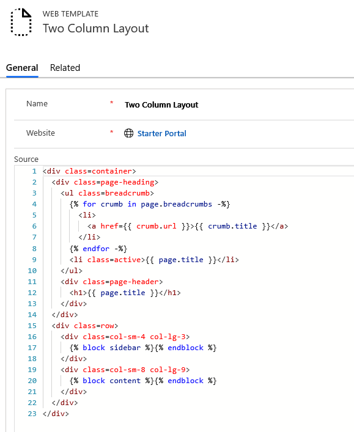
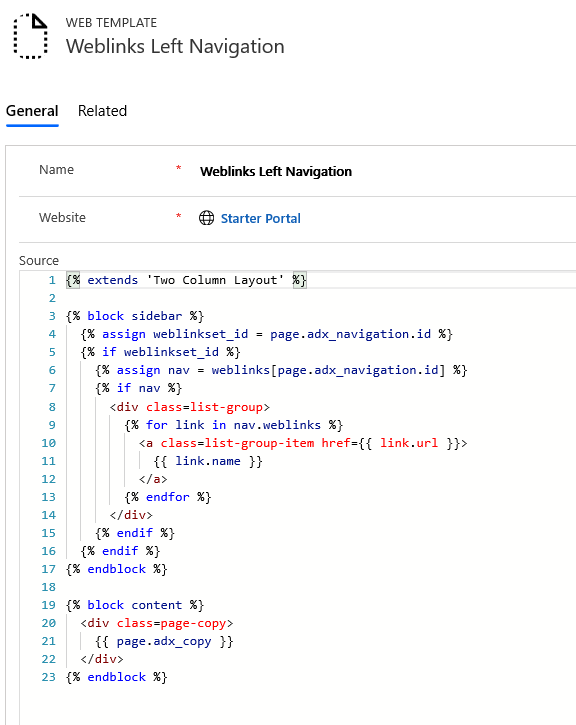
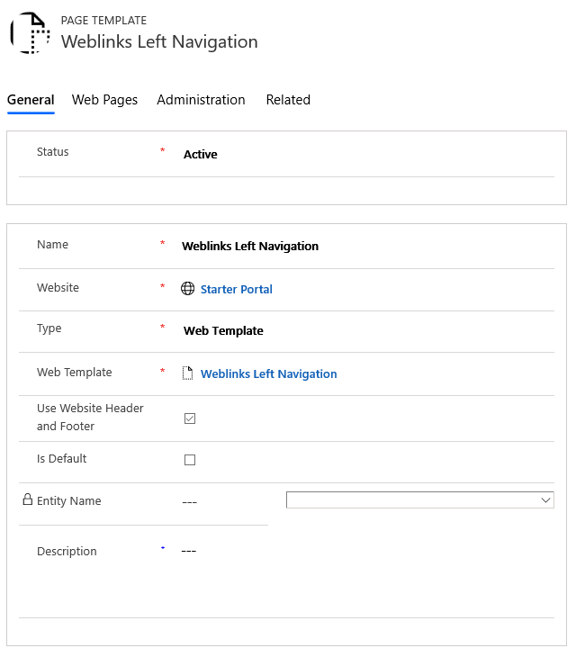
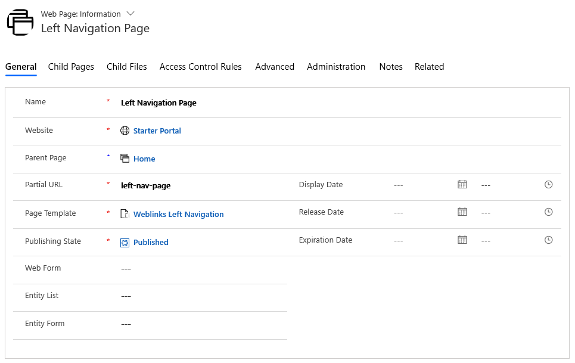

# Create a custom page template

In this example, we'll create a custom page template by using Liquid and a page template that is based on a web template. [!INCLUDE[proc-more-information](../../../includes/proc-more-information.md)] [Store source content by using web templates](store-content-web-templates.md). Our goal is to build a simple two-column template that uses a [web link set](../configure/manage-web-links.md) as left-side navigation, with the page content to the right. 

## Step 1: Create a web template and write the Liquid template code

First, we'll create our Web Template and write the Liquid template code. We're likely to reuse some common elements of this template in future templates. So, we'll create a common base template that we'll then extend with our specific template. Our base template will provide breadcrumb links and our page title/header, as well as define our one-column layout:

> [!div class=mx-imgBorder]


> [!TIP]
> Read about template inheritance using the block and extends tags: [Template tags](template-tags.md#extends)

### Two Column Layout (Web Template)

```xml
<div class=container>
  <div class=page-heading>
    <ul class=breadcrumb>
      
        <li>
          <a href={{ crumb.url }}>{{ crumb.title }}</a>
        </li>
      
      <li class=active>{{ page.title }}</li>
    </ul>
    <div class=page-header>
      <h1>{{ page.title }}</h1>
    </div>
  </div>
  <div class=row>
    <div class=col-sm-4 col-lg-3>
      
    </div>
    <div class=col-sm-8 col-lg-9>
      
    </div>
  </div>
</div>
```

## Step 2: Create a new web template that extends our base layout template

Use the navigation web link set associated with the current page for our navigation links to create a new web template that extends our base layout template.

> [!div class=mx-imgBorder]
  

> [!TIP]
> Familiarize yourself on how to load web link sets using the [weblinks](liquid-objects.md#weblinks) object.

### Weblinks Left Navigation (Web Template)

```xml



  
  
    
    
      <div class=list-group>
        
          <a class=list-group-item href={{ link.url }}>
            {{ link.name }}
          </a>
        
      </div>
    
  



  <div class=page-copy>
    {{ page.adx_copy }}
  </div>

```

## Step 3: Create a new page template based on the web template

In this step, we'll create a new page template that is based on the web template we created in the previous step.

> [!div class=mx-imgBorder]
  

## Step 4: Create a web page to display content

Now, all that's left to do is to create a web page that uses our page template, and has an associated Web Link Set, and we have our result.

> [!div class=mx-imgBorder]
  

### See also

[Create a custom page template to render an RSS feed](render-rss-custom-page-template.md)  
[Render the list associated with the current page](render-entity-list-current-page.md)  
[Render a website header and primary navigation bar](render-site-header-primary-navigation.md)  
[Render up to three levels of page hierarchy by using hybrid navigation](hybrid-navigation-render-page-hierachy.md)  


[!INCLUDE[footer-include](../../../includes/footer-banner.md)]