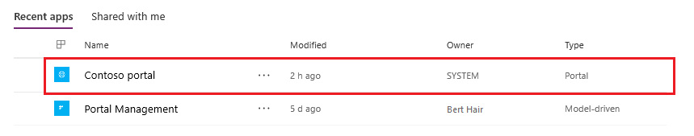
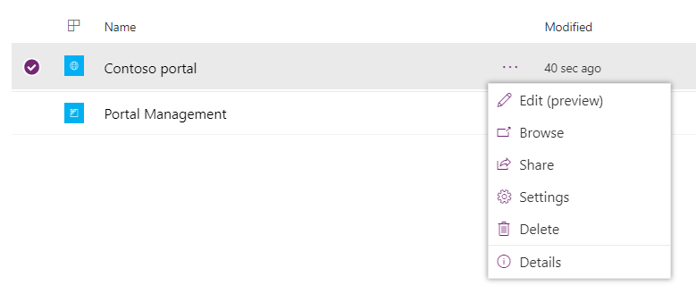
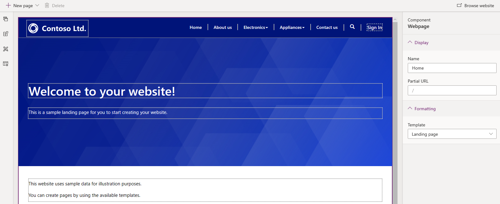
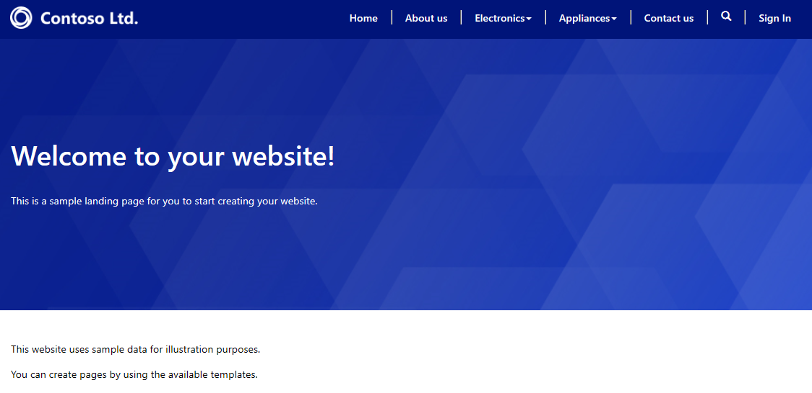
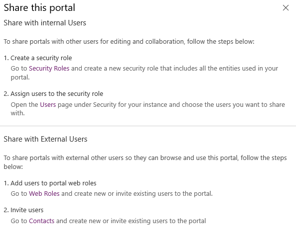
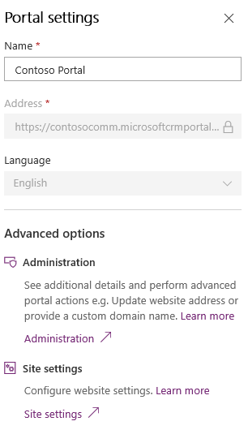
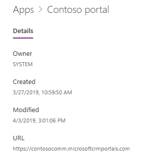

# Manage existing portals

Once you've created a portal, it's visible when you sign in to [Power Apps](https://make.powerapps.com), and then select **Apps**.

  

To manage an app, select **More Commands** (**…**) for the portal and choose an action from the context menu. Alternatively, you can also select action from the menu at the top.

  

## Edit

Opens the [Power Apps portals Studio](portal-designer-anatomy.md) to edit the content and components of the portal.  

  

Portals Studio requires a contact record with the email address `portaluser@powerappsportals.com` for some of its functionality to work. This contact record is automatically created when you edit the portal for the first time.

If you've one or more fields for the Contact table set as required, or any business logic such as synchronous plug-ins or workflows to restrict contact creation, this contact record creation may fail with the following error message:

`Contact creation failed`  
`A contact with an email address portaluser@powerappsportals.com must be created before you can edit your portal. Please create this contact manually.`

When you see this error message, create a contact record manually with the email address `portaluser@powerappsportals.com`.

## Browse

Opens the portal to browse the website. This option helps you to see the portal as it will look to your customers.

> [!div class=mx-imgBorder]
>   

Alternately, you can also open the portal to browse the website by selecting **Browse website** in the [Power Apps portals Studio](portal-designer-anatomy.md) to view the changes you have made to the website. The website opens in a new tab with URL of the website.

## Share

Share your portal with internal or external users. Follow the steps mentioned in the **Share this portal** pane.

  

### Share with internal users

To share the portal with internal users, you must first create a security role and then assign users to the security role so they can use the portal.

> [!NOTE]
> As a user in Microsoft Dataverse, if you do not have appropriate privileges on portal tables, you might see errors such as “You do not have access to view solutions in this environment.” or “You do not have access to view Website in this environment”. It is recommended that you are in a System Administrator security role in the corresponding Dataverse database.

#### Step 1: Create a security role

1.  In the **Share this portal** pane, under **Create a security role**, select **Security Roles**. A list of all the configured security roles is displayed.

2.  On the Actions toolbar, select **New**.

3.  In the **New Security Role** window, enter the role name.

4.  Set the privileges for all the tables used in your portal.

5.  When you have finished configuring the security role, on the toolbar, select **Save and Close**.

For information on security roles and privileges, see [Security roles and privileges](/power-platform/admin/security-roles-privileges).

#### Step 2: Assign users to the security role

1.  In the **Share this portal** pane, under **Assign users to the security role**, select **Users**. A list of all users is displayed.

2.  Select the user that you want to assign a security role to.

3.  Select **Manage Roles**.

    > [!NOTE]
    > If you are unable to see the **Manage Roles** button on the command bar, you must change the client by setting forceUCI to 0 in the URL. For example, https://&lt;org\_url&gt;/main.aspx?pagetype=entitylist&etn=systemuser&forceUCI=0

4.  In the **Manage User Roles** dialog box, select the security role that you created earlier, and then select **OK**.

### Share with external users

Your portal should work anonymously and should be accessible by the external users. If you want to try advanced capabilities for managing roles and permissions for external users, see [Configure a contact for use on a portal](configure/configure-contacts.md), [Invite contacts to your portals](configure/invite-contacts.md), [Create web roles for portals](configure/create-web-roles.md), [Assign table permissions](configure/assign-entity-permissions.md).  

## Settings

Displays the portal settings and allows you to change the name of the portal. You can also do advanced actions such as administering the portal though the Power Apps portals admin center and working with site settings. Settings provide links to the Power Apps portals admin center and Site settings. More information: [Advanced portal administration](admin/admin-overview.md) and [Configure site settings](configure/configure-site-settings.md).  

  

## Delete

Deletes the portal and hosted resources. When you delete a portal, its URL becomes inaccessible. Deleting a portal doesn't affect any portal configurations or solutions present in your environment, and they'll remain as-is.
If you want to remove the portal configurations from your environment completely, delete the portal configurations manually. To delete, use the Portal Management app, and delete the corresponding website record for the portal.

> [!NOTE]
> - If you don't have sufficient privileges to delete a portal, following error is displayed.   `Permission denied`  
`You do not have sufficient privileges to delete the portal [Name] portal.`   You must have the System Administrator role to delete a portal. Also, you must be the owner of the portal application in Azure Active Directory. The user who creates the portal is by default the owner and can delete a portal. For information on adding yourself as an owner, see [Add yourself as an owner of the Azure AD application](admin/admin-overview.md#add-yourself-as-an-owner-of-the-azure-ad-application).
> - When you delete a portal, and create a new portal with a different URL, the authentication provider configuration must be configured for the new portal to work correctly. To configure the authentication provider, go to [Get started with authentication configuration](configure/use-simplified-authentication-configuration.md).

### Completely delete a portal

To learn about how to delete a portal completely, go to [Delete a portal](admin/reset-portal.md#delete-a-portal).

## Details

Displays details such as owner of the portal, date, and time when it was created and last modified, the URL of the portal, and identity provider settings.

  

## Next steps

[Power Apps portals Studio](portal-designer-anatomy.md)

## See also

[Understand how portals connects to Microsoft Dataverse environment](admin/connectivity.md)  
[Understand and clear server-side cache in portals](admin/clear-server-side-cache.md)

[!INCLUDE[footer-include](../../includes/footer-banner.md)]
