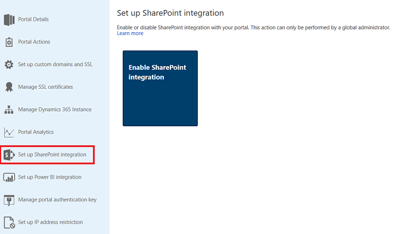
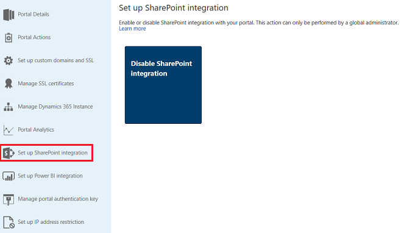
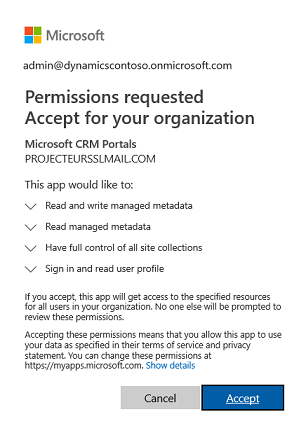
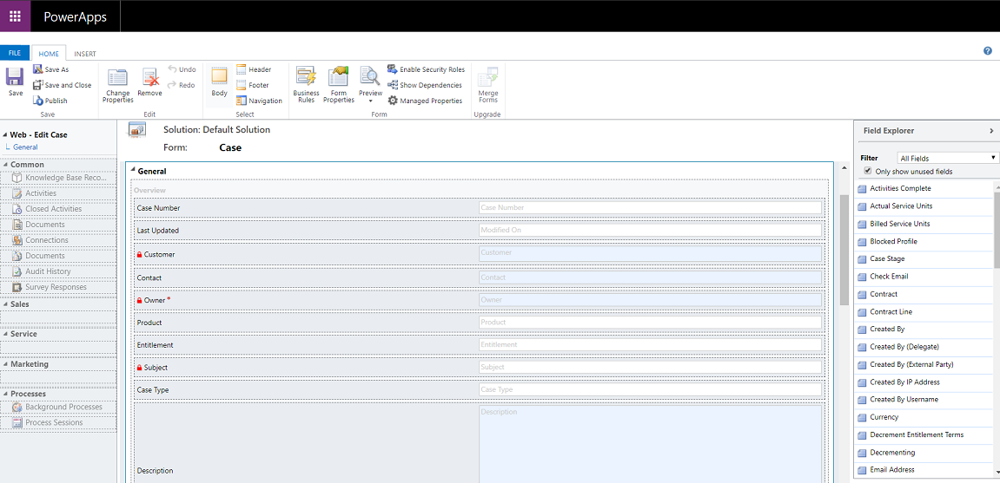
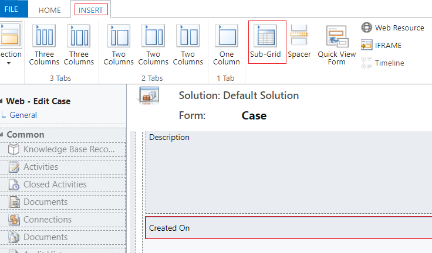
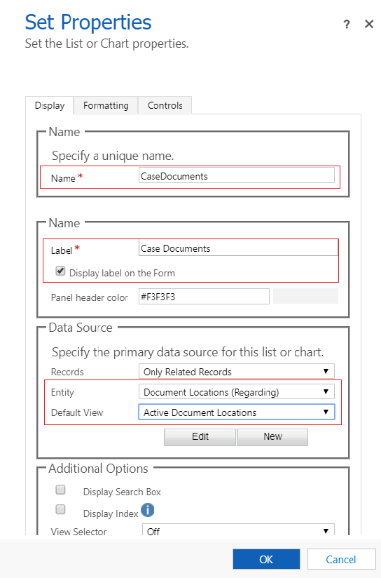
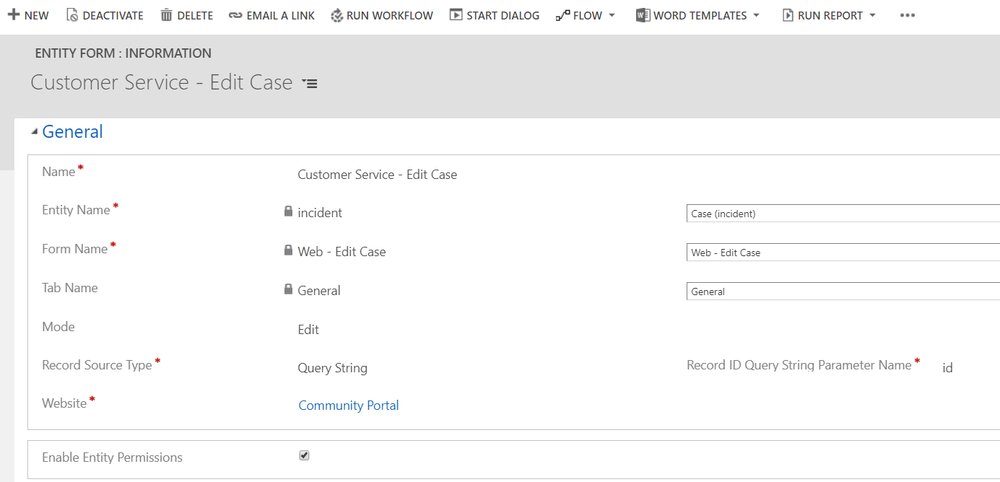
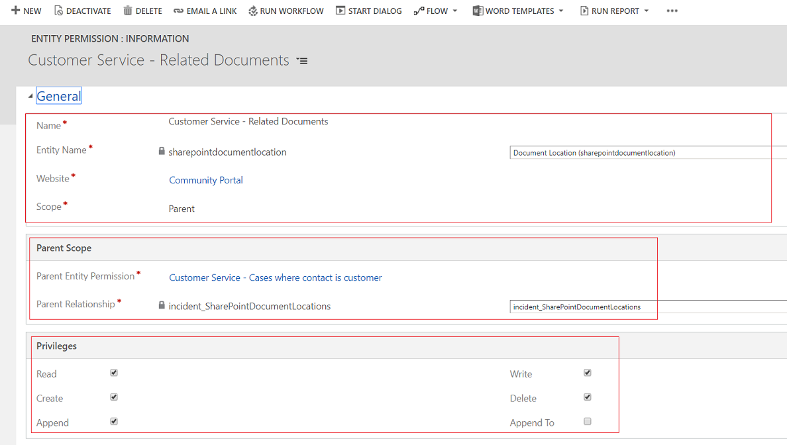
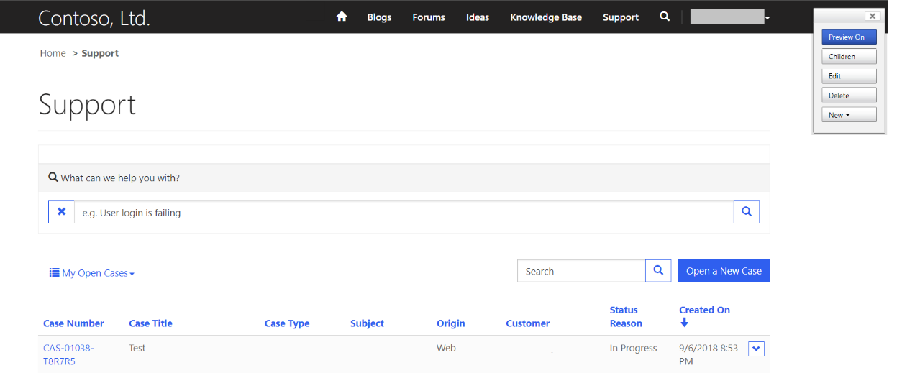
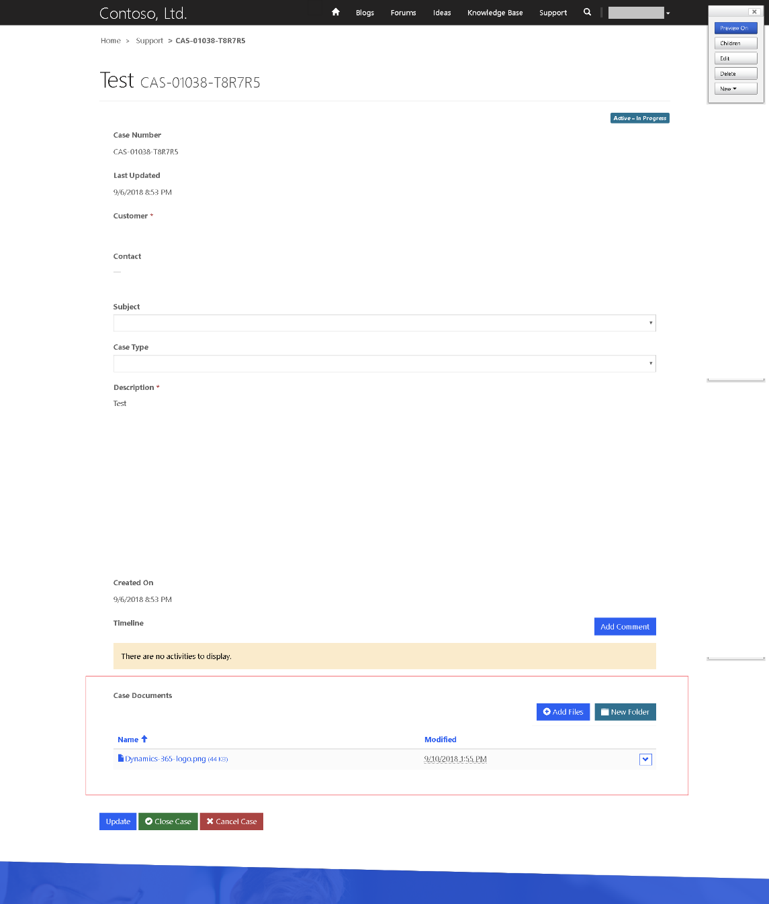

# Manage SharePoint documents

Common Data Service supports integration with [!INCLUDE[pn-microsoft-sharepoint-online](../../includes/pn-microsoft-sharepoint-online.md)] that enables you to use the document management capabilities of [!INCLUDE[pn-sharepoint-short](../../includes/pn-sharepoint-short.md)] from within Common Data Service. Power Apps portals now supports uploading and displaying documents to and from [!INCLUDE[pn-sharepoint-short](../../includes/pn-sharepoint-short.md)] directly on an entity form or web form in a portal. This allows portal users to view, download, add, and delete documents from a portal. Portal users can also create subfolders to organize their documents.

> [!NOTE]
> - Document management works only with [!INCLUDE[pn-microsoft-sharepoint-online](../../includes/pn-microsoft-sharepoint-online.md)].
> - Document management is supported with server-based integration.

To work with the document management capabilities of [!INCLUDE[pn-sharepoint-short](../../includes/pn-sharepoint-short.md)] from within Common Data Service, you must:

1.	[Enable document management functionality in model-driven apps in Dynamics 365](#step-1-enable-document-management-functionality-in-model-driven-apps-in-dynamics-365)

2.	[Set up SharePoint integration from Power Apps Portals admin center](#step-2-set-up-sharepoint-integration-from-power-apps-portals-admin-center)

3.	[Enable document management for entities](#step-3-enable-document-management-for-entities)

4.	[Configure the appropriate form in Power Apps documents](#step-4-configure-the-appropriate-form-to-display-documents)

5.	[Create appropriate entity permission and assign it to the appropriate web role](#step-5-create-appropriate-entity-permission-and-assign-it-to-the-appropriate-web-role)

## Step 1: Enable document management functionality in model-driven apps in Dynamics 365

You must enable the document management functionality in model-driven apps in Dynamics 365 by using server-based [!INCLUDE[pn-sharepoint-short](../../includes/pn-sharepoint-short.md)] integration. Server-based [!INCLUDE[pn-sharepoint-short](../../includes/pn-sharepoint-short.md)] integration allows model-driven apps in Dynamics 365 and [!INCLUDE[pn-microsoft-sharepoint-online](../../includes/pn-microsoft-sharepoint-online.md)] to perform a server-to-server connection. The default [!INCLUDE[pn-sharepoint-short](../../includes/pn-sharepoint-short.md)] site record is used by the portal. For information on how to enable document management functionality in model-driven apps in Dynamics 365, see [Set up model-driven apps in Dynamics 365 to use SharePoint Online](https://docs.microsoft.com/power-platform/admin/set-up-dynamics-365-online-to-use-sharepoint-online).

## Step 2: Set up SharePoint integration from Power Apps Portals admin center

To use the document management capabilities of [!INCLUDE[pn-sharepoint-short](../../includes/pn-sharepoint-short.md)], you must enable [!INCLUDE[pn-sharepoint-short](../../includes/pn-sharepoint-short.md)] integration from the Power Apps Portals admin center.

> [!NOTE]
> You must be a global administrator to perform this action.

1. Open [Power Apps Portals admin center](admin/admin-overview.md).

2.	Go to **Set up [!INCLUDE[pn-sharepoint-short](../../includes/pn-sharepoint-short.md)] integration** > **Enable [!INCLUDE[pn-sharepoint-short](../../includes/pn-sharepoint-short.md)] integration**.

    > [!div class=mx-imgBorder]
    > 

3.	Select **Enable** in the confirmation window. This will enable the portal to communicate with [!INCLUDE[pn-sharepoint-short](../../includes/pn-sharepoint-short.md)]. While the [!INCLUDE[pn-sharepoint-short](../../includes/pn-sharepoint-short.md)] integration is being enabled, the portal restarts and will be unavailable for a few minutes. A message appears when [!INCLUDE[pn-sharepoint-short](../../includes/pn-sharepoint-short.md)] integration is enabled.

When [!INCLUDE[pn-sharepoint-short](../../includes/pn-sharepoint-short.md)] integration is enabled, the following action becomes available:

- **Disable [!INCLUDE[pn-sharepoint-short](../../includes/pn-sharepoint-short.md)] integration**: Allows you to disable the [!INCLUDE[pn-sharepoint-short](../../includes/pn-sharepoint-short.md)] integration with your portal. While the [!INCLUDE[pn-sharepoint-short](../../includes/pn-sharepoint-short.md)] integration is being disabled, the portal restarts and will be unavailable for a few minutes. A message appears when [!INCLUDE[pn-sharepoint-short](../../includes/pn-sharepoint-short.md)] integration is disabled.

    > [!div class=mx-imgBorder]
    > 

Enabling or disabling the [!INCLUDE[pn-sharepoint-short](../../includes/pn-sharepoint-short.md)] integration will update the [!INCLUDE[pn-azure-active-directory](../../includes/pn-azure-active-directory.md)] ([!INCLUDE[pn-azure-shortest](../../includes/pn-azure-shortest.md)] AD) application for the portal and add or remove the required [!INCLUDE[pn-sharepoint-short](../../includes/pn-sharepoint-short.md)] permissions, respectively. You will also be redirected to provide your consent for the changes to be made in the [!INCLUDE[pn-azure-shortest](../../includes/pn-azure-shortest.md)] AD application. 

> [!div class=mx-imgBorder]
> 

If you do not provide your consent:

- Enabling or disabling the [!INCLUDE[pn-sharepoint-short](../../includes/pn-sharepoint-short.md)] integration will not be complete and an error message will display.

- Your out-of-the-box [!INCLUDE[pn-azure-shortest](../../includes/pn-azure-shortest.md)] AD login on the portal will not work. 

## Step 3: Enable document management for entities
You must enable document management for entities to store documents related to entity records in [!INCLUDE[pn-sharepoint-short](../../includes/pn-sharepoint-short.md)]. For information on how to enable document management for entities, see [Enable SharePoint document management for specific entities](https://docs.microsoft.com/dynamics365/customer-engagement/admin/enable-sharepoint-document-management-specific-entities).

## Step 4: Configure the appropriate form to display documents

### Power Apps customization

Identify the form where you want to use document management capabilities. You must edit the form by using model-driven app form editor and add a subgrid to it. The subgrid adds a section to the form, which allows you to work with documents from within a portal. You must set the following properties in the subgrid for this feature to work:

- Under **Data Source**, select **Document Locations** from the **Entity** list.

- Under **Data Source**, select **Active Document Locations** from the **Default View** list.

You can specify name and label as per your requirement. Save and publish the form once the subgrid is added and configured.

> [!NOTE]
> Document management must be enabled for the entity for which you edit the form. More information: [Enable document management for entities](#step-3-enable-document-management-for-entities)

### Power Apps portals configuration

Apart from the standard configuration required for entity form or web form, you must set the following properties to enable document management:

- **Entity Name** and **Form Name**: Enter the entity and form names customized in the previous step, respectively.

- Select the **Enable Entity Permission** check box on the form to allow a user to read the documents.

- Set the **Mode** to **Edit** to allow document uploads.

> [!NOTE]
> Document uploading requires the parent entity record to exist. If you set the Mode to Insert, the document upload will not work because the parent entity record is not created until the form is submitted.

## Step 5: Create appropriate entity permission and assign it to the appropriate web role

Two entity permission records are required to establish the necessary access to view and upload documents.

- Permissions on the entity of the entity or web form: 
    - Create an **Entity Permission** record specifying the **Entity Name** as the entity of the entity form or web form configured previously. 
    - Select a **Scope** and scope relationship that is appropriate to the desired behavior of the form. 
    - Enable **Read** and **Append To** privileges to allow read access to documents and optionally enable **Write** privilege to allow document uploads. Ignore the **Child Entity Permissions** section for now since it will be populated by the next step.
- Permissions on the **Document Location** with **Parent scope** referring to the previous permission record: 
    - Create an **Entity Permission** record specifying the **Entity Name** as **Document Location** entity with **Scope** set to **Parent**. 
    - Select the Parent Entity Permission to the entity permission record created in previous step. 
    - Privileges 
        - The minimum privileges to allow read access to documents are **Read**, **Create**, and **Append**. 
        - Include **Write** privileges for document upload access. 
        - Include **Delete** to allow deletion of a document.

> [!NOTE]
> A corresponding child entity permission on the **Document Location** entity needs to be created for each instance of the parent entity permission record that exists on the entity of the entity or web form where documents need to be shown.

## Configure file upload size

By default, the file size is set to 10 MB. However, you can configure the file size to a maximum of 50 MB by using the site setting `SharePoint/MaxUploadSize`.

## Sample configuration to enable document management on the Case entity form

The below example demonstrates configuration using the Case entity which needs the Dynamics 365 Customer Service application as a pre-requisite. Although this sample uses the Case entity, it is just an illustration of the steps mentioned above and can be followed with any other custom entity or any Common Data Service entity that supports managing documents in SharePoint. 

1.	Follow the instructions in [Step 1](#step-1-enable-document-management-functionality-in-model-driven-apps-in-dynamics-365) to ensure that server-based configuration is complete for model-driven apps in Dynamics 365 and [!INCLUDE[pn-sharepoint-short](../../includes/pn-sharepoint-short.md)] integration.

2.	Follow the instructions in [Step 2](#step-2-set-up-sharepoint-integration-from-power-apps-portals-admin-center) to ensure that the portal has permissions to integrate with [!INCLUDE[pn-sharepoint-short](../../includes/pn-sharepoint-short.md)]. 

3.	Follow the instructions in [Step 3](#step-3-enable-document-management-for-entities) to ensure Document Management is enabled for the Case entity.

4.	Follow the instructions in [Step 4](#step-4-configure-the-appropriate-form-to-display-documents) with the following configurations:

    - Model-driven apps in Dynamics 365 customization

        a. Go to **Settings** > **Customization** > **Customize the System**. 

        b. In the **Default Solution**, go to the **Case** entity > **Forms**. 
    
        c. Open the **Web – Edit Case** in form editor.

         > [!div class=mx-imgBorder]
         > 
    
        d. Select the **Created On** field on the form, and on the **Insert** tab, select **Sub-Grid**.

         > [!div class=mx-imgBorder]
         > 
    
        e. In the **Set Properties** dialog box, set the following properties, and select **OK**:

         - **Name** (This can be any name): CaseDocuments 
    
         - **Label** (This can be any label name): Case Documents 
      
         - **Entity**: Document Locations 
    
         - **Default View**: Active Document Locations

         > [!div class=mx-imgBorder]
         > 

        f. In the form editor, select **Save** and then select **Publish**.

    - Power Apps portals configuration

        a. Go to **Portals** > **Entity Forms**.
    
        b. Find and open **Customer Service - Edit Case** entity form.
    
        c. Review and ensure the following properties are set:
    
         - **Entity Name**: Case (incident)
    
         - **Form Name**: Web – Edit Case
    
         - **Mode**: Edit
    
         - **Entity Permission**: Enabled
    
         > [!div class=mx-imgBorder]
         > 
    
        d. If you’ve made any changes to the form, select **Save**.

5. Follow [Step 5](#step-5-create-appropriate-entity-permission-and-assign-it-to-the-appropriate-web-role
) to make sure entity permissions are granted to the users.

   1. Go to the **Web Role** record that is associated to the user. For this sample, we’ll assume that the user has an Administrator web role.

   2. Ensure that an Entity Permission record exists by the name of **Customer Service - Cases where contact is customer**. 

      > [!NOTE]
      > Ensure that your web role has this entity permission added. If your user is already an Administrator, then the above entity permission need not be explicitly assigned.

   3. Create a new entity permission, enter the following details, and select **Save**:

    - **Name** (This can be any name): Customer Service - Related Documents

    - **Entity Name**: Document Location
        
    - **Scope**: Parent
        
    - **Parent Entity Permission**: Customer Service - Cases where contact is customer
        
    - **Parent Relationship**: incident_SharePointDocumentLocations
        
    - **Privileges**: Read, Create, Append, Write, Delete

      > [!div class=mx-imgBorder]
      > 
  
   4. Sign in to portal to ensure document management is enabled for the Case entity.

      a. Go to the **Support** page.

      > [!div class=mx-imgBorder]
      > 

      b. Click on an existing Case record from the list. Go to the **Case Documents** section on the page and see the document list added.

      > [!div class=mx-imgBorder]
      > 

