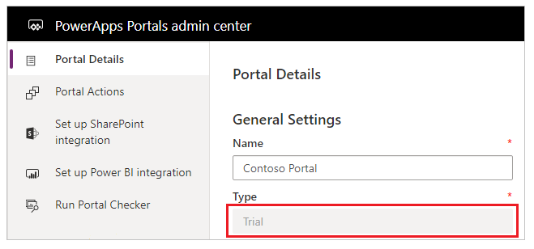

# What are Power Apps portals?

Power Apps makers can now create a powerful new type of experience: external-facing websites that allow users outside their organizations to sign in with a wide variety of identities, create and view data in Microsoft Dataverse, or even browse content anonymously. The full capabilities of Dynamics 365 Portals, previously offered only as an add-on to customer engagement apps (Dynamics 365 Sales, Dynamics 365 Customer Service, Dynamics 365 Field Service, Dynamics 365 Marketing, and Dynamics 365 Project Service Automation), are now available standalone in Power Apps.  

These capabilities feature a revamped end-to-end experience for makers to quickly create a website and customize it with pages, layout, and content. Makers can reuse page designs through templates, add forms and views to display key data from Dataverse, and publish to users.

## Power Apps portals, Dynamics 365 Portals, and add-on portals

After the launch of Power Apps portals on October 1, 2019, all Dynamics 365 Portals are now referred to as **Power Apps portals**.

One of the major changes introduced to portals after October 1, 2019 is the licensing model. Before this, portals were licensed add-ons to Dynamics 365 apps while certain Dynamics 365 licenses included a default portal add-on. As of October 1, 2019, portals are [licensed based on usage](/power-platform/admin/powerapps-flow-licensing-faq#can-you-share-more-details-regarding-the-new-power-apps-portals-licensing), or capacity. All previously existing portals must become part of a transition period based on current customer contract, after which they're required to be converted to a new licensing model.

You can check the type of a portal from the [Power Apps portals admin center](./admin/admin-overview.md):

Additional differences between Power Apps portals with capacity-based licenses and add-on licenses include:

- For add-on portals, an 'add-on' suffix is included to the portal type. For example, a production add-on portal type is listed as 'Production (add-on)'.
- Power Apps portals have a [different caching mechanism](admin/clear-server-side-cache.md) in comparison to portals with add-on licenses.
- The provisioning method is different for portals with capacity-based licenses than add-on licenses.

You can create a Power Apps portal with a capacity-based license using the steps described in the following articles:

- [Create a Dataverse starter portal](create-portal.md)
- [Create a portal with Dynamics 365 environment](create-dynamics-portal.md)

To create a Power Apps portal with an add-on license, see [provisioning a portal using the older portal add-on](provision-portal-add-on.md).

For more on the differences between add-on licenses and capacity-based licenses, see the [Power Apps portals licensing FAQ](/power-platform/admin/powerapps-flow-licensing-faq#what-is-the-difference-between-power-apps-portals-and-dynamics-365-portals-in-terms-of-licensing).

## Next steps

[Creating a starter portal](create-portal.md)

### See also

[Terminology changes in Power Apps portals](terminology-changes.md)  
[Microsoft Learn: Get started with Power Apps portals](/learn/paths/get-started-power-apps-portals/)  
[Power Apps portals lifecycle](admin/portal-lifecycle.md)  
[Available portal templates](portal-templates.md)  
[Portals connectivity to a Microsoft Dataverse environment](admin/connectivity.md)  
[Server-side cache in portals](admin/clear-server-side-cache.md)

[!INCLUDE[footer-include](../../includes/footer-banner.md)]
