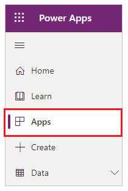
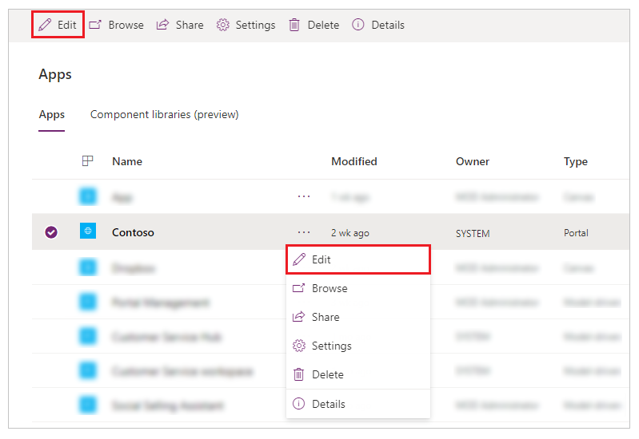
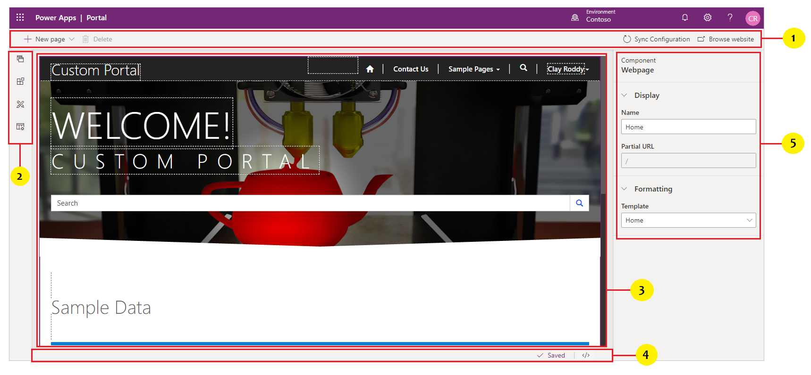

# Power Apps portals Studio

You can use Power Apps portals Studio to create and customize your website. It contains various options to add and configure webpages, components, forms, and lists.

## Open portals Studio

To open Power Apps portals Studio:

1. Go to [Power Apps](https://make.powerapps.com).

1. Select **Apps** from the left pane.

    

1. Select your portal.

1. Select **Edit**.

    

## Understand portals Studio

The anatomy of Power Apps portals Studio is as follows:

  

| **Annotation** | **Name**        | **Description**                                                                              |
|----------------|-----------------|----------------------------------------------------------------------------------------------|
| 1              | Command bar     | Allows you to: <ul> <li> Create a webpage. </li> <li> Delete a component. </li> <li> Sync Configuration - synchronizes the latest portal configuration changes in Microsoft Dataverse database with your current Studio session. For example, use *Sync Configuration* to reflect the changes in Studio when using the Portal Management app to change the configuration of pages, forms or any other objects. </li> <li> Browse website - clears the portal cache and opens the current portal page. </li></ul>  |
| 2              | Toolbelt        | Allows you to:<ul><li>View and manage webpages</li><li>Add components</li><li>Edit templates</li></ul>  |
| 3              | Canvas          | Contains components that build a webpage.                                                    |
| 4              | Footer          | Displays autosave status and allows you to open-source code editor.                         |
| 5              | Properties pane | Displays properties of webpage and selected components and lets you edit them as required. |

> [!NOTE]
> - Editing a portal through Power Apps portals Studio will temporarily cause poor portal performance due to multiple background processes. For example, the clear cache process runs and reloads data from Microsoft Dataverse.
> - Power Apps portals Studio only supports editing in the language selected while provisioning the portal. For help with creating portals in additional languages, see [Create additional portals in an environment](create-additional-portals.md).

## Next steps

[Create and manage webpages](create-manage-webpages.md)

### See also

[Customize webpages](compose-page.md)

[!INCLUDE[footer-include](../../includes/footer-banner.md)]