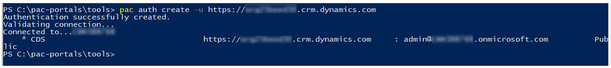
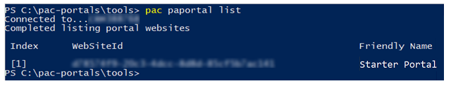
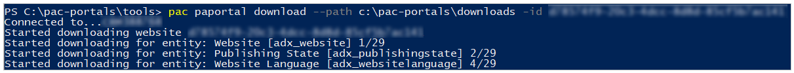
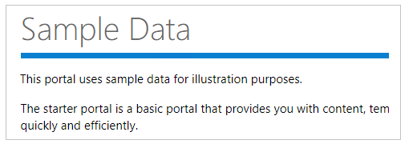
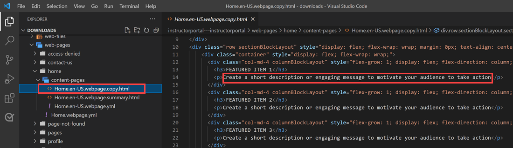
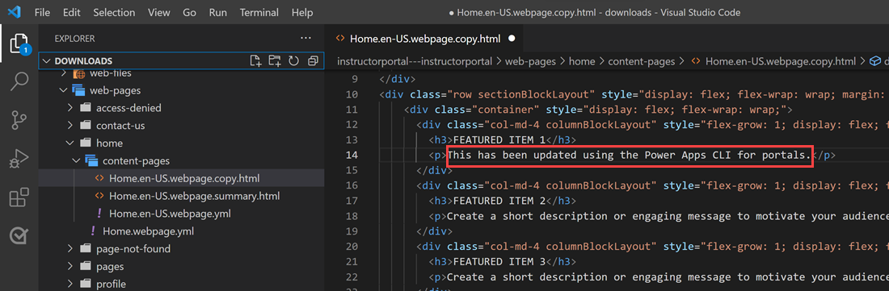
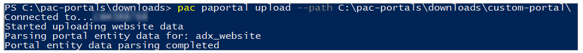
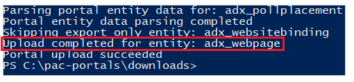

# Tutorial: Use Microsoft Power Platform CLI with portals

[This article is pre-release documentation and is subject to change.]

In this tutorial example, you’ll see how to get started with Microsoft Power Platform CLI to update sample portals configuration.

> [!NOTE]
> This tutorial focuses on the required Microsoft Power Platform CLI commands for
Power Apps portals use. For more information about commands used in Power Apps
CLI, read [Common
commands](../../developer/data-platform/powerapps-cli.md#common-commands).

> [!IMPORTANT]
> - This is a preview feature.
> - [!INCLUDE[cc_preview_features_definition](../../includes/cc-preview-features-definition.md)]

## Download and install Visual Studio Code

To connect to Power Apps portals, and to use Microsoft Power Platform CLI commands, use
[Visual Studio Code](https://code.visualstudio.com/docs) and the [integrated
terminal](https://code.visualstudio.com/docs/editor/integrated-terminal). The
integrated terminal makes it easy to connect to the Dataverse environment and to
download, change, and upload the portals configuration. You can also use Windows
PowerShell instead.

## Step 1: Authenticate

Before you connect, list, download, or upload any changes for a Power Apps
portal, you must authenticate to the Dataverse environment first. For more
information about authentication using Microsoft Power Platform CLI, go to [Microsoft Power Platform CLI –
Auth](../../developer/data-platform/cli/reference/auth-command.md).

To authenticate, open Windows PowerShell and run the following command using
your Dataverse environment URL:

`pac auth create -u [Dataverse URL]`

**Example**

`pac auth create -u https://contoso-org.crm.dynamics.com`

Follow the prompts of authentication to sign in to the environment.

## Step 2: List available portals

Use the **list** command to list the available Power Apps portals in the
Dataverse environment you connected to in the previous step.

`pac paportal list`

## Step 3: Download portals content

Download portal website content from the connected Dataverse environment.

`pac paportal download --path [PATH] -id [WebSiteId-GUID]`

**Example**

`pac paportal download --path c:\pac-portals\downloads -id
d44574f9-acc3-4ccc-8d8d-85cf5b7ad141`

For the **id** parameter, use the **WebSiteId** returned from the output of the
previous step.

## Step 4: Change portals content

Change the configuration using Visual Studio Code and save your changes.

> [!NOTE]
> Ensure you update only the supported tables for use with Power Apps
CLI. For more information, see [Supported tables](power-apps-cli.md#supported-tables).

For example, the default portal page shows text such as this:

This text is visible from the webpage html:

You can alter this text and save the changes:

> [!TIP]
> You can change the location of the folder path in PowerShell/integrated
terminal to the downloaded location, and enter “*code .”* to open the folder
directly in Visual Studio Code.

## Step 5: Upload the changes

After making the required changes, upload them using the following command:

`pac paportal --path [Folder-location]`

**Example**

`pac paportal upload --path C:\pac-portals\downloads\custom-portal\`

> [!NOTE]
> Ensure the path for the portals content you entered is correct. By
default, a folder named by the portal (friendly name) is created with downloaded
portals content. For example, if the portal’s friendly name is *custom-portal,*
the path for the above command (--path) should be
*C:\\pac-portals\\downloads\\custom-portal*.

The upload only happens for content that's been changed. In this example, since the
change is made to a webpage, content is uploaded only for the adx_webpage
table.

## Step 6: Confirm the changes

To confirm the changes made to the portal webpage:

1.  Clear the [server-side
    cache](admin/clear-server-side-cache.md),
    or use [Sync
    Configuration](portal-designer-anatomy.md)
    by using Power Apps portals Studio.

2.  Browse to the portal webpage to see the change.

    

This concludes the tutorial. You can repeat the above steps and change the
portals content for other [supported tables](power-apps-cli.md#supported-tables).

## Next steps

[Overview of portals support for Microsoft Power Platform CLI](power-apps-cli-tutorial.md)

### See also

- [Microsoft Power Platform CLI](../../developer/data-platform/powerapps-cli.md)
- [Use the Visual Studio Code extension (preview)](vs-code-extension.md)

