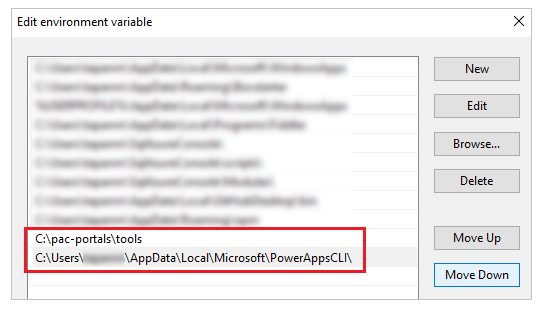
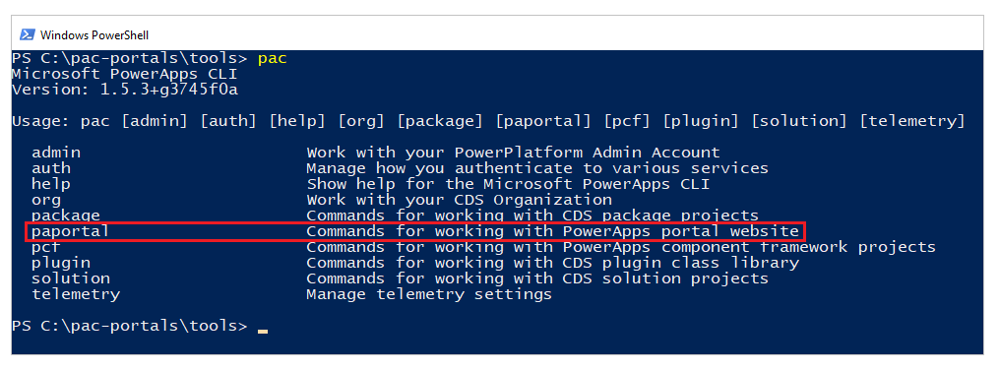

# Portals support for Power Apps CLI

Microsoft Power Apps CLI (Command Line Interface) is a simple, single-stop
developer command-line interface that empowers developers and app makers to
create code components.

Power Apps CLI tooling is the first step toward a comprehensive application
life-cycle management (ALM) story where the enterprise developers and ISVs can
create, build, debug, and publish their extensions and customizations quickly
and efficiently. More information: [What is Microsoft Power Apps
CLI?](../../developer/data-platform/powerapps-cli.md)

With this feature (currently in Private Preview), Microsoft Power Apps portals
supports Power Apps CLI to enable CI/CD (Continuous Integration/Continuous
Deployment) of portal configuration. You can now check-in the portal
configuration to source control and move portal configuration to any environment
using Power Apps CLI.

## Benefits of portal development using Power Apps CLI

With portals support for Power Apps CLI, you can now use offline-like capability
for portals customization by making changes to the portals content. And once all
customizations or changes are saved, upload them to the portal. When you
download portals content using Power Apps CLI, the content is structured in JSON
and HTML formats making it easy to customize, enabling a pro-development
experience.

Here's a list of features and capabilities that portals benefits from with the
support for Power Apps CLI:

### Ease of use

-   Support for download/upload of portal data to/from local file system.

-   Build on existing Power Apps CLI tool.

### Lifecycle Management (ALM)

-   Track changes to portal configuration within an org.

-   Move configuration files across organizations, or tenants.

### Pro-dev and enterprise support

-   Helps integrate seamlessly with any source control tools, such as “git”.

-   Easily setup CI/CD pipelines.

## Prerequisites

Before using Power Apps CLI commands for portals, ensure your portal is
configured to enable support for this feature.

## Install Power Apps CLI

For a step-by-step instructions, please refer to [Install Power Apps
CLI](../../developer/data-platform/powerapps-cli.md#install-power-apps-cli).

## Supported entities

Portals support for Power Apps CLI is limited to the entities listed below.

:::row:::
   :::column span="":::
      adx_contentaccesslevel
   :::column-end:::
   :::column span="":::
      adx_contentsnippet
   :::column-end:::
   :::column span="":::
      adx_entityform
   :::column-end:::
:::row-end:::
:::row:::
   :::column span="":::
      adx_entityformmetadata
   :::column-end:::
   :::column span="":::
      adx_entitylist
   :::column-end:::
   :::column span="":::
      adx_entitypermission
   :::column-end:::
:::row-end:::
:::row:::
   :::column span="":::
      adx_entitypermission_webrole
   :::column-end:::
   :::column span="":::
      adx_externalidentity
   :::column-end:::
   :::column span="":::
      adx_pagealert
   :::column-end:::
:::row-end:::
:::row:::
   :::column span="":::
      adx_pagenotification
   :::column-end:::
   :::column span="":::
      adx_pagetag
   :::column-end:::
   :::column span="":::
      adx_pagetag_webpage
   :::column-end:::
:::row-end:::
:::row:::
   :::column span="":::
      adx_pagetemplate
   :::column-end:::
   :::column span="":::
      adx_portallanguage
   :::column-end:::
   :::column span="":::
      adx_publishingstate
   :::column-end:::
:::row-end:::
:::row:::
   :::column span="":::
      adx_publishingstatetransitionrule
   :::column-end:::
   :::column span="":::
      adx_publishingstatetransitionrule_webrole
   :::column-end:::
   :::column span="":::
      adx_redirect
   :::column-end:::
:::row-end:::
:::row:::
   :::column span="":::
      adx_setting
   :::column-end:::
   :::column span="":::
      adx_shortcut
   :::column-end:::
   :::column span="":::
      adx_sitemarker
   :::column-end:::
:::row-end:::
:::row:::
   :::column span="":::
      adx_sitesetting
   :::column-end:::
   :::column span="":::
      adx_webfile
   :::column-end:::
   :::column span="":::
      adx_webfilelog
   :::column-end:::
:::row-end:::
:::row:::
   :::column span="":::
      adx_webform
   :::column-end:::
   :::column span="":::
      adx_webformmetadata
   :::column-end:::
   :::column span="":::
      adx_webformsession
   :::column-end:::
:::row-end:::
:::row:::
   :::column span="":::
      adx_webformstep
   :::column-end:::
   :::column span="":::
      adx_weblink
   :::column-end:::
   :::column span="":::
      adx_weblinkset
   :::column-end:::
:::row-end:::
:::row:::
   :::column span="":::
      adx_webnotificationentity
   :::column-end:::
   :::column span="":::
      adx_webnotificationurl
   :::column-end:::
   :::column span="":::
      adx_webpage
   :::column-end:::
:::row-end:::
:::row:::
   :::column span="":::
      adx_webpage_tag
   :::column-end:::
   :::column span="":::
      adx_webpageaccesscontrolrule
   :::column-end:::
   :::column span="":::
      adx_webpageaccesscontrolrule_webrole
   :::column-end:::
:::row-end:::
:::row:::
   :::column span="":::
      adx_webpagehistory
   :::column-end:::
   :::column span="":::
      adx_webpagelog
   :::column-end:::
   :::column span="":::
      adx_webrole_systemuser
   :::column-end:::
:::row-end:::
:::row:::
   :::column span="":::
      adx_website
   :::column-end:::
   :::column span="":::
      adx_website_list
   :::column-end:::
   :::column span="":::
      adx_website_sponsor
   :::column-end:::
:::row-end:::
:::row:::
   :::column span="":::
      adx_websiteaccess
   :::column-end:::
   :::column span="":::
      adx_websiteaccess_webrole
   :::column-end:::
   :::column span="":::
      adx_websitebinding
   :::column-end:::
:::row-end:::
:::row:::
   :::column span="":::
      adx_websitelanguage
   :::column-end:::
   :::column span="":::
      adx_webtemplate
   :::column-end:::
   :::column span="":::
      adx_urlhistory
   :::column-end:::
:::row-end:::

> [!IMPORTANT]
> Custom entities and portal template-specific entities (such as
blog, community, or ideas portal) are not supported for customization using
Power Apps CLI.

## Install Power Apps CLI for portals

During this private preview period, you’ll have to download and install the
Power Apps CLI package separately instead of the publicly (and generally)
available package. The private preview CLI package includes portals-specific
command-line support.

To prepare your local machine for the private preview package that includes
Power Apps CLI for portals:

1.  Download the Power Apps CLI package for Power Apps portals for this private
    preview.

2.  Rename the package with the file extension of **.zip**.

3.  Use third-party compression software such as 7-zip to unzip this compressed
    file to a location of your choice. For example, *c:\\pac-portals*.

4.  Update the **PATH** system environment variable, and add a new path for the
    **tools** folder inside the folder that you unzipped the package to. For
    example, *c:\\pac-portals\\tools*.

5.  If you have Power Apps CLI already installed, ensure to move the existing
    Power Apps CLI path below the new path you just added in the previous step.

    

    > [!TIP]
    > Remember to change the order of the environment variable for the publicly available Power Apps CLI after you complete this walkthrough to use
    the CLI for other areas.

6.  Open Windows PowerShell.

7.  Change the directory to the **tools** folder from the unzipped package.

8.  Run *pac* and verify that the output contains “paportal” - the command for
    Power Apps portals.

    

Power Apps CLI commands for portals
===================================

Power Apps CLI command for portals is “*paportal”*.

The following sections provides additional details about different properties of
“*paportal”* command.

Command: list
-------------

Lists all portal websites from the current Microsoft Dataverse environment.

### Example

*pac paportal list*

Command: download
-----------------

Download portal website content from the current Dataverse environment.

### Parameters

| **Name**     | **Description**                                                                                                             |
|--------------|-----------------------------------------------------------------------------------------------------------------------------|
| \--path      | Path where the website content will be downloaded (alias: -p).                                                              |
| \--webSiteId | Portal website id to download (alias: -id).                                                                                 |
| \--overwrite | (Optional) *true* - to overwrite existing content, *false* - to fail if the folder already has website content (alias: -o). |

### Example

*pac paportal download --path "C:\\portals" --webSiteId
f88b70cc-580b-4f1a-87c3-41debefeb902*

Command: upload
---------------

Upload portal website content to the current Dataverse environment.

### Parameters

| **Name** | **Description**                                       |
|----------|-------------------------------------------------------|
| \--path  | Path where the website content is stored (alias: -p). |

### Example

*pac paportal upload --path "C:\\portals\\starter-portal"*

