# Query data using portals Web API (preview)

You can perform [available Web API operations](web-api-overview.md#web-api-operations) in portals. Web API operations consist of HTTP requests and responses. This article shows sample read operations, methods, URI, and the sample JSON you can use in the HTTP GET request.

See also [Portals write, update and delete operations using the Web API](write-update-delete-operations.md).

## Prerequisites

- Enable table and field for Web API operations. More information: [Site settings for the Web API](web-api-overview.md#site-settings-for-the-web-api)

- The portals Web API accesses table records and follows the table permissions given to users through the associated web roles. Ensure you configure table permissions accordingly. More information: [Create web roles](../configure/create-web-roles.md)

## Site setting for Web API read operations

You must configure the site setting **WebAPI/enableReadOperationPreview** and set its value to **True** to enable read operations using portals Web API.

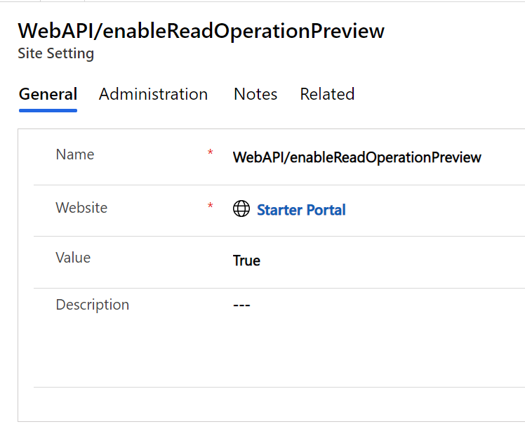

## Query records

This example queries account records.

| **Operation** | **Method** | **URI** |
|-------------------------|-------------------------|-------------------------|
| Retrieve table records | **GET** | [Portal URI]/_api/accounts **Example:** <em>https://contoso.powerappsportals.com/_api/accounts</em> |

**Sample response**

| <em>{</em> <em>"value": [</em> <em>{</em> <em>"@odata.etag": "W/\"1066412\"",</em> <em>"name": "Fourth Coffee (sample)",</em> <em>"accountid": "d2e11ba8-92f6-eb11-94ef-000d3a5aa607"</em> <em>},</em> <em>{</em> <em>"@odata.etag": "W/\"1066413\"",</em> <em>"name": "Litware, Inc. (sample)",</em> <em>"accountid": "d4e11ba8-92f6-eb11-94ef-000d3a5aa607"</em> <em>}</em> <em>]</em> <em>}</em> |
|-------------------------|

Use **$select** and **$top** system query options to return the name property for the first three accounts:

| **Operation** | **Method** | **URI** |
|-------------------------|-------------------------|-------------------------|
| Retrieve first 3 entity records | **GET** | [Portal URI]/_api/accounts?$select=name,revenue&amp;$top=3 **Example:**  [https://contoso.powerappsportals.com/_api/accounts?$select=name,revenue&amp;$top=3](https://contoso.powerappsportals.com/_api/accounts?$select=name,revenue&amp;$top=3) |

Retrieve account by using account ID:

| **Operation** | **Method** | **URI** |
|-------------------------|-------------------------|-------------------------|
| Retrieve specific property for a record | **GET** | [Portal URI]/_api/accounts(e0e11ba8-92f6-eb11-94ef-000d3a5aa607)?$select=name **Example:** <em>https://contoso.powerappsportals.com/_api/accounts(e0e11ba8-92f6-eb11-94ef-000d3a5aa607)?$select=name</em> |

**Sample response**

| { "@odata.etag": "W/\"1066414\"", "name": "Adventure Works (sample)", "accountid": "d6e11ba8-92f6-eb11-94ef-000d3a5aa607" } |
|-------------------------|

## Apply system query options

Each of the system query options you append to the URL for the entity set is added using the syntax for query strings. The first is appended after \[**?**\] and subsequent query options are separated using \[**&**\]. All query options are case-sensitive as shown in the following example.

| **Method** | **URI** |
|-------------------------|-------------------------|
| **GET** | [Portal URI]/_api/accounts?$select=name,revenue&amp;$filter=revenue gt 90000&amp;$top=3 **Example:** <em>https://contoso.powerappsportals.com/_api/accounts?$select=name,revenue&amp;$filter=revenue gt 90000&amp;$top=3</em> |

## Request specific properties

Use the **$select** system query option to limit the properties returned as shown in the following example.

| **Method** | **URI** |
|-------------------------|-------------------------|
| **GET** | [[Portal URI]/_api/accounts?$select=name,revenue&amp;$top=3](https://demo-portal-20210805.powerappsportals.com/_api/accounts?$select=name,revenue&amp;$top=3) **Example:** [https://contoso.powerappsportals.com/_api/accounts?$select=name,revenue&amp;$top=3](https://contoso.powerappsportals.com/_api/accounts?$select=name,revenue&amp;$top=3) |

**IMPORTANT:** This is a performance best practice. If properties aren't specified using $select, all properties will be returned.

## Filter results

Use the **$filter** system query option to set criteria for which rows will be returned.

### Standard filter operators

The Web API supports the standard OData filter operators listed in the following table.

| **Operator**             | **Description**       | **Example**                                                              |
|--------------------------|-----------------------|--------------------------------------------------------------------------|
| **Comparison Operators** |                       |                                                                          |
| eq                       | Equal                 | *$filter=revenue eq 100000*                                              |
| ne                       | Not Equal             | *$filter=revenue ne 100000*                                              |
| gt                       | Greater than          | *$filter=revenue gt 100000*                                              |
| ge                       | Greater than or equal | *$filter=revenue ge 100000*                                              |
| lt                       | Less than             | *$filter=revenue lt 100000*                                              |
| le                       | Less than or equal    | *$filter=revenue le 100000*                                              |
| **Logical Operators**    |                       |                                                                          |
| and                      | Logical and           | *$filter=revenue lt 100000 and revenue gt 2000*                          |
| or                       | Logical or            | *$filter=contains(name,'(sample)') or contains(name,'test')*             |
| not                      | Logical negation      | *$filter=not contains(name,'sample')*                                    |
| **Grouping Operators**   |                       |                                                                          |
| ( )                      | Precedence grouping   | *(contains(name,'sample') or contains(name,'test')) and revenue gt 5000* |

### Standard query functions

The Web API supports these standard OData string query functions:

| **Function** | **Example**                         |
|--------------|-------------------------------------|
| contains     | *$filter=contains(name,'(sample)')* |
| endswith     | *$filter=endswith(name,'Inc.')*     |
| startswith   | *$filter=startswith(name,'a')*      |

## Order results

Specify the order in which items are returned using the **$orderby** system query option. Use the **asc** or **desc** suffix to specify ascending or descending order respectively. The default is ascending if the suffix isn't applied. The following example shows retrieving the name and revenue properties of accounts ordered by ascending revenue and by descending name.

| **Method** | **URI** |
|-------------------------|-------------------------|
| **GET** | [Portal URI]/_api/accounts?$select=name,revenue&amp;$orderby=name asc,revenue desc&amp;$filter=revenue gt 90000 **Example:** <em>https://contoso.powerappsportals.com/_api/accounts?$select=name,revenue&amp;$orderby=name asc,revenue desc&amp;$filter=revenue gt 90000</em> |

## Aggregate and grouping results

By using **$apply,** you can aggregate and group your data dynamically as seen in the following examples.

| **Scenarios**                                                | **Example**                                                                                        |
|--------------------------------------------------------------|----------------------------------------------------------------------------------------------------|
| List of unique statuses in the query                         | *accounts?$apply=groupby((statuscode))*                                                            |
| Aggregate sum of the estimated value                         | *opportunities?$apply=aggregate(estimatedvalue with sum as total)*                                 |
| Average size of the deal based on estimated value and status | *opportunities?$apply=groupby((statuscode),aggregate(estimatedvalue with average as averagevalue)* |
| Sum of estimated value based on status                       | *opportunities?$apply=groupby((statuscode),aggregate(estimatedvalue with sum as total))*           |
| Total opportunity revenue by account name                    | *opportunities?$apply=groupby((parentaccountid/name),aggregate(estimatedvalue with sum as total))* |
| Primary contact names for accounts in 'WA'                   | *accounts?$apply=filter(address1\_stateorprovince eq 'WA')/groupby((primarycontactid/fullname))*   |
| Last created record date and time                            | *accounts?$apply=aggregate(createdon with max as lastCreate)*                                      |
| First created record date and time                           | *accounts?$apply=aggregate(createdon with min as firstCreate)*                                     |

## Retrieve a count of rows

Use the **$count** system query option with a value of true to include a count of entities that match the filter criteria up to 5000.

| **Method** | **URI** |
|-------------------------|-------------------------|
| **GET** | [Portal URI/_api/accounts?$select=name &amp;$filter=contains(name,'sample') &amp;$count=true **Example:** <em>https://contoso.powerappsportals.com/_api/accounts?$select=name &amp;$filter=contains(name,'sample') &amp;$count=true</em> |

**Sample response**

| { "@odata.count": 10, "value": [ { "@odata.etag": "W/\"1066412\"", "name": "Fourth Coffee (sample)", "accountid": "d2e11ba8-92f6-eb11-94ef-000d3a5aa607" }, { "@odata.etag": "W/\"1066413\"", "name": "Litware, Inc. (sample)", "accountid": "d4e11ba8-92f6-eb11-94ef-000d3a5aa607" }, { "@odata.etag": "W/\"1066414\"", "name": "Adventure Works (sample)", "accountid": "d6e11ba8-92f6-eb11-94ef-000d3a5aa607" } ] } |
|-------------------------|

If you don't want to return any data except for the count, you can apply **$count** to any collection to get just the value.

| **Method** | **URI** |
|-------------------------|-------------------------|
| **GET** | [Portal URI/_api/accounts/$count **Example:** <em>https://contoso.powerappsportals.com/_api/accounts/$count</em> |

**Sample response**

|     |
|-----|
| 3   |

## Column comparison

The following example shows how to compare columns using the Web API:

| **Method** | **URI** |
|-------------------------|-------------------------|
| GET | [Portal URI]/_api/contacts?$select=firstname&amp;$filter=firstname eq lastname **Example:** <em>https://contoso.powerappsportals.com/_api/contacts?$select=firstname&amp;$filter=firstname eq lastname</em> |

## Retrieve related table records with a query

Use the **$expand** system query option in the navigation properties to control what data from related entities is returned.

### Retrieve related table records by expanding single-valued navigation properties

The following example demonstrates how to retrieve the contact for all the account records. For the related contact records, we are only retrieving the **contactid** and **fullname**.

| **Method** | **URI** |
|-------------------------|-------------------------|
| GET | [Portal URI/_api/accounts?$select=name &amp;$expand=primarycontactid($select=contactid,fullname)  **Example:** <em>https://contoso.powerappsportals.com/_api/accounts?$select=name &amp;$expand=primarycontactid($select=contactid,fullname)</em> |

**Sample response**

| { "value": [ { "@odata.etag": "W/\"1066412\"", "name": "Fourth Coffee (sample)", "accountid": "d2e11ba8-92f6-eb11-94ef-000d3a5aa607", "primarycontactid": { "contactid": "e6e11ba8-92f6-eb11-94ef-000d3a5aa607", "fullname": "Yvonne McKay (sample)" } }, { "@odata.etag": "W/\"1066413\"", "name": "Litware, Inc. (sample)", "accountid": "d4e11ba8-92f6-eb11-94ef-000d3a5aa607", "primarycontactid": { "contactid": "e8e11ba8-92f6-eb11-94ef-000d3a5aa607", "fullname": "Susanna Stubberod (sample)" } } ] } |
|-------------------------|

### Retrieve related tables by expanding collection-valued navigation properties

If you expand on collection-valued navigation parameters to retrieve related entities for entity sets, only one level of depth is returned if there is data. Otherwise, the collection will return an empty array.

| **Method** | **URI** |
|-------------------------|-------------------------|
| **GET** | [[Portal URI]/_ api/accounts?$top=5&amp;$select=name&amp;$expand=Account_Tasks($select=subject,scheduledstart)](https://demo-portal-20210805.powerappsportals.com/_api/accounts?$top=5&amp;$select=name&amp;$expand=primarycontactid($select=contactid,fullname),Account_Tasks($select=subject,scheduledstart)) **Example:** <em>https://contoso.powerappsportals.com/_ api/accounts?$top=5&amp;$select=name&amp;$expand=Account_Tasks($select=subject,scheduledstart)</em> |

### Retrieve related tables by expanding both single-valued and collection-valued navigation properties

The following example demonstrates how you can expand related entities for entity sets using both single and collection-valued navigation properties. 

| **Method** | **URI** |
|-------------------------|-------------------------|
| **GET** | [[Portal URI]/_api/accounts?$top=5&amp;$select=name&amp;$expand=primarycontactid($select=contactid,fullname),Account_Tasks($select=subject,scheduledstart)](https://demo-portal-20210805.powerappsportals.com/_api/accounts?$top=5&amp;$select=name&amp;$expand=primarycontactid($select=contactid,fullname),Account_Tasks($select=subject,scheduledstart))  **Example:** <em>https://contoso.powerappsportals.com/_api/accounts?$top=5&amp;$select=name&amp;$expand=primarycontactid($select=contactid,fullname),Account_Tasks($select=subject,scheduledstart)</em> |

## Tutorial

In this example, you'll contact entity set with fields *firstname*, *lastname*, *fullname*, *emailaddress1*, and*telephone1*.

**NOTE:** You can change the field names, or use a different entity, while following the steps in this example.

### Step 1 - Create site settings

Before you can use the portals Web API, you have to enable the required site settings with the Portal Management app. The site settings depend on the table that you want to use when interacting with the Web API.

1. Go to [Power Apps](https://make.powerapps.com/).

1. On the left pane, select **Apps**.

1. Select the **Portal Management** app.

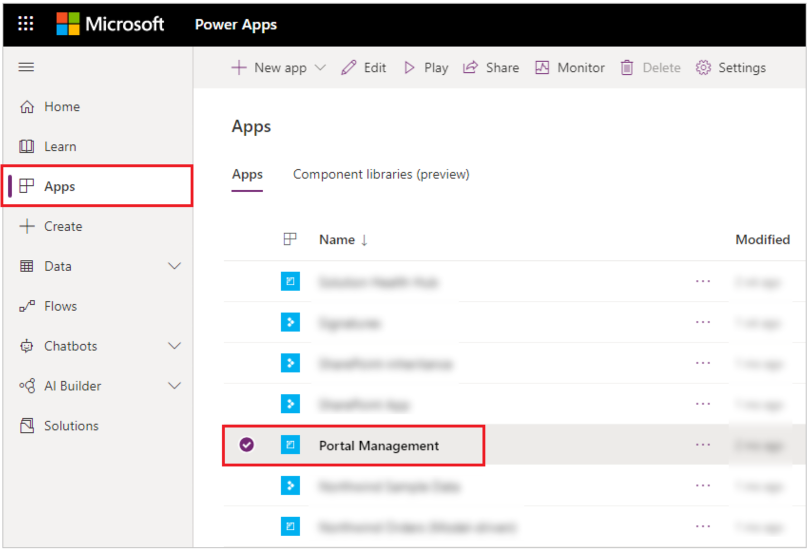

1. In the **Portal Management** app on the left pane, select **Site Settings**.

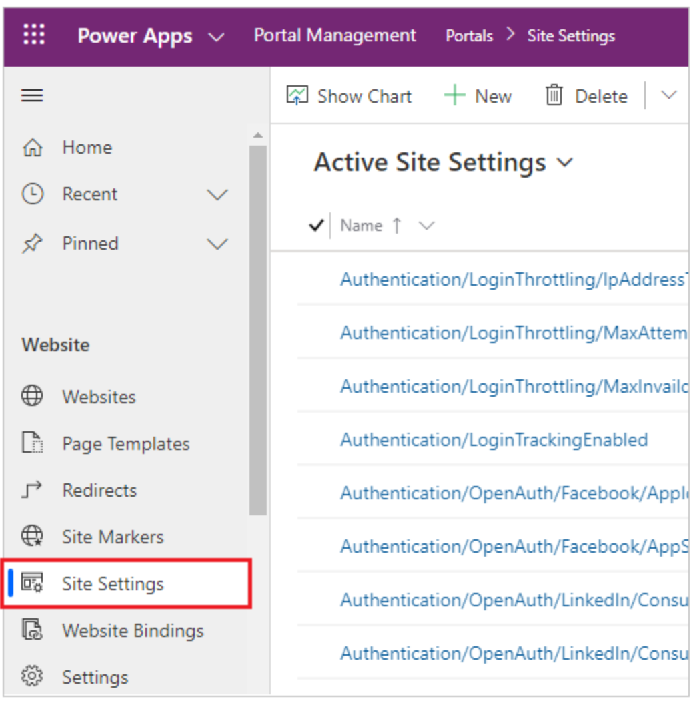

1. Select **New**.

1. In the **Name** box, enter **WebAPI/enableReadOperationPreview**.

1. In the **Website** list, select your website record.

1. In the **Value** box, enter **true**.

1. Select **New**.

1. In the **Name** box, enter **Webapi/contact/enabled**.

1. In the **Website** list, select your website record.

1. In the **Value** box, enter **true**.

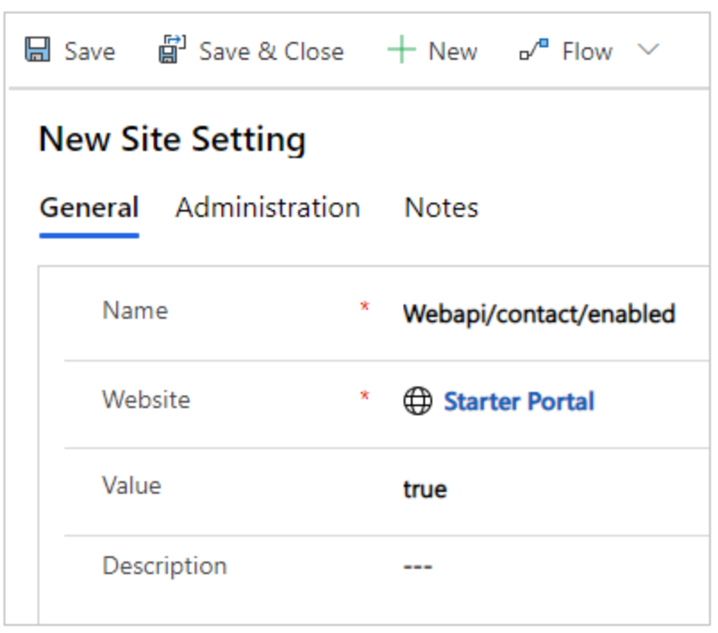

1. Select **Save & Close**.

1. Select **New**.

1. In the **Name** box, enter **Webapi/contact/fields**.

1. In the **Website** list, select your website record.

1. In the **Value** box, enter  
 **firstname,lastname,fullname,emailaddress1,telephone1**

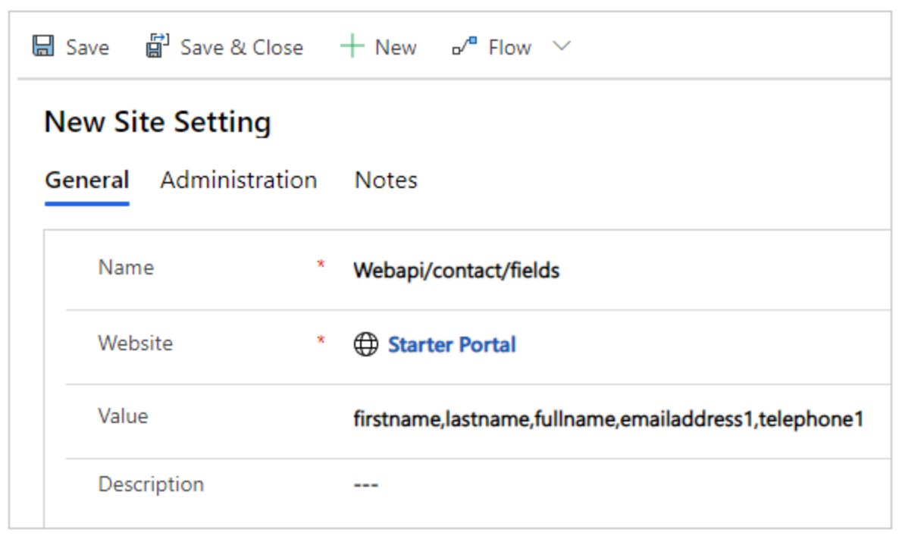

1. Select **Save & Close**.

1. Select **New**.

1. In the **Name** box, enter **Webapi/error/innererror**.

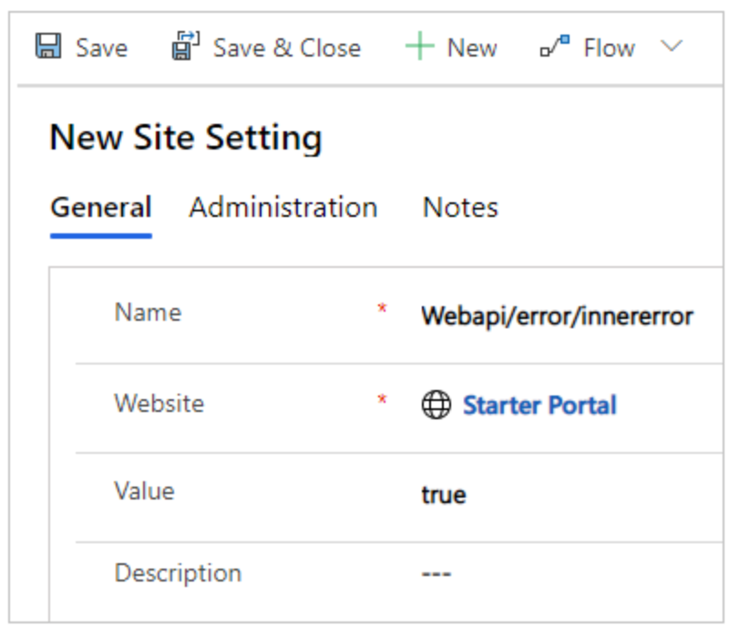

1. In the **Website** list, select your website record.

1. In the **Value** box, enter **true**.

1. Select **Save & Close**.

1. Verify the site settings for **Web API**.

### Step 2 - Configure permissions

You'll have to configure permissions so that users are able to use the Web API feature. In this example, you'll enable the Contact table for table permissions, create a web role for using the Web API, add the table permissions for the Contact table to this web role, and then add the web role to users to allow them to use the Web API.

1. In the **Portal Management** app on the left pane, select **Table Permissions**.

1. Select **New**.

1. In the **Name** box, enter **Contact Table Permission**.

1. In the **Table Name** list, select **Contact (contact)**.

1. In the **Website** list, select your website record.

1. In the **Access Type** list, select **Global**.

1. Select **Read**, **Write**, **Create**, and **Delete** privileges.

1. Select **Save & Close**.

1. On the left pane, select **Web Roles** .

1. Select **New**.

1. In the **Name** box, enter **Web API User**.

1. In the **Website** list, select your website record.

1. For **Authenticated Users Role**, select **Yes**.

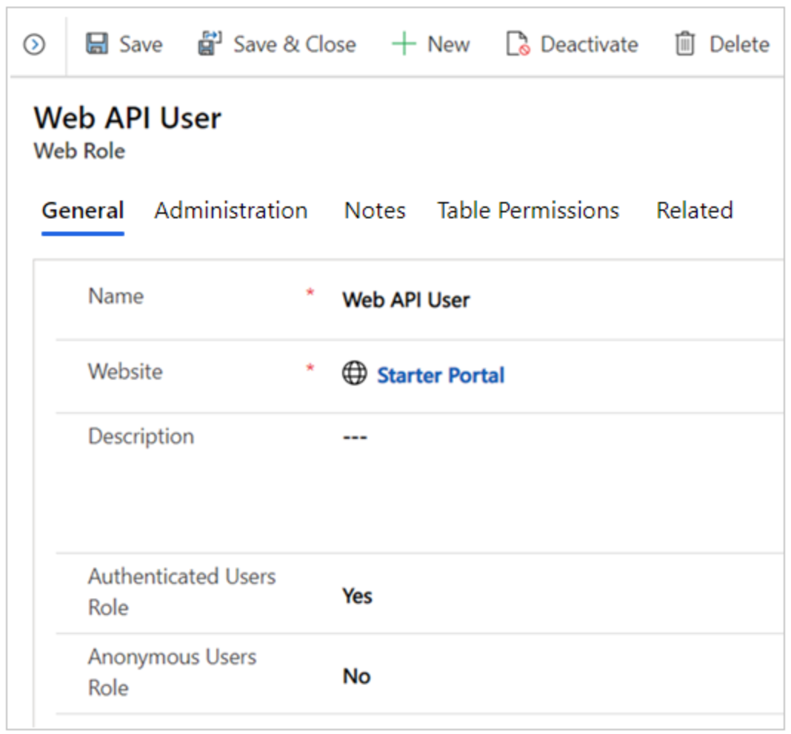

1. Select **Save**.

1. Select **Related** &gt; **Table Permissions**.

1. Select **Add Existing Table Permission**.

1. Select **Contact Table Permission**, created earlier.

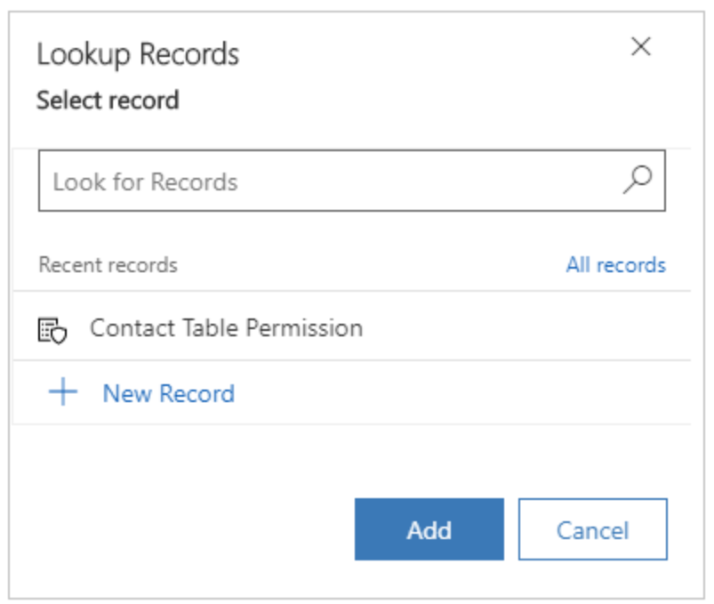

1. Select **Add**.

1. Select **Save & Close**.

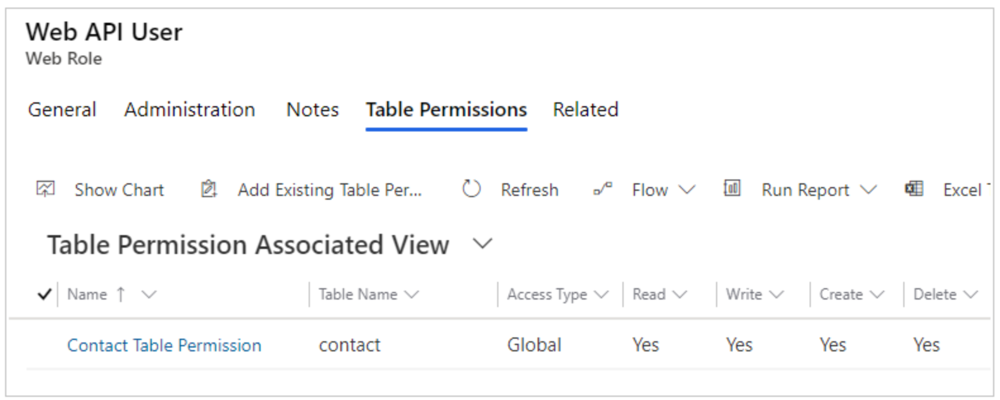

1. On the left pane, select **Contacts**.

1. Select a contact that you want to use in this example for the Web API.

**NOTE:** This contact is the user account used in this example for testing the Web API. Be sure to select the correct contact in your portal.

1. Select **Related** &gt; **Web Roles**.

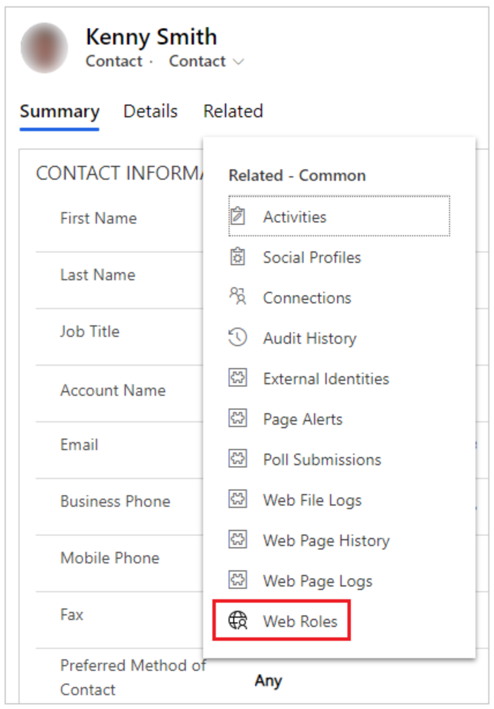

1. Select **Add Existing Web Role**.

1. Select the **Web API User** role, created earlier.

1. Select **Add**.

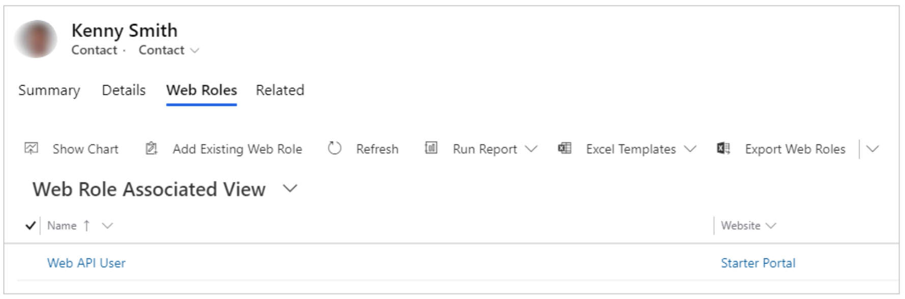

1. Select **Save & Close**.

### Step 3 - Clear the portals cache

You've created a **webapi** sample page to test the Web API functionality. Before you get started, ensure that the Power Apps portals cache has been cleared so that the changes from the Portal Management app are reflected on your portal.

**IMPORTANT:** Clearing the portal server-side cache causes temporary performance degradation of the portal while data gets reloaded from Microsoft Dataverse.

**To clear the cache:**

1. Sign in to your portal as a member of the Administrators web role.

1. Change the URL by appending **/\_services/about** at the end. For example, if the portal URL is [https://contoso.powerappsportals.com](https://contoso.powerappsportals.com/), change it to <https://contoso.powerappsportals.com/_services/about>.

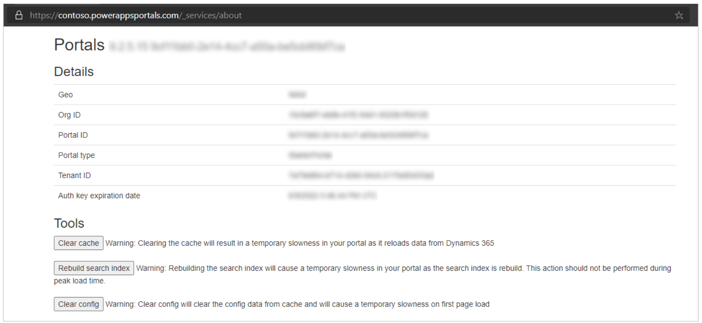

**NOTE:** You must be a member of the **Administrators** web role to clear the cache. If you see a blank screen, check the web role assignments.

1. Select **Clear cache**.

More information: [Clear the server-side cache for a portal](https://docs.microsoft.com/en-us/powerapps/maker/portals/admin/clear-server-side-cache)

### Step 4 - Use browser address bar to fire retrieve call

Enter **\[Portal URI\]/\_api/contacts?$select=firstname,lastname** in browser address bar.

### See also

[Web API overview](web-api-overview.md)
[Portals write, update and delete operations using the Web API](write-update-delete-operations.md)

[!INCLUDE[footer-include](../../includes/footer-banner.md)]