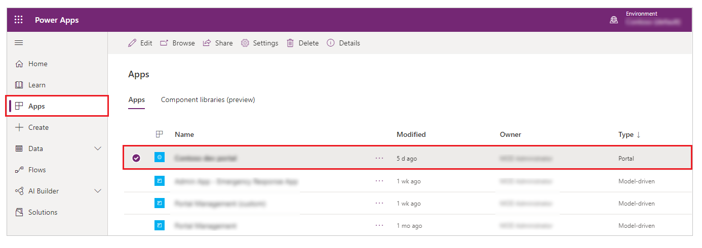
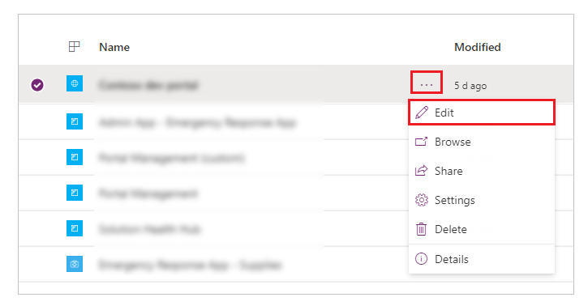
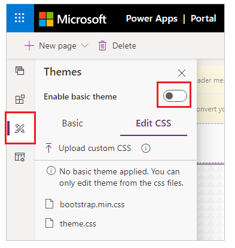
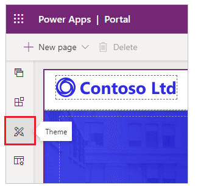
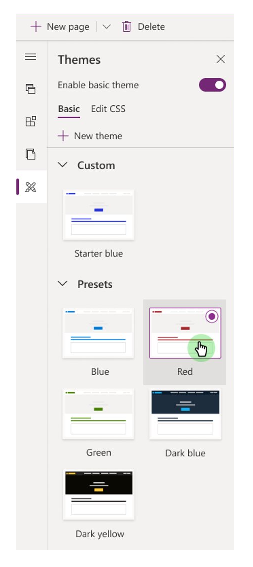
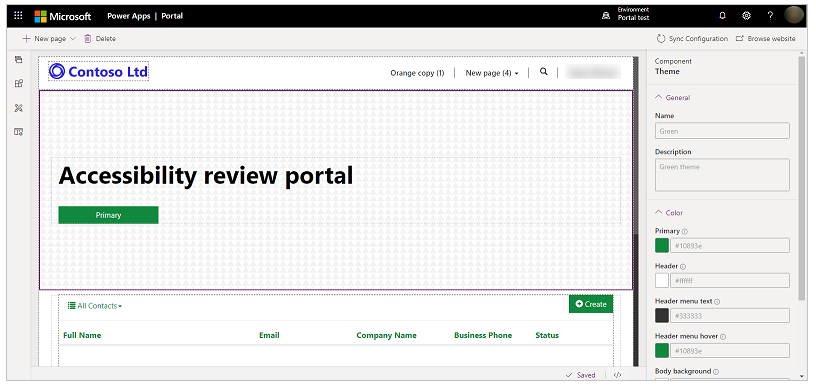
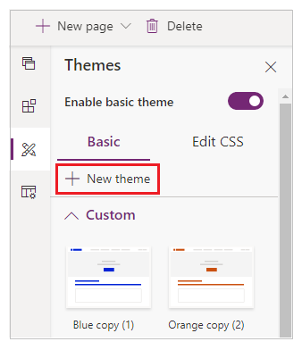
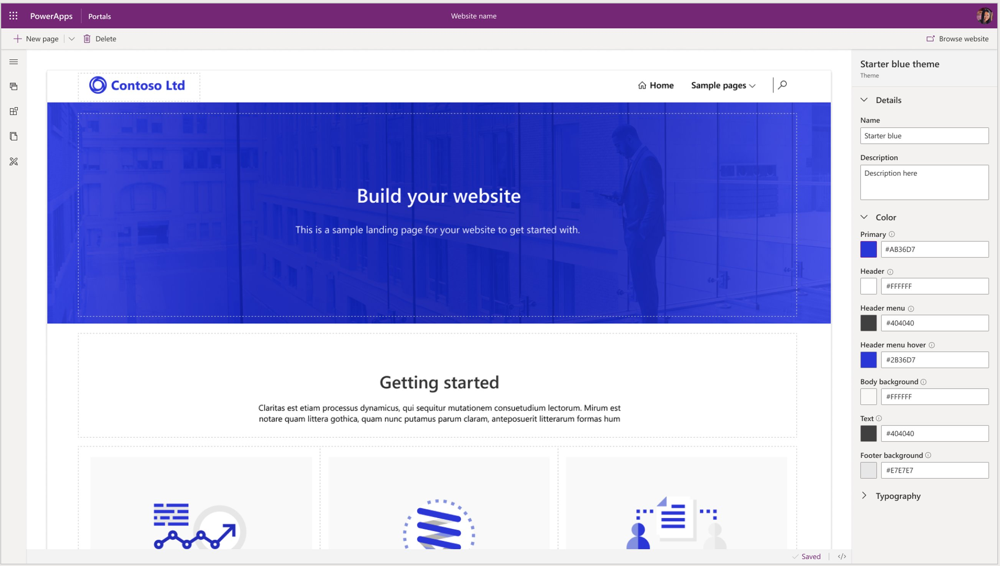
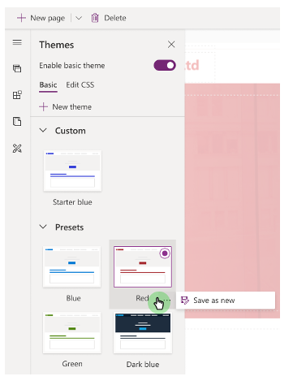

# Overview of themes in Power Apps portal

Power Apps portal by default has **Enable basic theme** feature **Off**. Basic themes allow you to use themes available by default, called **Presets**. You can also create copies of default basic themes for additional customization.

In this article, you'll walk through basic themes feature. For more advanced theme customization, read [Edit CSS](edit-css.md).

> [!IMPORTANT]
> **Basic theme** feature is in preview. For more information about preview features, read [Understand experimental and preview features in Power Apps](https://docs.microsoft.com/powerapps/maker/canvas-apps/working-with-experimental-preview).

## Enable basic theme for existing portals (Preview)

To enable basic theme and apply a preset theme on your existing portal:

1. Sign in to [Power Apps](https://make.powerapps.com).

1. Select **Apps** from left pane and then select the portal:

    

1. Select **More Commands** (**...**) and then select **Edit** to edit the portal:

    

1. Select **Themes** from left pane and then select **Enable basic theme** to enable basic theme:

    

Basic theme feature is enabled on your portal.

## Change preset theme

To change theme for your portal from an existing theme to any default theme:

1. Sign in to [Power Apps](https://make.powerapps.com).

1. Select **Apps** from left pane and then select the portal:

1. Select **More Commands** (**...**) and then select **Edit** to edit the portal:

1. Select **Theme** from the components pane:

    

1. Select any default theme from the available presents, such as **Green**:

    

Selected theme is applied to your portal:



## Create new theme

To create a new theme:

1. Sign in to [Power Apps](https://make.powerapps.com).

1. Select **Apps** from left pane and then select the portal:

1. Select **More Commands** (**...**) and then select **Edit** to edit the portal:

1. Select **Theme** from the components pane.

1. Select **New Theme** to create a new theme:

    

## Edit theme details

You can update theme name, description, color, and other typography settings in the Power Apps portal Studio. 

To edit theme details:

1. . Sign in to [Power Apps](https://make.powerapps.com).

1. Select **Apps** from left pane and then select the portal:

1. Select **More Commands** (**...**) and then select **Edit** to edit the portal:

1. Select **Theme** from the components pane.

1. Select theme currently applied, or select a new theme from the presets.
   Selecting a theme opens the details pane on the right:

    

1. Edit theme details such as name, description, and color for different areas:

    |Color option | Impacted area
    | - | - 
    | Primary | Button and link colors.
    | Header | Header background color.
    | Header menu text | Text color for header menu.
    | Header menu hover | Background color of menu items upon hover over.
    | Body background |  Background color of body section.​
    | Footer background | Background color for footer.​
    | Footer text | Footer text color.​

1. Save and publish the changes.

## Copy preset theme

To copy preset theme:

1. . Sign in to [Power Apps](https://make.powerapps.com).

1. Select **Apps** from left pane and then select the portal:

1. Select **More Commands** (**...**) and then select **Edit** to edit the portal:

1. Select **Theme** from the components pane.

1. Select the theme from presets that you want to copy, select **...** (ellipsis) and then select **Save as Copy**:

    

1. Update the [theme details](#edit-theme-details) as needed and save.

## Saas variables

[Sass](https://sass-lang.com/) is a stylesheet language with fully CSS-compatible syntax. When you enable *Basic theme* feature, you can use [Sass variables](https://sass-lang.com/documentation/variables) instead of values to configure theme colors.

For example, if you want the **Header** color to be 25% lighter than the **Primary** color, you can use the following value instead of actual color:

```
lighten($primaryColor, 25%);
```


You can use the following Sass variables with *Basic theme*:

|Color option | Sass variable name
| - | -
| Primary | ```$primaryColor```
| Header | ```$headerColor```
| Header menu text | ```$headerMenuTextColor```
| Header menu hover | ```$headerMenuHoverColor```
| Body background |  ```$bodyBackground```
| Footer background | ```$footerColor​```
| Footer text | ```$footerTextColor```

### Sass variable order

Sass variables work from top to bottom. You can set *Header* color to ```lighten($primaryColor, 25%);```. But, you can't set *Primary* color to ```lighten($headerColor, 25%);``` as *Header* is below *Primary* in color options.

## Basic theme considerations

- You can't have two themes with same *theme name* or same *theme file name*. 
- Color value manually entered must be for a valid color.
- Changing CSS for preset themes isn't supported.
- Theme foreground and background color contrast ratio is recommended at 4.5:1 for accessibility.

### Next steps

[Edit theme CSS](edit-css.md)
