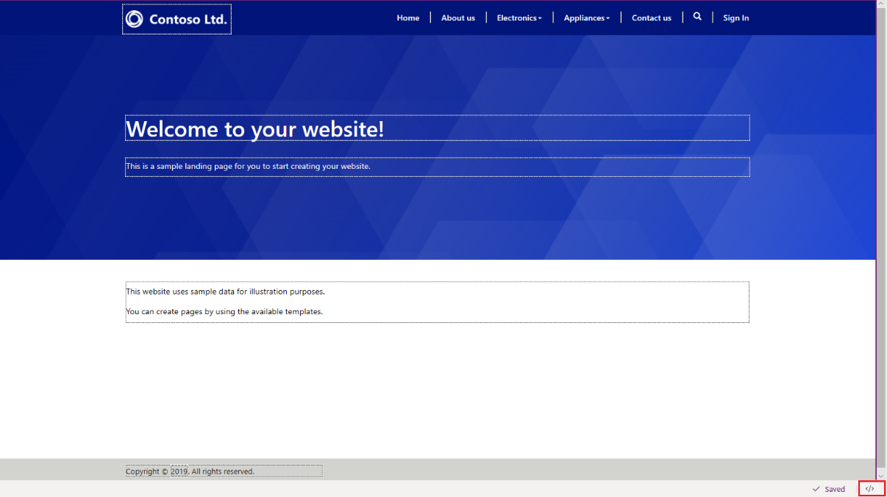
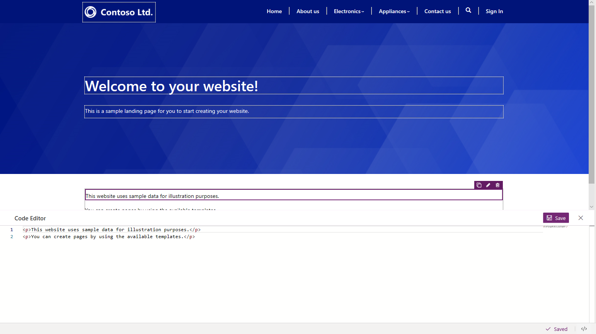

# Use code editor

To view the source of a component on the canvas, select the component, and then select the source code editor icon **&lt;/&gt;** in the footer.

> [!div class=mx-imgBorder]
>   

The source code is displayed in the **Code Editor** pane at the bottom of the screen. The changes you made earlier are updated in the source code. To make changes, update the source code and select **Save**. The changes are reflected on the canvas.

> [!div class=mx-imgBorder]
>  

> [!NOTE]
> You can also add Liquid tags in source code editor for advanced configuration. More information: [Work with Liquid templates](liquid/liquid-overview.md)

### See also

- [Power Apps portals Studio](portal-designer-anatomy.md)
- [Create and manage webpages](create-manage-webpages.md)
- [WYSIWYG editor](compose-page.md)

[!INCLUDE[footer-include](../../includes/footer-banner.md)]