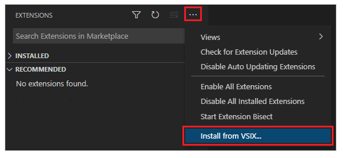
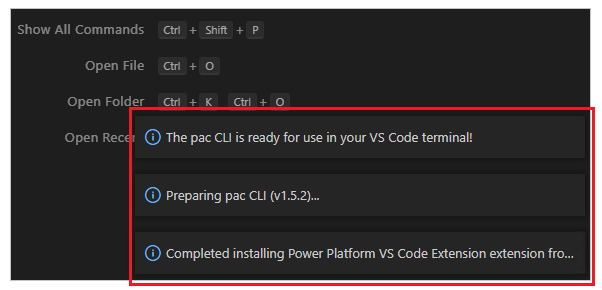
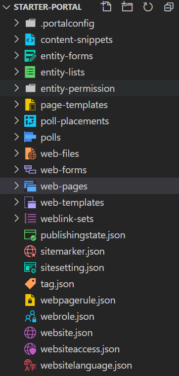
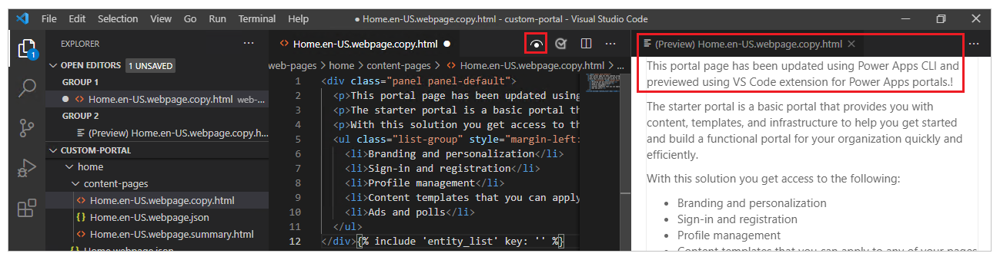
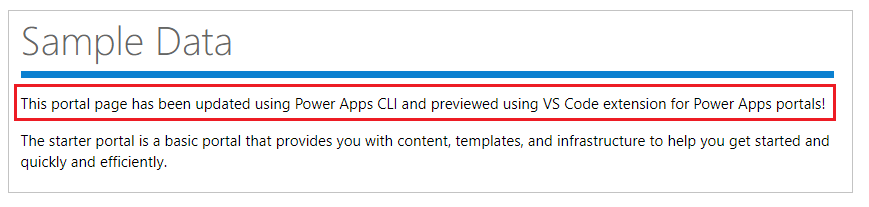

# Use Visual Studio Code extension (Preview)

[This article is pre-release documentation and is subject to change.]

Visual Studio Code (VS Code) is a lightweight but powerful source code editor
which runs on your desktop and is available for Windows, macOS and Linux. It
comes with built-in support for JavaScript, TypeScript and Node.js and has a
rich ecosystem of extensions for other languages (such as C++, C\#, Java,
Python, PHP, Go) and runtimes (such as .NET and Unity). More information: [Get
started with VS Code](https://code.visualstudio.com/docs/getstarted/introvideos)

VS Code allows extending the capability through
[extensions](https://code.visualstudio.com/docs/introvideos/extend). VS Code
extensions can add more features to the overall experience. With the release of
this feature, you can now use the VS Code extension to work with Power Apps
portals.

> [!IMPORTANT]
> - This is a preview feature.
> - [!INCLUDE[cc_preview_features_definition](../../includes/cc-preview-features-definition.md)]

Benefits

The VS Code extension for portals adds the capability to configure portals using
VS Code, and utilize the built-in Liquid language
[IntelliSense](https://code.visualstudio.com/docs/editor/intellisense) enabling
help with code completion, assistance and hinting while customizing portals
interface using VS Code.

Using the VS Code extension, you can also configure portals through the portals
support for Power Apps CLI. For more information about how to use Power Apps CLI
commands, refer to the supplementary private preview documentation for Power
Apps portals CI/CD support using CLI.

Prerequisites
=============

Before using VS Code extension for Power Apps portals, you must:

-   Download, install and configure Visual Studio Code. More information:
    [Download Visual Studio Code](https://code.visualstudio.com/Download)

-   Configure your environment and system for Power Apps portals CI/CD support
    using CLI. Refer to the supplementary documentation for more information.

Install VS Code extension
=========================

After you install Visual Studio Code, you need to install the extension for
Power Apps portals plugin for VS Code. More information: [Install extensions
from VSIX
file](https://code.visualstudio.com/docs/editor/extension-gallery#_install-from-a-vsix)

To install VS code extension:

1.  Open Visual Studio Code.

2.  Select

    

    (Extensions) from the left pane.

    

3.  Select

    

    from the top-right on the extensions pane.

4.  Select **Install from VSIX**.

    

5.  Select the VSIX file.

6.  Verify the extension is installed successfully from the status messages.

    

Download portals content
========================

To authenticate against a Microsoft Dataverse environment, and to download
portals content, refer to the supplementary private preview documentation for
Power Apps portals CI/CD support using CLI.

Snippet support
===============

When customizing downloaded content using VS Code, you can now use IntelliSense
for Power Apps portals
[liquid](https://docs.microsoft.com/powerapps/maker/portals/liquid/liquid-tags)
tags.

File icons
==========

The VS Code extension for portals automatically identifies and shows icons for
files and folders inside the downloaded portals content.

VS Code uses default [file icon
theme](https://code.visualstudio.com/docs/getstarted/themes#_file-icon-themes)
that by default doesn’t show portals-specific icons. To view file icons specific
to portals, you’ll have to update the VS Code instance to use the
portals-specific file icon theme.

To enable portals-specific file-icon theme:

1.  Open VS Code.

2.  Go to **File** -\> **Preferences** -\> **File Icon Theme**

3.  Select the theme for Power Apps portals icons.

    

Live preview
============

VS Code extension enables a live preview option to view the portals content page
inside the Visual Studio Code interface as preview during the development
experience.

To see the preview, select

from the top-right when having an HTML file open in edit mode.

The preview pane opens on the right side of the page being edited using VS Code.

Preview feature requires that have the other files also open in the same VS Code
session that make up the HTML markup for the preview to show. For example, if
only the HTML file is opened without the folder structure opened using VS Code,
you’ll see the following message.

When this happens, open the folder using **File -\> Open folder** in VS Code and
select the downloaded portal content folder to open before you try to preview
again.

Autocomplete
============

The autocomplete capability in the VS Code extension shows the current context
being edited, and the relevant autocomplete elements through IntelliSense.

Walkthrough
===========

In this example walkthrough, you’ll see how to use VS Code extension for Power
Apps portals to customize portals content.

**NOTE:** The steps to use Power Apps CLI commands for Power Apps portals are
also available in the supplementary documentation.

Visual Studio Code
------------------

To connect to Power Apps portals, and to use Power Apps CLI commands, use
[Visual Studio Code](https://code.visualstudio.com/docs) and the [integrated
terminal](https://code.visualstudio.com/docs/editor/integrated-terminal). The
integrated terminal makes it easy to connect to the Dataverse environment and to
download/change/upload the portals configuration. You can also use Windows
PowerShell instead.

Step 1: Authenticate
--------------------

Before you connect, list, download or upload any changes for a Power Apps
portal, you must authenticate to the Dataverse environment first. For more
information about authentication using Power Apps CLI, read [Power Apps CLI –
Auth](https://docs.microsoft.com/powerapps/developer/data-platform/powerapps-cli#auth).

To authenticate, open Windows PowerShell, and run the following command using
your Dataverse environment URL.

*pac auth create -u [Dataverse URL]*

Example:

*pac auth create -u* <https://contoso-org.crm.dynamics.com>

Follow the prompts of authentication to sign into the environment.

Step 2: List available portals
------------------------------

Use the **list** command to list the available Power Apps portals in the
Dataverse environment you connected to using the previous step.

*pac paportal list*

Step 3: Download portals content
--------------------------------

Download portal website content from the connected Dataverse environment.

*pac paportal download --path [PATH] -id [WebSiteId-GUID]*

Example:

*pac paportal download --path c:\\pac-portals\\downloads -id
d44574f9-acc3-4ccc-8d8d-85cf5b7ad141*

For the **id** parameter, use the **WebSiteId** returned from the output of the
previous step.

Step 4: Change portals content
------------------------------

Change the configuration using Visual Studio Code and save your changes.

**NOTE:** Ensure you update only the supported entities for use with Power Apps
CLI. More information: [Supported entities](#_Supported_entities)

For example, the default portal page shows the text such as this:

This text is visible from the web page html:

You can change this text, and save the changes. Use the preview capability to
preview your changes:

**TIP:** You can change the location of the folder path in PowerShell/integrated
terminal to the downloaded location, and enter “*code .”* to open the folder
directly in Visual Studio Code.

Before you upload your changes, try and use the IntelliSense capability using
liquid tags, and configuration fields/IDs.

Step 5: Upload the changes
--------------------------

After making the required changes, upload them using the following command.

*pac paportal --path [Folder-location]*

Example*:*

*pac paportal upload --path C:\\pac-portals\\downloads\\custom-portal\\*

**NOTE:** Ensure the path for the portals content you entered is correct. By
default, a folder named by the portal (friendly name) is created with downloaded
portals content. For example, if the portal’s friendly name is *custom-portal,*
the path for the above command (--path) should be
*C:\\pac-portals\\downloads\\custom-portal*.

The upload only happens for content that has changed. In this example, since the
change is made to a web page, content is uploaded only for the adx_webpage
entity.

Step 6: Confirm the changes
---------------------------

To confirm the changes made to the portal webpage:

1.  Clear the [server-side
    cache](https://docs.microsoft.com/powerapps/maker/portals/admin/clear-server-side-cache),
    or use [Sync
    Configuration](https://docs.microsoft.com/powerapps/maker/portals/portal-designer-anatomy)
    by using Power Apps portals Studio.

2.  Browse to the portal webpage to see the change.

>   Highlighted change in text as seen on the portal after browsing the webpage
>   post upload of the changes.

>   This concludes the walkthrough. You can repeat the above steps and change
>   the portals content for other supported entities.

Preview disclaimer
==================

Preview features are features that aren’t complete but are made available on a
“preview” basis so customers can get early access and provide feedback. Preview
features are not supported by Microsoft Support, may have limited or restricted
functionality, aren’t meant for production use, and may be available only in
selected geographic areas.

Copyright
=========

This document is provided "as-is". Information and views expressed in this
document, including URL and other Internet web site references, may change
without notice.

Some examples depicted herein are provided for illustration only and are
fictitious. No real association or connection is intended or should be inferred.

This document does not provide you with any legal rights to any intellectual
property in any Microsoft product. You may copy and use this document for your
internal, reference purposes. This document is confidential and proprietary to
Microsoft. It is disclosed and can be used only pursuant to a non-disclosure
agreement.

© 2021 Microsoft. All rights reserved.

Microsoft is trademark of the Microsoft group of companies. All other trademarks
are property of their respective owners.
