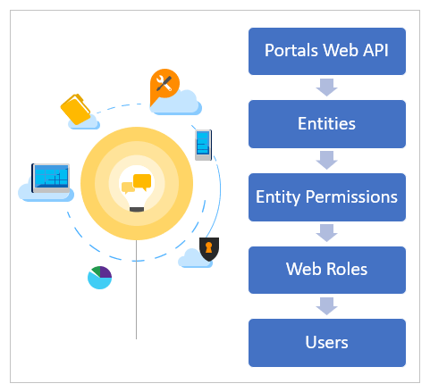

# Portals Web API

## Overview

Portals Web API enables building a richer user experience inside Power Apps portals pages. You can use Web API to create, read, update, and delete (CRUD) operations across all Common Data Service entities from your portal pages.

For example, you can create a new account, update a contact, or change the [entity permissions](configure/assign-entity-permissions.md) for a product using portals Web API instead of using Portal Management app.

> [!IMPORTANT]
> Portals Web API operations are limited to entities related to data. For example, entities such as Accounts, Contacts or your custom entity. Configuration of entity metadata, or portal configuration entity data isn't supported when using the portals Web API. For example, configuring portals entities such as adx_contentsnippet, adx_entityform or adx_entitylist isn't supported using portals Web API. 

## Web API operations

Portals Web API offers a subset of capabilities for Common Data Service operations that you can do using Common Data Service API. The following list explains the Common Data Service operations available in portal Web API.

| Common Data Service operation | Available in portals Web API |
| - | - |
| [Associate and disassociate entities](../../developer/common-data-service/webapi/associate-disassociate-entities-using-web-api.md) | &check; |
| [Create an entity](../../developer/common-data-service/webapi/create-entity-web-api.md) | &check; |
| [Detect duplicate data](../../developer/common-data-service/webapi/manage-duplicate-detection-create-update.md)  | &cross; |
| [Execute batch operations](../../developer/common-data-service/webapi/execute-batch-operations-using-web-api.md) | &cross; |
| [Impersonate another user](../../developer/common-data-service/webapi/impersonate-another-user-web-api.md) | &cross; |
| [Perform conditional operations](../../developer/common-data-service/webapi/perform-conditional-operations-using-web-api.md) | &cross; |
| [Query Data](../..//developer/common-data-service/webapi/query-data-web-api.md) | &check; |
| [Retrieve an entity](../../developer/common-data-service/webapi/retrieve-entity-using-web-api.md) | &check; |
| [Retrieve and execute predefined queries](../../developer/common-data-service/webapi/retrieve-and-execute-predefined-queries.md) | &cross; |
| [Update and delete entities](../../developer/common-data-service/webapi/update-delete-entities-using-web-api.md) | &check; |
| [Use actions](../../developer/common-data-service/webapi/use-web-api-actions.md) | &check; |
| [Use functions](../../developer/common-data-service/webapi/use-web-api-functions.md) | &cross; |

## Site settings for Web API

You must enable site setting to enable the portals Web API for your portal. Also, you can configure field-level Web API that determines the entity fields that can or can't be modified using portals Web API.

When you configure inner error site setting, the Web API response includes **what?** @Neeraj: What is inner error?

| Site Setting Name | Description|
| - |- |
| *webapi/\<entity name\>/enabled* | Enables or disables OData API for \<entity name\>.   **Default:** `False`   **Valid values:** `True, False` |
| *webapi/\<entity name\>/fields*  | Defines the comma-separated list of attributes that can be modified using Web API.    **Possible values:**    - *All attributes:* `*`   - *Specific attributes:* `attr1,attr2,attr3`   **Note**: **\*** takes precedence over individual attribute names. For example, **\*** is considered and all attributes are allowed if the value is: `attr1,*,attr3`.   **Important**: Mandatory site setting. When this setting is missing, you'll see this error: *No fields defined for this entity.* |
| *webapi/error/innererror* | Enables or disables innererror.   **Default:** `False`   **Valid values:** `True, False`

> [!NOTE]
> Site settings must be set to **Active** for changes to take effect.

For example, to expose OData API for case entity where authenticated
users are allowed to perform CRUD operation on this entity, the site settings are:

| Site Setting Name | Site Setting Value|
| - |- |
| *webapi/incident/enabled* | true |
| *webapi/incident/fields* | attr1,attr2,attr3 |

## Security with portals Web API

You can configure record-based security to individual records in portals using [entity permissions](configure/assign-entity-permissions.md). Portals Web API access entity records and follow the entity permissions given to users through the associated [web role](configure/create-web-roles.md).

@Neeraj - is the modified image acceptable? Also, it had 'MS confidential' earlier, removed now. So just to be sure, are we sure it's intended for public use and no longer MS confidential? Also, is the image on the right 'complete'? It appears the vertical line to the inward circle needs a title or a legend.

## Authenticating portals Web API requests

You don't need to include authentication code since authentication and authorization are managed by the application. Portals API must use cookie for authentication and authorization. All POST call must include CSRF token.

## General Data Protection Regulation (GDPR)

All request header should have contact id passed for auditing purpose. For
anonymous user, it will be passed as `null`.

If audit logging is enabled, then user can see all the audit events in [Office 365 audit log](https://protection.office.com/unifiedauditlog).

More information: [Enable and use Activity Logging](https://docs.microsoft.com/power-platform/admin/enable-use-comprehensive-auditing), [Export, configure, and view audit log records](https://docs.microsoft.com/microsoft-365/compliance/export-view-audit-log-records).

## CORS

CORS is an HTTP feature that enables a web application running under one domain to access resources in another domain. Portals Web API calls made from outside the portals pages aren't allowed.

## Telemetry

@Neeraj - where is this telemetry logged?

Portals Web API logs the following telemetry.

| Action | Description |
| - | - |
| Web API uses | Web API uses that include request rate, and request data complexity.   The request data complexity details include:   - Type of request, such as Create, Update, or Delete.   - Number attribute with data type. (@Neeaj - needs better explanation)   - Nested entity depth. (@Neeaj - needs better explanation) |
| Web API response code | [HTTP response codes](https://www.w3.org/Protocols/HTTP/HTRESP.html) such as 2xx, 4xx, and 5xx to identify the request and success rate. |
| Response time (performance) | Describes the response time for the Web API request, for performance considerations. |

## Throttling 

@Neeraj - what are the error codes?

| **Error code** | **Error message** |
| - | - |
| | Number of requests exceeded the limit of 6000, measured over time window of 300 seconds. |
| | Combined execution time of incoming requests exceeded limit of 1,200,000 milliseconds over time window of 300 seconds. Decrease number of concurrent requests or reduce the duration of requests and try again later. |
| | Number of concurrent requests exceeded the limit of 52. |

If you use HTTP requests with the Web API, the response will include the same
messages, but with status code 429.

All requests will return these error responses until the volume of API requests falls below the limit. If you get these responses, your application should stop sending API requests until the volume of requests is below the limit.

### Check remaining limit

If you're using HTTP requests with the Web API, you can track the remaining
limit values with the following HTTP response headers:

| Header | Value Description |
| - | - |
| x-ms-ratelimit-burst-remaining-xrm-requests | The remaining number of requests for this connection. |
| x-ms-ratelimit-time-remaining-xrm-requests | The remaining combined duration for all connections using the same user account. |

## Web API and licensing

Portals Web API utilizes existing licensing behavior, including the API calls for each user type.

Portals uses existing license behavior, that includes the API calls
for each user type. For more information about API limits for Power Apps portals, download and read [Microsoft Power Apps and Power Automate Licensing Guide](https://go.microsoft.com/fwlink/?linkid=2085130).

## Next steps

[Perform Web API operations](web-api-perform-operations.md)

### See also

- [Compose HTTP requests and handle errors](web-api-http-requests-handle-errors.md)
