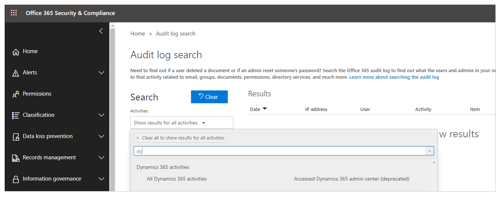

# Portals Web API

The portals Web API enables building a richer user experience inside Power Apps portals pages. You can use the Web API to perform create, update, and delete operations across all Microsoft Dataverse tables from your portal pages. For example, you can create a new account, update a contact, or change the [table permissions](configure/assign-entity-permissions.md) for a product by using the portals Web API instead of the Portal Management app.

> [!IMPORTANT]
> - **Your portal version must be 9.3.3.x or later for this feature to work**.
> - The portals Web API is built for creating a rich user experience inside portal pages. It isn't optimized for third-party services or application integration.
> - Portals Web API operations are limited to tables related to data&mdash;for example, accounts, contacts, or your custom tables. Configuring table metadata or portal configuration table data&mdash;for example, configuring portals tables such as adx_contentsnippet, adx_entityform, or adx_entitylist&mdash;isn't supported with the portals Web API. For a complete list, go to [unsupported configuration tables](#unsupported-configuration-tables), later in this topic.
> - The portals Web API benefits from [server-side caching](admin/clear-server-side-cache.md) and, hence, subsequent calls to the Web API are faster than the initial calls. Note that clearing the portal server-side cache causes temporary performance degradation.
> - Portals Web API operations require Power Apps portals license. For example, Web API calls made by anonymous users are counted towards page view capacity. Web API calls made by authenticated users (internal or external) are not counted towards page views, but require applicable licenses. More information: [Power Apps portals licensing FAQs](/power-platform/admin/powerapps-flow-licensing-faq#can-you-share-more-details-regarding-the-new-power-apps-portals-licensing)

## Web API operations

The portals Web API offers a subset of capabilities for Dataverse operations that you can do by using the Dataverse API. We've kept the API format as similar as possible, to reduce the learning curve.

### Web API operations available in portals

- [Create a record in a table](web-api-perform-operations.md#create-a-record-in-a-table)
- [Update and delete records in a table](web-api-perform-operations.md#update-and-delete-records-by-using-the-web-api) 
- [Associate and disassociate tables](web-api-perform-operations.md#associate-and-disassociate-tables-by-using-the-web-api)

## Site settings for the Web API

You must enable the site setting to enable the portals Web API for your portal. Also, you can configure the field-level Web API that determines the table fields that can or can't be modified with the portals Web API.

| Site setting name | Description|
| - |- |
| *Webapi/\<table name\>/enabled* | Enables or disables the Web API for \<table name\>.   **Default:** `False`   **Valid values:** `True`, `False` |
| *Webapi/\<table name\>/fields*  | Defines the comma-separated list of attributes that can be modified with the Web API.    **Possible values:**    - *All attributes:* `*`   - *Specific attributes:* `attr1,attr2,attr3`   **Note**:  The value must be either an asterisk (**\***) or a comma-separated list of field names.   **Important**: This is a mandatory site setting. When this setting is missing, you'll see the error "No fields defined for this entity." |
| *Webapi/error/innererror* | Enables or disables InnerError.   **Default:** `False`   **Valid values:** `True`, `False`

> [!NOTE]
> Site settings must be set to **Active** for changes to take effect.

For example, to expose the Web API for the Case table where authenticated
users are allowed to perform create, update, and delete operations on this entity, the site settings are shown in the following table.

| Site setting name | Site setting value|
| - |- |
| *Webapi/incident/enabled* | true |
| *Webapi/incident/fields* | attr1,attr2,attr3 |

## Security with the portals Web API

You can configure record-based security to individual records in portals by using [table permissions](configure/assign-entity-permissions.md). The portals Web API accesses table records and follows the table permissions given to users through the associated [web role](configure/create-web-roles.md).

## Authenticating portals Web API requests

You don't need to include authentication code, because authentication and authorization are managed by the application session. All Web API calls must include a Cross-Site Request Forgery (CSRF) token.

## General Data Protection Regulation (GDPR)

All request headers will have a contact ID passed for auditing purpose. For an anonymous user, this will be passed as `null`.

If audit logging is enabled, a user can see all the audit events in the [Office 365 audit log](https://protection.office.com/unifiedauditlog).

More information: [Enable and use Activity Logging](/power-platform/admin/enable-use-comprehensive-auditing) [Export, configure, and view audit log records](/microsoft-365/compliance/export-view-audit-log-records).

## Unsupported configuration tables

Portals Web API can't be used for the following configuration tables.

:::row:::
:::column:::
	adx_contentaccesslevel
:::column-end:::
:::column:::
	adx_contentsnippet
:::column-end:::
:::column:::
	adx_entityform
:::row-end:::
:::row:::
:::column:::
	adx_entityformmetadata
:::column-end:::
:::column:::
	adx_entitylist
:::column-end:::
:::column:::
	adx_entitypermission
:::row-end:::
:::row:::
:::column:::
	adx_entitypermission_webrole
:::column-end:::
:::column:::
	adx_externalidentity
:::column-end:::
:::column:::
	adx_pagealert
:::row-end:::
:::row:::
:::column:::
	adx_pagenotification
:::column-end:::
:::column:::
	adx_pagetag
:::column-end:::
:::column:::
	adx_pagetag_webpage
:::row-end:::
:::row:::
:::column:::
	adx_pagetemplate
:::column-end:::
:::column:::
	adx_portallanguage
:::column-end:::
:::column:::
	adx_publishingstate
:::row-end:::
:::row:::
:::column:::
	adx_publishingstatetransitionrule
:::column-end:::
:::column:::
	adx_publishingstatetransitionrule_webrole
:::column-end:::
:::column:::
	adx_redirect
:::row-end:::
:::row:::
:::column:::
	adx_setting
:::column-end:::
:::column:::
	adx_shortcut
:::column-end:::
:::column:::
	adx_sitemarker
:::row-end:::
:::row:::
:::column:::
	adx_sitesetting
:::column-end:::
:::column:::
	adx_urlhistory
:::column-end:::
:::column:::
	adx_webfile
:::row-end:::
:::row:::
:::column:::
	adx_webfilelog
:::column-end:::
:::column:::
	adx_webform
:::column-end:::
:::column:::
	adx_webformmetadata
:::row-end:::
:::row:::
:::column:::
	adx_webformsession
:::column-end:::
:::column:::
	adx_webformstep
:::column-end:::
:::column:::
	adx_weblink
:::row-end:::
:::row:::
:::column:::
	adx_weblinkset
:::column-end:::
:::column:::
	adx_webnotificationentity
:::column-end:::
:::column:::
	adx_webnotificationurl
:::row-end:::
:::row:::
:::column:::
	adx_webpage
:::column-end:::
:::column:::
	adx_webpage_tag
:::column-end:::
:::column:::
	adx_webpageaccesscontrolrule
:::row-end:::
:::row:::
:::column:::
	adx_webpageaccesscontrolrule_webrole
:::column-end:::
:::column:::
	adx_webpagehistory
:::column-end:::
:::column:::
	adx_webpagelog
:::row-end:::
:::row:::
:::column:::
	adx_webrole_systemuser
:::column-end:::
:::column:::
	adx_website
:::column-end:::
:::column:::
	adx_website_list
:::row-end:::
:::row:::
:::column:::
	adx_website_sponsor
:::column-end:::
:::column:::
	adx_websiteaccess
:::column-end:::
:::column:::
	adx_websiteaccess_webrole
:::row-end:::
:::row:::
:::column:::
	adx_websitebinding
:::column-end:::
:::column:::
	adx_websitelanguage
:::column-end:::
:::column:::
	adx_webtemplate
:::row-end:::

## Next step

[Perform Web API operations](web-api-perform-operations.md)

### See also

[Compose HTTP requests and handle errors](web-api-http-requests-handle-errors.md)

[!INCLUDE[footer-include](../../includes/footer-banner.md)]