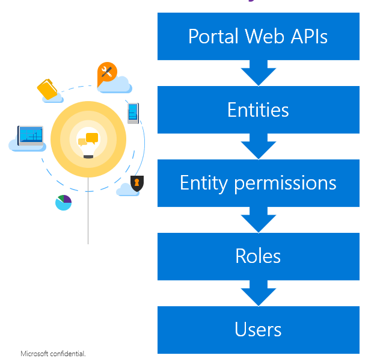
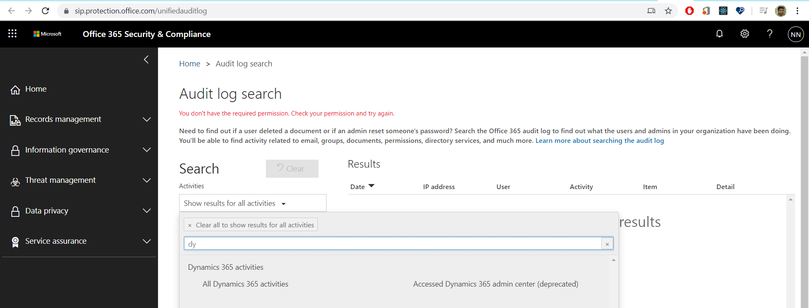
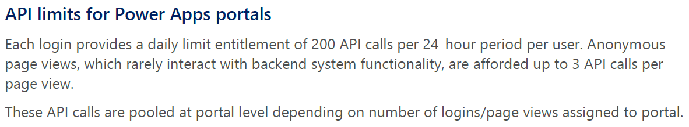

# Portals Web API

## Overview

Portals Web API enables building a richer user experience inside Power Apps portals pages. You can use Web API to create, read, update, and delete (CRUD) operations across all Common Data Service entities from your portal pages.

For example, you can create a new account, update a contact, or change the [entity permissions](configure/assign-entity-permissions.md) for a product using portals Web API instead of using Portal Management app.

> [!IMPORTANT]
> Portals Web API operations are limited to entities related to data. For example, entities such as Accounts, Contacts or your custom entity. Configuration of entity metadata, or portal configuration entity data isn't supported when using the portals Web API. For example, configuring portals entities such as adx_contentsnippet, adx_entityform or adx_entitylist isn't supported using portals Web API. 

## Web API operations

Portals Web API offers a subset of capabilities for Common Data Service operations that you can do using Common Data Service API. The following list explains the operations available in portal Web API in addition to Common Data Service Web API:

| Common Data Service operation | Available in portals Web API |
| - | - |
| [Associate and disassociate entities](../../developer/common-data-service/webapi/associate-disassociate-entities-using-web-api.md) | &check; |
| [Create an entity](../../developer/common-data-service/webapi/create-entity-web-api.md) | &check; |
| [Detect duplicate data](../../developer/common-data-service/webapi/manage-duplicate-detection-create-update.md)  | &cross; |
| [Execute batch operations](../../developer/common-data-service/webapi/execute-batch-operations-using-web-api.md) | &cross; |
| [Impersonate another user](../../developer/common-data-service/webapi/impersonate-another-user-web-api.md) | &cross; |
| [Perform conditional operations](../../developer/common-data-service/webapi/perform-conditional-operations-using-web-api.md) | &cross; |
| [Query Data](../..//developer/common-data-service/webapi/query-data-web-api.md) | &check; |
| [Retrieve an entity](../../developer/common-data-service/webapi/retrieve-entity-using-web-api.md) | &check; |
| [Retrieve and execute predefined queries](../../developer/common-data-service/webapi/retrieve-and-execute-predefined-queries.md) | &cross; |
| [Update and delete entities](../../developer/common-data-service/webapi/update-delete-entities-using-web-api.md) | &check; |
| [Use actions](../../developer/common-data-service/webapi/use-web-api-actions.md) | &check; |
| [Use functions](../../developer/common-data-service/webapi/use-web-api-functions.md) | &cross; |

## Site settings for Web API

You must enable site setting to enable the portals Web API for your portal. Also, you can configure field-level Web API that determines the entity fields that can or can't be modified using portals Web API. 

When you configure inner error site setiing, the Web API response includes **@Neeraj: What is inner error?**

| Site Setting Name | Description|
| - |- |
| *webapi/\<entity name\>/enabled* | Enables or disables OData API for \<entity name\>.   **Default:** `False`   **Valid values:** `True, False` |
| *webapi/\<entity name\>/fields*  | Defines the comma separated list of attributes that can be modified using Web API.    **Possible values:**    - *All attributes:* `*`   - *Specific attributes:* `attr1,attr2,attr3`   **Note**: **\*** takes precedence over individual attribute names. For example, **\*** is considered and all attributes are allowed if the value is: `attr1,*,attr3`.   **Important**: Mandatory site setting. When this setting is missing, you'll see this error: *No field define for this entity.* |
| *webapi/error/innererror* | Enables or disables **@Neeraj: What is inner error?**.   **Default:** `False`   **Valid values:** `True, False`

## Sample code

You can perform the [available Web API operations](#web-api-operations) in portals. Web API operations consist of [HTTP requests and responses](../..developer/common-data-service/webapi/compose-http-requests-handle-errors.md). The following table shows sample operations, methods, URI and the sample JSON you can use in the HTTP request.

<table style="text-align:left">
  <tr>
    <th>Operation</th>
    <th>Method</th>
    <th>URI</th>
    <th>JSON Sample</th>
  </tr>
  <tr>
    <td>Basic create</td>
    <td>POST</td>
    <td><i>[Portal URI]/_api/accounts</i></td>
    <td>@Neeraj: need sample</td>
  </tr>
  <tr>
    <td>Associate entity records on create</td>
    <td>POST</td>
    <td><i>[Portal URI]/_api/accounts</i></td>
    <td><code>{"name":"Sample Account","primarycontactid@odata.bind":"/contacts(00000000-0000-0000-0000-000000000001)"}</code></td>
  </tr>
  <tr>
    <td>Basic update</td>
    <td>PATCH</td>
    <td><i>[Portal URI]/_api/accounts(00000000-0000-0000-0000-000000000001)</i></td>
    <td><code>{      "name": "Updated Sample Account ",      "creditonhold": true,      "address1_latitude": 47.639583,      "description": "This is the updated description of the sample account",      "revenue": 6000000,      "accountcategorycode": 2  }</code></td>
  </tr>
  <tr>
    <td>Update a single property value</td>
    <td>PUT</td>
    <td><i>[Portal URI]/_api/accounts(00000000-0000-0000-0000-000000000001)/name</i></td>
    <td><code>{"value": "Updated Sample Account Name"}</code></td>
  </tr>
  <tr>
    <td>Update a single property value</td>
    <td>PUT</td>
    <td><i>[Portal URI]/_api/accounts(00000000-0000-0000-0000-000000000001)/name</i></td>
    <td><code>{"value": "Updated Sample Account Name"}</code></td>
  </tr>
  <tr>
    <td>Delete a single property value</td>
    <td>DELETE</td>
    <td><i>[Portal URI]/_api/accounts(00000000-0000-0000-0000-000000000001)/description</i></td>
    <td><code>@Neeraj: need sample</code></td>
  </tr>
  <tr>
    <td>Basic delete</td>
    <td>DELETE</td>
    <td><i>[Portal URI]/_api/accounts(00000000-0000-0000-0000-000000000001)</i></td>
    <td><code>@Neeraj: need sample</code></td>
  </tr>
  <tr>
    <td>Add a reference to a collection-valued navigation property</td>
    <td>POST</td>
    <td><i>[Portal URI]/_api/accounts(00000000-0000-0000-0000-000000000002)/opportunity_customer_accounts/$ref</i></td>
    <td><code>{"@odata.id":"[Portal URI]/_api/opportunities(00000000-0000-0000-0000-000000000001)"}</code></td>
  </tr>
  <tr>
    <td>Remove a reference to an entity</td>
    <td>DELETE</td>
    <td><i>[Portal URI]/_api/accounts(00000000-0000-0000-0000-000000000002)/opportunity_customer_accounts/$ref?$id=[Portal URI]/_api/opportunities(00000000-0000-0000-0000-000000000001)</i></td>
    <td><code>@Neeraj: need sample</code></td>
  </tr>
  <tr>
    <td>Remove a reference to an entity</td>
    <td>DELETE</td>
    <td><i>[Portal URI]/_api/accounts(00000000-0000-0000-0000-000000000002)/opportunity_customer_accounts(00000000-0000-0000-0000-000000000001)/$ref</i></td>
    <td><code>@Neeraj: need sample & please confirm if sample is different than earlier since both have same operation - "Remove a reference to an entity"</code></td>
  </tr>
  <tr>
    <td>Remove a reference to an entity for a single-valued navigation property</td>
    <td>DELETE</td>
    <td><i>[Portal URI]/_api/opportunities(00000000-0000-0000-0000-000000000001)/customerid_account/$ref</i></td>
    <td><code>For a single-valued navigation property, remove the $id query string parameter. @Neeraj: please elaborate or share sample</code></td>
  </tr>
  <tr>
    <td>Change the reference in a single-valued navigation property</td>
    <td>PUT</td>
    <td><i>[Portal URI]/_api/opportunities(00000000-0000-0000-0000-000000000001)/customerid_account/$ref</i></td>
    <td><code>{"@odata.id":"[Portal URI]/_api/accounts(00000000-0000-0000-0000-000000000002)"}</code></td>
  </tr>
  <tr>
    <td>Associate entities on update using single-valued navigation property</td>
    <td>PATCH</td>
    <td><i>[Portal URI]/_api/opportunities(00000000-0000-0000-0000-000000000001)</i></td>
    <td><code>{"customerid_account@odata.bind":"[Portal URI]/_api/accounts(00000000-0000-0000-0000-000000000002)"}</code></td>
  </tr>
  <tr>
    <td>Associate entities on update using collection-valued navigation property</td>
    <td>PUT</td>
    <td><i>[Portal URI]/_api/emails(00000000-0000-0000-0000-000000000001)/email_activity_parties</i></td>
    <td><code>{"value": [{"partyid_contact@odata.bind":"contact(a30d4045-fc46-e711-8115-e0071b66df51)","participationtypemask":3},{"partyid_contact@odata.bind":"contact(1dcdda07-3a39-e711-8145-e0071b6a2001)","participationtypemask":2}]}</code></td>
  </tr>
</table>

<!---Completed till here-->

Web API’s URI
-------------

| **Operation**                                                            | **Method** | **URI**                                                                                                                                                                         | JSON Sample                                                                                                                                                                                                                                                                                                                     |
|--------------------------------------------------------------------------|------------|---------------------------------------------------------------------------------------------------------------------------------------------------------------------------------|---------------------------------------------------------------------------------------------------------------------------------------------------------------------------------------------------------------------------------------------------------------------------------------------------------------------------------|
| Basic create                                                             | POST       | [Portal URI]/_api/accounts                                                                                                                                                      |                                                                                                                                                                                                                                                                                                                                 |
| Associate entity records on create                                       | POST       | [Portal URI]/_api/accounts                                                                                                                                                      | {                                                                                                                                                                                                                                                                                                                               |
|                                                                          |            |                                                                                                                                                                                 | "name":"Sample Account",                                                                                                                                                                                                                                                                                                        |
|                                                                          |            |                                                                                                                                                                                 | "primarycontactid\@odata.bind":"/contacts(00000000-0000-0000-0000-000000000001)"                                                                                                                                                                                                                                                |
|                                                                          |            |                                                                                                                                                                                 | }                                                                                                                                                                                                                                                                                                                               |
| Basic update                                                             | PATCH      | [Portal URI]/_api/accounts(00000000-0000-0000-0000-000000000001)                                                                                                                | { "name": "Updated Sample Account ", "creditonhold": true, "address1_latitude": 47.639583, "description": "This is the updated description of the sample account", "revenue": 6000000, "accountcategorycode": 2 }                                                                                                               |
| Update a single property value                                           | PUT        | [Portal URI]/_api/accounts(00000000-0000-0000-0000-000000000001)/name                                                                                                           | {"value": "Updated Sample Account Name"}                                                                                                                                                                                                                                                                                        |
| Delete a single property value                                           | DELETE     | [Portal URI]/_api/accounts(00000000-0000-0000-0000-000000000001)/description                                                                                                    |                                                                                                                                                                                                                                                                                                                                 |
| Basic delete                                                             | DELETE     | [Portal URI]/_api/accounts(00000000-0000-0000-0000-000000000001)                                                                                                                |                                                                                                                                                                                                                                                                                                                                 |
| Add a reference to a collection-valued navigation property               | POST       | [Portal URI]/_api/accounts(00000000-0000-0000-0000-000000000002)/opportunity_customer_accounts/\$ref                                                                            | [{ "\@odata.id":"[Portal URI]/_api/opportunities(00000000-0000-0000-0000-000000000001)" } ](../../../../nenandw/AppData/Local/Microsoft/Windows/INetCache/Content.MSO/%7b%20%20%22@odata.id%22:%22%5bPortal%20URI%5d/api/data/opportunities(00000000-0000-0000-0000-000000000001)%22%20%20%7d)                                  |
| Remove a reference to an entity                                          | DELETE     | [Portal URI]/_api/accounts(00000000-0000-0000-0000-000000000002)/opportunity_customer_accounts/\$ref?\$id=[Portal URI]/_api/opportunities(00000000-0000-0000-0000-000000000001) |                                                                                                                                                                                                                                                                                                                                 |
| Remove a reference to an entity                                          | DELETE     | [Portal URI]/_api/accounts(00000000-0000-0000-0000-000000000002)/opportunity_customer_accounts(00000000-0000-0000-0000-000000000001)/\$ref                                      |                                                                                                                                                                                                                                                                                                                                 |
| Remove a reference to an entity for a single-valued navigation property  | DELETE     | [Portal URI]/_api/opportunities(00000000-0000-0000-0000-000000000001)/customerid_account/\$ref                                                                                  | For a single-valued navigation property, remove the \$id query string parameter.                                                                                                                                                                                                                                                |
| Change the reference in a single-valued navigation property              | PUT        | [Portal URI]/_api/opportunities(00000000-0000-0000-0000-000000000001)/customerid_account/\$ref                                                                                  | [{ "\@odata.id":"[Portal URI]/_api/accounts(00000000-0000-0000-0000-000000000002)" } ](../../../../nenandw/AppData/Local/Microsoft/Windows/INetCache/Content.MSO/%7b%20%20%20%22@odata.id%22:%22%5bPortal%20URI%5d/api/data/accounts(00000000-0000-0000-0000-000000000002)%22%20%20%7d)                                         |
| Associate entities on update using single-valued navigation property     | PATCH      | [Portal URI]/_api/opportunities(00000000-0000-0000-0000-000000000001)                                                                                                           | [{ "customerid_account\@odata.bind":"[Portal URI]/_api/accounts(00000000-0000-0000-0000-000000000002)" } ](../../../../nenandw/AppData/Local/Microsoft/Windows/INetCache/Content.MSO/%7b%20%20%20%22customerid_account@odata.bind%22:%22%5bPortal%20URI%5d/api/data/accounts(00000000-0000-0000-0000-000000000002)%22%20%20%7d) |
| Associate entities on update using collection-valued navigation property | PUT        | [Portal URI]/_api/emails(00000000-0000-0000-0000-000000000001)/email_activity_parties                                                                                           | {                                                                                                                                                                                                                                                                                                                               |
|                                                                          |            |                                                                                                                                                                                 | "value": [                                                                                                                                                                                                                                                                                                                      |
|                                                                          |            |                                                                                                                                                                                 | {                                                                                                                                                                                                                                                                                                                               |
|                                                                          |            |                                                                                                                                                                                 | "partyid_contact\@odata.bind":"contacts(a30d4045-fc46-e711-8115-e0071b66df51)",                                                                                                                                                                                                                                                 |
|                                                                          |            |                                                                                                                                                                                 | "participationtypemask":3                                                                                                                                                                                                                                                                                                       |
|                                                                          |            |                                                                                                                                                                                 |                                                                                                                                                                                                                                                                                                                                 |
|                                                                          |            |                                                                                                                                                                                 | },                                                                                                                                                                                                                                                                                                                              |
|                                                                          |            |                                                                                                                                                                                 | {                                                                                                                                                                                                                                                                                                                               |
|                                                                          |            |                                                                                                                                                                                 | "partyid_contact\@odata.bind":"contacts(1dcdda07-3a39-e711-8145-e0071b6a2001)",                                                                                                                                                                                                                                                 |
|                                                                          |            |                                                                                                                                                                                 | "participationtypemask":2                                                                                                                                                                                                                                                                                                       |
|                                                                          |            |                                                                                                                                                                                 |                                                                                                                                                                                                                                                                                                                                 |
|                                                                          |            |                                                                                                                                                                                 | }                                                                                                                                                                                                                                                                                                                               |
|                                                                          |            |                                                                                                                                                                                 | ]                                                                                                                                                                                                                                                                                                                               |
|                                                                          |            |                                                                                                                                                                                 | }                                                                                                                                                                                                                                                                                                                               |

Error Codes
-----------

Error codes with Error messages for all handled error messages.

| **Error Code** | **Error Name**                                           | **Error Message**                                                                       |
|----------------|----------------------------------------------------------|-----------------------------------------------------------------------------------------|
| 900400FF       | NoAttributesForEntityCreate                              | No attributes for Create Entity action.                                                 |
| 90040100       | InvalidAttribute                                         | Attribute {0} cannot be found for entity {1}.                                           |
| 90040101       | AttributePermissionIsMissing                             | Attribute {0} in entity {1} is not enabled for Web Api.                                 |
| 90040102       | EntityPermissionWriteIsMissingDuringUpdate               | You don’t have permission to update {0} entity.                                         |
| 90040103       | EntityPermissionCreateIsMissing                          | You don’t have permission to create {0} entity.                                         |
| 90040104       | EntityPermissionDeleteIsMissing                          | You don’t have permission to delete {0) entity.                                         |
| 90040105       | EntityPermissionAppendIsMissngDuringAssociationChange    | You don’t have permission to associate or disassociate entity {0} with {1}.             |
| 90040106       | EntityPermissionAppendToIsMissingDuringAssociationChange | You don’t have permission to associate or disassociate entity {1} to {0}                |
| 90040107       | CannotDeleteDueToAssociation                             | The object you tried to delete is associated with another object and cannot be deleted. |
| 90040108       | MissingPortalRequestVerificationToken                    | An invalid request verification token was passed.                                       |
| 90040109       | MissingPortalSessionCookie                               | An Invalid session token was passed into the throwing method                            |
| 9004010A       | InvalidOperation                                         | Invalid Operation performed.                                                            |
| 9004010B       | NotSupported                                             | This action is not supported.                                                           |
| 9004010C       | ResourceDoesNotExists                                    | Resource not found for the segment '{0}'.                                               |
| 9004010D       | CDSError                                                 | CDS error occurred.                                                                     |

How Security works?
-------------------

Web API sample code 
--------------------

### Web API Ajax Call

>   (function(webapi, \$){

>   function safeAjax(ajaxOptions) {

>   var deferredAjax = \$.Deferred();

>    

>   shell.getTokenDeferred().done(function (token) {

>   // add headers for ajax

>   if (!ajaxOptions.headers) {

>   \$.extend(ajaxOptions, {

>   headers: {

>   "__RequestVerificationToken": token

>   }

>   });

>   } else {

>   ajaxOptions.headers["__RequestVerificationToken"] = token;

>   }

>   \$.ajax(ajaxOptions)

>   .done(function(data, textStatus, jqXHR) {

>   validateLoginSession(data, textStatus, jqXHR, deferredAjax.resolve);

>   }).fail(deferredAjax.reject); //ajax

>   }).fail(function () {

>   deferredAjax.rejectWith(this, arguments); // on token failure pass the token
>   ajax and args

>   });

>    

>   return deferredAjax.promise();        

>   }

>   webapi.safeAjax = safeAjax;

>   })(window.webapi = window.webapi \|\| {}, jQuery)

>    

### //Create 

>   webapi.safeAjax({

>   type: "POST",

>   url: "<https://magic273.powerappsportals.com/_api/accounts>",

>   contentType: "application/json",

>   data: JSON.stringify({

>   "name": "Sample Account 02:20 PM"

>   }),

>   success: function (res, status, xhr) {

>   console.log(res);

>   console.log("entityID: "+ xhr.getResponseHeader("entityid"))

>   }

>   });

>    

### //Update

>   webapi.safeAjax({

>   type: "PATCH",

>   url:
>   "<https://magic273.powerappsportals.com/_api/accounts(1da81c42-ee99-ea11-a811-000d3a37ed0b)>",

>   contentType: "application/json",

>   data: JSON.stringify({

>   "name": "Sample Account 02:20 PM"

>   }),

>   success: function (res) {

>   console.log(res);

>   }

>   });

>    

### //Delete

>   webapi.safeAjax({

>   type: "DELETE",

>   url:
>   "<https://magic273.powerappsportals.com/_api/accounts(1da81c42-ee99-ea11-a811-000d3a37ed0b)>",

>   contentType: "application/json",

>   success: function (res) {

>   console.log(res);

>   }

>   });

### Authentication 

User does not need to include any code for authentication as each of these are
already authenticated by the application and authentication and authorization
are managed by the application.

Portal API must use cookie for authentication and authorization. All POST call
must include CSRF token.

### GDPR

All request header should have contact id passed for auditing purpose. For
anonymous user it will be passed “null”.

If audit logging is enabled, then user can see all the audit events in Office
365 audit logging (i.e. <https://protection.office.com/unifiedauditlog> ).

Useful links:

-   [Enable and use Activity
    Logging](https://docs.microsoft.com/en-us/power-platform/admin/enable-use-comprehensive-auditing)

-   [Export, configure, and view audit log
    records](https://docs.microsoft.com/en-us/microsoft-365/compliance/export-view-audit-log-records)

### CORS

Any call from outside the Portal pages will not be allowed.

### Telemetry

1.  Web API Uses, that includes

    1.  Request rate

    2.  Request data complexity

        1.  Create/Update/Delete: Request JSON body complexity. Number attribute
            with datatype. Nested entity depth.

2.  What is the web API response code?

    1.  2xx, 4xx, 5xx etc. to identify the success/error rate

3.  What is the response time (performance) of the specific webAPI request?

### Throttling 

| **Error code** | **Error message**                                                                                                                                                                                                     |
|----------------|-----------------------------------------------------------------------------------------------------------------------------------------------------------------------------------------------------------------------|
|                | Number of requests exceeded the limit of 6000, measured over time window of 300 seconds.                                                                                                                              |
|                | Combined execution time of incoming requests exceeded limit of 1,200,000 milliseconds over time window of 300 seconds. Decrease number of concurrent requests or reduce the duration of requests and try again later. |
|                | Number of concurrent requests exceeded the limit of 52                                                                                                                                                                |

If you use HTTP requests with the Web API, the response will include the same
messages, but with:  
StatusCode : 429

All requests will return these error responses until the volume of API requests
falls below the limit. If you get these responses, your application should stop
sending API requests until the volume of requests is below the limit.

**Check remaining limit**

If you are using HTTP requests with the Web API, you can track the remaining
limit values with the following HTTP response headers:

| **Header**                                  | **Value Description**                                                           |
|---------------------------------------------|---------------------------------------------------------------------------------|
| x-ms-ratelimit-burst-remaining-xrm-requests | The remaining number of requests for this connection                            |
| x-ms-ratelimit-time-remaining-xrm-requests  | The remaining combined duration for all connections using the same user account |

### Licensing 

We will be utilizing existing licensing, behavior which includes the API calls
for each user type.

For more detail please refer internal Licensing guide

API Configuration
-----------------

User can configure Portal API related settings through sitesetting.

Only active sitesetting will be honored.

| **Site Setting Name**                          | **Description**                                                                                                                                                                                                                                                                                                                                                                  |
|------------------------------------------------|----------------------------------------------------------------------------------------------------------------------------------------------------------------------------------------------------------------------------------------------------------------------------------------------------------------------------------------------------------------------------------|
| webapi/\<entity name\>/enabled                 | Enables or disables OData API for \<entity name\> **Default:** False **Valid values:** True/False                                                                                                                                                                                                                                                                                |
| webapi/\<entity name\>/fields                  | User can define the list of attributes which can modify via web api It’s a mandatory. If this setting is missing, it will throw error. **Error message:** No field define for this entity. Possible values: **All attributes:** \* **Specific attributes:** attr1,attr2,attr3 If “\*” is specified in the values, then it take precedence and it will enable all the attributes. |
| webapi/\<entity name\>/disableentitypermission | **Default:** False **Valid values:** True/False                                                                                                                                                                                                                                                                                                                                  |
| webapi/error/innererror                        | **Default:** False **Valid values:** True/False                                                                                                                                                                                                                                                                                                                                  |

Example: User want to expose OData API for case entity. Where authenticated
users are allowed to perform CURD operation on this entity

**webapi/incident/enabled**: true

**webapi/incident/fields:** attr1,attr2,attr3

Compose HTTP requests and handle errors 
----------------------------------------

### Web API URL and versioning 

| Part         | Description                              |
|--------------|------------------------------------------|
| Protocol     | https://                                 |
| Base URL     | \<portal name\>                          |
| Web API Path | \_api                                    |
| Versioning   | v[major].[minor][patch]                  |
| Resource     | Name of entity or action you want to use |

-   Example:
    [https://contoso.powerappsportal.com/_api/case](https://contoso.powerappsportal.com/api/data/v1.0/case)
    -

For entity resources [portal’s entity
permission](https://docs.microsoft.com/en-us/dynamics365/portals/assign-entity-permissions)
configuration will be owner

### JavaScript Client API

We will be providing JavaScript Client API to get Portal base URL for API
endpoint.

**GetAPIBaseURL() – result: https://\<portal name\>/_api**

### HTTP methods

| Method | Usage                                                           |
|--------|-----------------------------------------------------------------|
| Get    | Use when retrieving data.                                       |
| Post   | Creating entities and calling actions                           |
| Patch  | Use when updating entities or performing upsert operation.      |
| Delete | Use when deleting entities or individual properties of entities |
| Put    |                                                                 |

### HTTP Headers

Web API only support JSON. There following headers can be applied.

Every request should include the Accept header value of *application/json*, even
when no response body is expected.

Include *If-None-Match*: null header in the request body to override browser
caching of Web API request.

The current OData version is 4.0, but future versions may allow for new
capabilities. To ensure that there is no ambiguity about the OData version that
will be applied to your code at that point in the future.

Every request that includes JSON data in the request body *must include a
Content-Type header* with a value of *application/json*.

Example: Get entity data

Example: Create entity data

### Identify status codes

| Code                        | Description                                                                                                                               | Type         |
|-----------------------------|-------------------------------------------------------------------------------------------------------------------------------------------|--------------|
| **200 OK**                  | Expect this when your operation will return data in the response body.                                                                    | Success      |
| **204 No Content**          | Expect this when your operation succeeds but does not return data in the response body.                                                   | Success      |
| **403 Forbidden**           | Expect this for the following types of errors:                                                                                            | Client Error |
|                             |                                                                                                                                           |              |
|                             | \-        AccessDenied                                                                                                                    |              |
|                             | \-        AttributePermissionIsMissing                                                                                                    |              |
|                             | \-        EntityPermissionWriteIsMissingDuringUpdate                                                                                      |              |
|                             | \-        EntityPermissionCreateIsMissing                                                                                                 |              |
|                             | \-        EntityPermissionDeleteIsMissing                                                                                                 |              |
|                             | \-        EntityPermissionAppendIsMissngDuringAssociationChange                                                                           |              |
|                             | \-        EntityPermissionAppendToIsMissingDuringAssociateChange                                                                          |              |
| **401 Unauthorized**        | Expect this for the following types of errors:                                                                                            | Client Error |
|                             |                                                                                                                                           |              |
|                             | \-        MissingPortalRequestVerificationToken                                                                                           |              |
|                             | \-        MissingPortalSessionCookie                                                                                                      |              |
|                             |                                                                                                                                           |              |
| **413 Payload Too Large**   | Expect this when the request length is too large.                                                                                         | Client Error |
| **400 BadRequest**          | Expect this when an argument is invalid.                                                                                                  | Client Error |
| **404 Not Found**           | Expect this when the resource doesn’t exist.                                                                                              | Client Error |
|                             | Entity is not expose for web api                                                                                                          |              |
| **405 Method Not Allowed**  | This error occurs for incorrect method and resource combinations. For example, you can’t use DELETE or PATCH on a collection of entities. | Client Error |
|                             |                                                                                                                                           |              |
|                             | Expect this for the following types of errors:                                                                                            |              |
|                             |                                                                                                                                           |              |
|                             | \-        CannotDeleteDueToAssociation                                                                                                    |              |
|                             | \-        InvalidOperation                                                                                                                |              |
|                             | \-        NotSupported                                                                                                                    |              |
| **429 Too Many Requests**   | Expect this when API limits are exceeded. More information:Service Protection API Limits.                                                 | Client Error |
| **501 Not Implemented**     | Expect this when some requested operation isn't implemented.                                                                              | Server Error |
| **503 Service Unavailable** | Expect this when the web API service isn’t available.                                                                                     | Server Error |

-   InvalidAttribute

magPost

| **Header Name**                                                                                                                                            | **Is CDS specific** |
|------------------------------------------------------------------------------------------------------------------------------------------------------------|---------------------|
| cache-control: no-cache                                                                                                                                    |                     |
| allow: OPTIONS,GET,HEAD,POST                                                                                                                               |                     |
| expires: -1                                                                                                                                                |                     |
| \--location: https://magic23.crm.dynamics.com/_api/v9.1/accounts(4ae4d4c4-f398-ea11-a811-000d3a37ed0b)                                                     | Y                   |
| \--x-ms-service-request-id: 237b2702-5bc8-4d2c-84e0-61717700f90c, 1fb700d8-28d8-44b8-8cf5-1978d576c1c5                                                     | Y                   |
| strict-transport-security: max-age=31536000; includeSubDomains                                                                                             |                     |
| req_id: 1fb700d8-28d8-44b8-8cf5-1978d576c1c5                                                                                                               |                     |
| access-control-allow-origin: \*                                                                                                                            |                     |
| access-control-expose-headers: Preference-Applied,OData-EntityId,Location,ETag,OData-Version,Content-Encoding,Transfer-Encoding,Content-Length,Retry-After |                     |
| \--authactivityid: 7c9bcb94-411d-47b0-874d-d1f9c1ca3b81                                                                                                    | Y                   |
| odata-version: 4.0                                                                                                                                         |                     |
| \--odata-entityid: https://magic23.crm.dynamics.com/_api/v9.1/accounts(4ae4d4c4-f398-ea11-a811-000d3a37ed0b)                                               | Y                   |
| \--x-ms-ratelimit-burst-remaining-xrm-requests: 5993                                                                                                       | Y                   |
| \--x-ms-ratelimit-time-remaining-xrm-requests: 1,199.46                                                                                                    | Y                   |
| public: OPTIONS,GET,HEAD,POST                                                                                                                              |                     |
| timing-allow-origin: \*                                                                                                                                    |                     |
| x-source: 1274022621962271406513018456102176233138130371162212021413319206254117391372519213849                                                            |                     |
| date: Mon, 18 May 2020 10:38:54 GMT                                                                                                                        |                     |
| X-Firefox-Spdy: h2                                                                                                                                         |                     |

### Parse errors from the response 

<https://powerapps.microsoft.com/en-us/blog/web-api-innererror-property-will-be-removed/>

Error will be in the format. We will have site setting to expose *innererror*
field to the portal.

Site setting to expose *innererror* field :

**Name**: webapi/error/innererror

**Value**: True or False (default is false, to expose the attribute set the
value to True)

{

"error":{

"code": "\<This code is not related to the http status code and is frequently
empty\>",

"message": "\<A message describing the error\>",

"innererror": {

“code”: “800xxxx”,

"message": "\<A message describing the error, this is frequently the same as the
outer message\>",

"type": "Microsoft.Crm.CrmHttpException",

"stacktrace": "\
"

}

}

}

In case CDS throws the error

CDS Error JSON:

{

"error":{

"code": "800XXX

"message": " error message

}

}

Portal WEB APIs error response will be

{

"error":{

"code": "9004010D"

"message": "CDS error occurred",

“cdscode”: “800xxx”,

"innererror": {

"code": "800XXX

"message": " error message

}

}

}

#### Error Codes

Error codes with Error messages for all handled error messages.

| **Error Code** | **Error Name**                                           | **Error Message**                                                                       |
|----------------|----------------------------------------------------------|-----------------------------------------------------------------------------------------|
| 900400FF       | NoAttributesForEntityCreate                              | No attributes for Create Entity action.                                                 |
| 90040100       | InvalidAttribute                                         | Attribute {0} cannot be found for entity {1}.                                           |
| 90040101       | AttributePermissionIsMissing                             | Attribute {0} in entity {1} is not enabled for Web Api.                                 |
| 90040102       | EntityPermissionWriteIsMissingDuringUpdate               | You don’t have permission to update {0} entity.                                         |
| 90040103       | EntityPermissionCreateIsMissing                          | You don’t have permission to create {0} entity.                                         |
| 90040104       | EntityPermissionDeleteIsMissing                          | You don’t have permission to delete {0) entity.                                         |
| 90040105       | EntityPermissionAppendIsMissngDuringAssociationChange    | You don’t have permission to associate or disassociate entity {0} with {1}.             |
| 90040106       | EntityPermissionAppendToIsMissingDuringAssociationChange | You don’t have permission to associate or disassociate entity {1} to {0}                |
| 90040107       | CannotDeleteDueToAssociation                             | The object you tried to delete is associated with another object and cannot be deleted. |
| 90040108       | MissingPortalRequestVerificationToken                    | An invalid request verification token was passed.                                       |
| 90040109       | MissingPortalSessionCookie                               | An Invalid session token was passed into the throwing method                            |
| 9004010A       | InvalidOperation                                         | Invalid Operation performed.                                                            |
| 9004010B       | NotSupported                                             | This action is not supported.                                                           |
| 9004010C       | ResourceDoesNotExists                                    | Resource not found for the segment '{0}'.                                               |
| 9004010D       | CDSError                                                 | CDS error occurred.                                                                     |

For 500 unhandled server error: "An unexpected error occurred while processing
the request"

Retrieve an entity record – P3
------------------------------

Use a GET request to retrieve data for an entity specified as the resource with
a unique identifier. When retrieving an entity record you can also request
specific properties and expand navigation properties to return properties from
related entities.

### Basic Retrieve example

This example returns data for an account entity instance with the primary key
value equal to 00000000-0000-0000-0000-000000000001.

This example will return all the allowed properties from the entities. As a
recommended practice user should always use *\$select* system query to limit the
return properties.

### Retrieve specific properties

Use the \$select system query option to limit the properties returned by
including a comma-separated list of property names. This is an important
performance best practice. If properties aren’t specified using \$select, all
properties will be returned.

**Request:**

**Response:**

Create and Entity record – P1
-----------------------------

Use a POST request to send data to create an entity. You can create multiple
related entity records in a single operation using ‘deep insert’. You also need
to know how to set values to associate a new entity record to existing entities
using the \@odata.bind annotation.

### Basic create 

**Request**:

**Response**:

The response *OData-EntityId* header contains the Uri of the created entity.

### Create related entity records in one operation

You can create entities related to each other by defining them as navigation
properties values. This is known as *deep insert*.

As with a basic create, the response *OData-EntityId* header contains the Uri of
the created entity. The URIs for the related entities created aren’t returned.

For example, the following request body posted to the Account entity set will
create a total of four new entities in the context of creating an account.

-   A contact is created because it is defined as an object property of the
    single-valued navigation property *primarycontactid*.

-   An opportunity is created because it is defined as an object within an array
    that is set to the value of a collection-valued navigation
    property *opportunity_customer_accounts*.

-   A task is created because it is defined an object within an array that is
    set to the value of a collection-valued navigation
    property *Opportunity_Tasks*.

**Request**:

**Response**:

The response *OData-EntityId* header contains the Uri of the created entity.

### Associate entity records on create

To associate new entities to existing entities when they are created you must
set the value of single-valued navigation properties using
the \@odata.bind annotation.

The following request body posted to the accounts entity set will create a new
account associated with an existing contact with the contactid value of
00000000-0000-0000-0000-000000000001.

**Request**

**Response**  

**Example JSON for creating annotation via Web API**

{

"new_attribute1": "test attribute 1",

"new_attribute2": "test attribute 2",

"new_comments": "test comments",

"new_recordurl": recordURL,

"new_feedback_Annotations":

[

{

"notetext": "Screenshot attached",

"subject": "Attachment",

"filename": file.name,

"mimetype": file.type,

"documentbody": base64str,

}

]

}

“documentbody” will contain the attachment as base64 string.

### Check for Duplicate records

In CDS by default, duplicate detection is suppressed when you are creating
records using the Web API. You must include
the MSCRM.SuppressDuplicateDetection: false header with your POST request to
enable duplicate detection. Duplicate detection only applies when the
organization has enabled duplicate detection, the entity is enabled for
duplicate detection, and there are active duplicate detection rules being
applied. More information: [Detect duplicate data using
code](https://docs.microsoft.com/en-us/powerapps/developer/common-data-service/detect-duplicate-data-with-code)

Portal Web API will not

### Create a new entity record from another entity

### Create with data returned

You can compose your POST request so that data from the created record will be
returned with a status of 201 (Created). To get his result, you must use
the return=representation preference in the request headers.

To control which properties are returned, append the \$select query option to
the URL to the entity set. The \$expand query option will be ignored if used.

When an entity is created in this way the OData-EntityId header containing the
URI to the created record is not returned.

**Request**

**Response**

Update and delete entities using the Web API – P1
-------------------------------------------------

Operations to modify data are a core part of the Web API. In addition to a
simple update and delete, you can perform operations on single attributes and
compose *upsert* requests that will either update or insert an entity depending
on whether it exists.

### Basic update

Update operations use the HTTP PATCH verb. Pass a JSON object containing the
properties you want to update to the URI that represents the entity. A response
with a status of 204 will be returned if the update is successful.

This example updates an existing account record with the accountid value of
00000000-0000-0000-0000-000000000001.

**Request**

**Response**

### Update with data returned

To retrieve data from an entity you are updating you can compose
your PATCH request so that data from the created record will be returned with a
status of 200 (OK). To get this result, you must use
the return=representation preference in the request headers.

To control which properties are returned, append the \$select query option to
the URL to the entity set. The \$expand query option will be ignored if used.

**Request**

**Response**

### Update a single property value

When you want to update only a single property value use a PUT request with the
property name appended to the Uri of the entity.

The following example updates the name property of an existing account entity
with the accountid value of 00000000-0000-0000-0000-000000000001.

**Request**

**Response**

### Delete a single property value

To delete the value of a single property use a DELETE request with the property
name appended to the Uri of the entity.

The following example deletes the value of the description property of an
account entity with the accountid value of 00000000-0000-0000-0000-000000000001.

**Request**

**Response**

### Upsert an entity

An *upsert* operation is exactly like an update. It uses a PATCH request and
uses a URI to reference a specific entity. The difference is that if the entity
doesn’t exist it will be created. If it already exists, it will be updated. 

Normally when creating a new entity you will let the system assign a unique
identifier. This is a best practice. But if you need to create a record with a
specific *id* value, an upsert operation provides a way to do this. This can be
valuable in situation where you are synchronizing data in different systems.

#### Prevent create in upsert

If you are updating data and there is some possibility that the entity was
deleted intentionally, you will not want to re-create the entity. To prevent
this, add an If-Match header to the request with a value of "\*".

**Request**

**Response**

#### Prevent update in upsert

If you’re inserting data, there is some possibility that a record with the
same id value already exists in the system and you may not want to update it. To
prevent this, add an If-None-Match header to the request with a value of "\*".
**Request**

**Response**

If the entity isn’t found, you will get a normal response with status 204 (No
Content). When the entity is found, you’ll get the following response with
status 412 (Precondition Failed).

### Basic delete

A delete operation is very straightforward. Use the DELETE verb with the URI of
the entity you want to delete. This example message deletes an account entity
with the primary key accountid value equal to
00000000-0000-0000-0000-000000000001.

**Request**

**Response**

Associate and disassociate entities – P1
----------------------------------------

### Add a reference to a collection-valued navigation property

The following example shows how to associate an existing opportunity entity with
the opportunityid value of 00000000-0000-0000-0000-000000000001 to the
collection-valued opportunity_customer_accounts navigation property for an
account entity with the accountid value of 00000000-0000-0000-0000-000000000002.
This is a 1:N relationship but you can perform the same operation for an N:N
relationship.

**Request**

**Response**

### Remove a reference to an entity

Use a DELETE request to remove a reference to an entity. The way you do it is
different depending on whether you’re referring to a collection-valued
navigation property or a single-valued navigation property.

**Request**  
For a collection-valued navigation property, use the following.

Or use this

**Request**

For a single-valued navigation property, remove the \$id query string parameter.

**Response**

Either way, a successful response has status 204.

### Change the reference in a single-valued navigation property

You can associate entities by setting the value of a single-valued navigation
property using PUT request with the following pattern.

**Request**

**Response**

### Associate entities on create

As described in [Create related entities in one
operation](#create-related-entity-records-in-one-operation), new entities can be
created with relationships using *deep insert*.

### Associate entities on update using single-valued navigation property

You can associate entities on update using the same message described in [Basic
update](#basic-update) but you must use the \@odata.bind annotation to set the
value of a single-valued navigation property. The following example changes the
account associated to an opportunity using the customerid_account single-valued
navigation property.

**Request**

**Response**

### Associate entities on update using collection-valued navigation property

We are not supporting this functionality right now as associating multiple
entities with an entity on update is a special scenario that is possible only
with [activityparty
EntityType.](https://docs.microsoft.com/en-us/dynamics365/customer-engagement/web-api/activityparty)

** Note**

Associating multiple entities with an entity on update is a special scenario
that is possible only with [activityparty
EntityType](https://docs.microsoft.com/en-us/dynamics365/customer-engagement/web-api/activityparty).

**Request**

**Response**

Use actions – P2
----------------

Actions represent re-usable operations you can perform using the Web API. Use a
POST request with actions listed in [Web API Action
Reference](https://docs.microsoft.com/en-us/dynamics365/customer-engagement/web-api/actions) to
perform operations that have side effects. You can also define custom actions
and they’ll be available for you to use.

### Unbound actions

[CDS Web API unbound
action](https://docs.microsoft.com/en-us/powerapps/developer/common-data-service/webapi/use-web-api-actions#unbound-actions)

The following example is the HTTP request and response to call
the [WinOpportunity ](https://docs.microsoft.com/en-us/dynamics365/customer-engagement/web-api/winopportunity?view=dynamics-ce-odata-9)action
for an opportunity with an opportunityid value
of b3828ac8-917a-e511-80d2-00155d2a68d2.

**Request**

**Response**

### Bound actions

When invoking a bound function, you must include the full name of the function
including the Microsoft.Dynamics.CRM namespace. If you do not include the full
name, you will get the following error: Status Code:400 Request message has
unresolved parameters.

The following example shows using the [AddToQueue
Action](https://docs.microsoft.com/en-us/dynamics365/customer-engagement/web-api/addtoqueue) to
add a letter to a queue. Because the type of the Target parameter type is not
specific (mscrm.crmbaseentity), you must explicitly declare type of the object
using the \@odata.type property value of the full name of the entity, including
the Microsoft.Dynamics.CRM namespace. In this
case, Microsoft.Dynamics.CRM.letter. More information:[Specify entity parameter
type](https://docs.microsoft.com/en-us/powerapps/developer/common-data-service/webapi/use-web-api-actions#bkmk_specifyentityparametertype)

**Request**

**Response**

### Use a custom action

\<add details\>

### Specify entity parameter type

\<add details\>