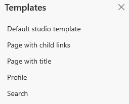

# Work with templates

The built-in templates are available according to the portal you provision. You can edit the templates by using the code editor. For example, the following built-in templates are available when you provision a Common Data Service starter portal:

- Default studio template
- Page with title
- Page with child links

> [!NOTE]
> It is recommended not to edit **Default studio template**, **Profile**, and **Search** templates.

To open a template in code editor:

1.  [Edit the portal](manage-existing-portals.md#edit) to open it in PowerApps portals Studio.  

2.  Select **Templates**  from the toolbelt on the left side of the screen. The available templates are displayed.  

    > [!div class=mx-imgBorder]
    >   

3.  Select the required template to open it in the code editor.

4.  Edit the code and save the changes.

> [!NOTE]
> - You can also add Liquid tags in source code editor for advanced configuration. More information: [Work with Liquid templates](liquid/liquid-overview.md)
> - The page templates you create using the [Portal Management app](configure/configure-portal.md) are also displayed in the **Templates** pane.
