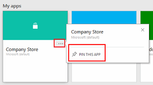

# Quickstart: Run a canvas-based or model-driven app in a web browser
When you create a canvas-based or model-driven app, or an app creator shares an app with you, you can run that app on Windows, iOS, Android, or in a web browser. In this quickstart, you'll learn how to run a canvas-based or model-driven app in a web browser from the [Dynamics 365 Home page](https://home.dynamics.com).

To follow this quickstart, you need a [Microsoft Office 365 subscription](https://signup.microsoft.com/Signup?OfferId=467eab54-127b-42d3-b046-3844b860bebf&dl=O365_BUSINESS_PREMIUM&ali=1) that includes Dynamics 365, and access to a [supported browser and operating system](limits-and-config.md). Also, make sure you have access to a canvas-based or model-driven app that you built, or that someone else built and shared with you.

## Sign in to Dynamics 365
Sign in to Dynamics 365 at [https://home.dynamics.com]([https://home.dynamics.com).

## Find an app on the Home page
The Home page may show several types of business apps, but you can find a specific app by typing part of its name in the search box. You can also filter the list to show only apps created by a specific source, such as PowerApps. To do this, click or tap **Filter** and then select the source.

If you've recently installed the app, it might not immediately appear in the list of apps. Click or tap **Sync** to show all of your apps. This process may take up to a minute.

## Run an app from the task pane
After you find an app, you can pin it to the task pane for easier access. To pin an app, click or tap the ellipsis (...) on the app tile, and then click or tap **Pin this app**.

To run the pinned app from the task pane, click or tap **Dynamics 365** in the upper-left corner, locate the app under **My apps**, and then click or tap it.

## Run an app from a URL
You can save an app's URL as a bookmark in your browser and run it by selecting the bookmark, or you can send a URL as a link through email. If someone else created an app and shared it with you in an email, you can run the app by clicking or tapping the link in the email. When running an app using a URL, you may be prompted to sign in using your Azure Active Directory credentials.

## Connect to data
If an app requires a connection to a data source or permission to use the device's capabilities (such as the camera or location services), you must give consent before you can use the app. Typically, you're prompted only the first time.

## Close an app
To close an app, sign out of the Dynamics 365 Home page, or open another app.

## Next steps
In this quickstart, you learned how to run a canvas-based or model-driven app in a web browser. To learn more about PowerApps, continue to the PowerApps tutorials.

> [!div class="nextstepaction"]
> [PowerApps Tutorials](get-started-create-from-blank.md)
