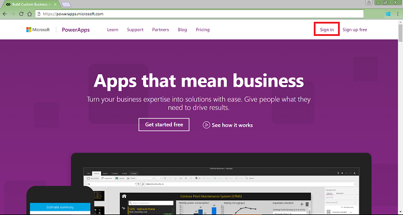
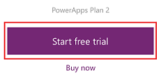
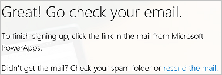
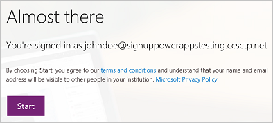
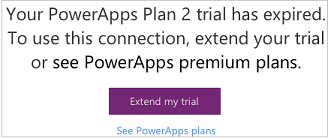
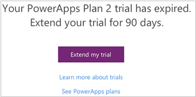

# Sign up for a free license to try PowerApps
To create an app in PowerApps, you need one of several types of licenses that offer different levels of functionality. You already have a license for PowerApps if your organization has purchased any of several versions of Office 365 or Dynamics 365 for you, or your organization purchased PowerApps Plan 1 or Plan 2 licenses for you.

> [!NOTE]
> If you're an administrator, see [Purchase PowerApps for your organization](../administrator/signup-for-powerapps-admin.md) or [PowerApps in your organization Q&A](../administrator/signup-question-and-answer.md).

You can [learn more](https://powerapps.microsoft.com/pricing/) about which licenses include PowerApps and what they offer. You can also determine whether you have a license by selecting **Sign in** on the [PowerApps site](http://powerapps.microsoft.com).

   

If you have no license or you want more functionality than what your current license offers, you can sign up for a free trial of PowerApps Plan 2. This license offers all PowerApps functionality but expires after 30 days.

## Upgrade an existing license 
You can sign up for a free trial by signing into PowerApps with an existing license and then trying any of these features:

* [Create and manage an instance](../administrator/signup-for-powerapps-admin.md) of the Common Data Service.
* [Model your data](./common-data-service/data-platform-intro.md) using the Common Data Service.
* [Create and manage environments](../administrator/environments-administration.md) from the PowerApps admin center.
* [Manage an on-premises data gateway](./canvas-apps/gateway-management.md) in PowerApps.  

If you try any of these features without a Plan 2 license, you'll be prompted to start your free trial. Just select **Start my trial**, and then consent to the terms of use in the dialog box that appears.

## Get a license from scratch
If you have no license for PowerApps, you can sign up for a trial license from the [PowerApps site](http://powerapps.microsoft.com).

* If you're using a browser on a phone, tap the menu icon in the upper-right corner, and then tap **Sign up free**.
* If you're using a browser on another type of device, select **Sign up free** in the upper-right corner.

    

Near the middle of the screen, select **Pricing**, and then select **Start free trial**.

In the dialog box that appears, type or paste your work or school email address, and then click or tap **Submit**.

> [!IMPORTANT]
> Consumer email services, telecommunication providers, government, and military addresses aren't supported, including:  
> 
> * outlook.com, hotmail.com, gmail.com, and so on  
> * .gov and .mil
>
> If you try to sign up with a personal email address, a message indicates that you must use a work or school email address.

If PowerApps recognizes your organization, you can sign in with your credentials for that organization (and skip the rest of these instructions).

Otherwise, you're prompted to check your email. 

In the email message, select the link to verify your email address, and (if prompted) provide more information.

When this dialog box appears, select **Start**, and then start to use [PowerApps](http://web.powerapps.com)!

> [!NOTE]
> If you need more time to evaluate PowerApps, you can request to extend your trial period.

## FAQ

### What premium features does the trial license include?

* **Access to the Common Data Service**, which is a secure business data platform built into PowerApps. This service comes with hundreds of standard business entities, so all your apps can share the same definition of “customer,” “product,” “lead,” and more. [Learn more](./common-data-service/data-platform-intro.md)
* **Access to premium connections** such as Salesforce, DB2, Zendesk, and the Common Data Service. With many Office 365 and Dynamics 365 plans, you can connect to data sources such as Office 365, Dynamics 365, Dropbox, and Twitter. With the trial license, you can also connect to data through premium connectors such as these:
  
    
  
    In the [complete list of connectors](./canvas-apps/connections-list.md), premium connectors appear with a badge:
  
    
* **Access to the PowerApps admin center**, in which you can manage your environments, databases, user permissions, and data policies. [Learn more](../administrator/introduction-to-the-admin-center.md)

For more information about the functionality and capacity in the trial license, see the [pricing page](https://powerapps.microsoft.com/pricing/).

### What email address can I use?
You can use a work or school address to sign up for a trial license. If you use another kind of address, you might experience one of the symptoms in this table.

| Symptom / Error Message | Cause and Workaround |
| --- | --- |
| **Personal email addresses (e.g. nancy@gmail.com)**     You receive a message like the following during signup:     `You entered a personal email address: Please enter your work email address so we can securely store your company's data.`     or     `That looks like a personal email address. Enter your work address so we can connect you with others in your company. And don’t worry. We won’t share your address with anyone.` |PowerApps does not support email addresses provided by consumer email services or telecommunications providers.     To complete signup, try again using an email address assigned by your work or school. |
| **.gov or .mil addresses**     You receive a message like the following during signup:     `PowerApps unavailable: PowerApps is not available for users with .gov or .mil email addresses at this time. Use another work email address or check back later.`     or     `We can't finish signing you up. It looks like Microsoft PowerApps isn't currently available for your work or school.` |PowerApps does not support .gov or .mil addresses at this time. |
| **Email address is not an Office 365 ID**      You receive a message like the following during signup:     `We can't find you at contoso.com.  Do you use a different ID at work or school? Try signing in with that, and if it doesn't work, contact your IT department.` |Your organization signs in to Office 365 and other Microsoft services with IDs other than email addresses. For example, your email address might be Nancy.Smith@contoso.com, but your ID is nancys@contoso.com.     To complete signup, use the ID that your organization has assigned to you for signing in to Office 365 or other Microsoft services.  If you don't know what this is, contact your IT administrator. |

### What happens when my trial expires?
After 30 days, you'll be prompted to request an extension of the trial or purchase a plan. You can find details about all plans on the [pricing page](https://powerapps.microsoft.com/pricing/).

* If you have access to PowerApps through Office 365, Dynamics 365, or a PowerApps Plan 1 license, you can still use PowerApps, but you might lose access to the Common Data Service, premium connectors, the admin center, and other Plan 2 features. For example, this screen might appear if you try to create a premium connection:
  
    

* If your only access to PowerApps is through the trial (for which you signed up on the [PowerApps site](http://powerapps.microsoft.com/) or the [pricing page](http://powerapps.microsoft.com/pricing)), this screen will appear if you try to access PowerApps:
  
    

### How many days are left before my trial expires?
You'll soon be able to see how many days are left before your trial expires.

### What happens to my data when my trial expires?
If you still have access to PowerApps, you can continue to use it. Any data in the Common Data Service will remain as it is, and any app or flow that used the Common Data Service as a data source will continue to run as it did. But you won't be able to use that app or flow, and you'll be prompted to request an extension of the trial or purchase a plan if you try to modify a schema or entities in the Common Data Service.

### What should I do next?
You can retain access to PowerApps and its features by doing either of the following:

* Extend your trial license when prompted.
* Review the available plans on the PowerApps [pricing page](https://powerapps.microsoft.com/pricing/), and then [purchase one](../administrator/signup-for-powerapps-admin.md).

## More questions?
Try the PowerApps [community](https://community.powerapps.com).