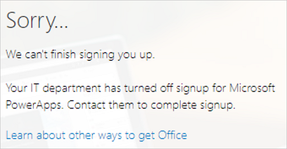

# Explore Power Apps for free for 30 days

You can explore all the Power Apps capabilities for free by signing up for a 30-day Power Apps trial plan. If you don't have any license for Power Apps, the trial plan provides temporary access to do the following activities:

- Extend the capabilities of Office 365 (SharePoint Online, Teams, Excel, and more)
- Create and run canvas apps that connect to Microsoft Dataverse and a wide range of more than 200 other data sources, including premium connectors and on-premises data
- Create and run model-driven apps
- Create automated workflows with Power Automate
- Create and manage environments and Dataverse databases

If you have a Power Apps license or a license through Office 365, you already have access to some of these features. However, the trial license temporarily expands your access to include all features in the previous list. To find out what capabilities each type of license offers, see the [pricing page](https://powerapps.microsoft.com/pricing/).

> [!NOTE]
> - If you're an administrator, see [Purchase Power Apps for your organization](/power-platform/admin/signup-for-powerapps-admin) or [Power Apps in your organization Q&A](/power-platform/admin/signup-question-and-answer).
> - Beginning January 2020, self-service purchase, subscription, and license management capabilities for Power Platform products (Power BI, Power Apps, and Power Automate) are available for commercial cloud customers in the United States. For more information, including steps to enable or disable self-service purchasing in your organization, see [Self-service purchase FAQ](/microsoft-365/commerce/subscriptions/self-service-purchase-faq).

## Need an account?  
If you don't have a work or school account, you can create a free account with Azure AD and you can be a low code developer with Power Apps. To continue building apps beyond the trial period, just opt-in to the free [Power Apps Developer Plan](https://powerapps.microsoft.com/developerplan/). 

1. Go to [PowerApps.com](https://powerapps.microsoft.com/) and then select, **Start free**. 
2. Enter your email. If your email isn't a work or school account, you'll be prompted to create a free Azure AD account using [this sign up experience](https://signup.microsoft.com/get-started/signup?products=83d3609a-14c1-4fc2-a18e-0f5ca7047e46). 

If you want to evaluate Power Apps integrations with Microsoft 365 then you can sign up for a [Office 365 trial](https://signup.microsoft.com/get-started/signup?products=ec920d3e-7e24-492d-ba28-79763d637b79) account. 

## Identify your current license

To find out which license or licenses you already have:

1. [Sign in to Power Apps](https://make.powerapps.com?utm_source=padocs&utm_medium=linkinadoc&utm_campaign=referralsfromdoc) with your work or school credentials.

    > [!IMPORTANT]
    > You can't sign in by using a personal email address, such as one that ends in outlook.com, hotmail.com, or gmail.com. For more information, see [What email address can I use?](#what-email-address-can-i-use) later in this topic.

2. Select the gear icon near the upper-right corner and then select **Plan(s)**.

    

## Upgrade an existing license

To start a free 30-day trial of Power Apps per user plan from an existing license, [sign in to Power Apps](https://make.powerapps.com?utm_source=padocs&utm_medium=linkinadoc&utm_campaign=referralsfromdoc). And then, try any feature that requires a premium Power Apps license. (For example, select the gear icon near the upper-right corner, select **Admin center**, and then select **New environment** near the upper-right corner.) Follow the prompts to complete the sign-up process.

## Get a license from scratch

Regardless of whether you have a license for Power Apps, you can start a free 30-day trial per user plan by following these steps:

1. Open the [Power Apps site](https://powerapps.microsoft.com), and then select **Try free**.

    If you're using a phone, select the menu in the top right corner, and then select **Try free**.

1. Near the middle of the screen, select **Pricing**, and then select **Start free trial**.

1. In the dialog box that appears, type or paste your work or school email address and then select **Submit**.

    > [!IMPORTANT]
    > For more information, see [What email address can I use?](#what-email-address-can-i-use) later in this topic.

1. If a dialog box indicates that Power Apps recognizes your organizational credentials, follow the prompts to finish signing in.

    

    Otherwise, follow the prompts to check your email, verify your email address, provide more information if necessary, and then select **Start**.

    You'll see the following message if your admin has disabled free trials.

    

    >[!NOTE]
    >For more information, including the steps to enable or disable trial licenses in your organization, see [Block trial licenses commands](/power-platform/admin/powerapps-powershell#block-trial-licenses-commands).

## FAQ

### What email address can I use?

You can use a work or school email address, backed by [Azure Active Directory](/azure/active-directory/fundamentals/sign-up-organization), to sign up for a trial license. If you use a different kind of address, you might experience one of the symptoms in this table.

|                                                                                                                                                                                                                             Symptom / error message                                                                                                                                                                                                                             |                                                                                                                                                                                                     Cause and workaround                                                                                                                                                                                                      |
|---------------------------------------------------------------------------------------------------------------------------------------------------------------------------------------------------------------------------------------------------------------------------------------------------------------------------------------------------------------------------------------------------------------------------------------------------------------------------------|-------------------------------------------------------------------------------------------------------------------------------------------------------------------------------------------------------------------------------------------------------------------------------------------------------------------------------------------------------------------------------------------------------------------------------|
| <strong>Personal email addresses (for example, `@gmail.com` email address)</strong>     You receive a message like the following during signup:     `You entered a personal email address: Please enter your work email address so we can securely store your company's data.`     or     `That looks like a personal email address. Enter your work address so we can connect you with others in your company. And don’t worry. We won’t share your address with anyone.` |                                                                                                        Power Apps doesn't support email addresses provided by consumer email services or telecommunications providers.     To complete signup, try again using an email address assigned by your work or school.                                                                                                        |
|                             **.gov or .mil addresses**     You receive a message like the following during signup:     `Power Apps unavailable: Power Apps is not available for users with .gov or .mil email addresses at this time. Use another work email address or check back later.`     or     `We can't finish signing you up. It looks like Microsoft Power Apps isn't currently available for your work or school.`                              |                                                                                                                                                                                Power Apps doesn't support .gov or .mil addresses at this time.                                                                                                                                                                                |
|                                                                                             **Email address is not an Office 365 ID**      You receive a message like the following during signup:     `We can't find you at contoso.com.  Do you use a different ID at work or school? Try signing in with that, and if it doesn't work, contact your IT department.`                                                                                              | Your organization signs in to Office 365 and other Microsoft services with IDs other than email addresses. For example, your email address might be Nancy.Smith@contoso.com, but your ID is nancys@contoso.com.     To complete signup, use the ID that your organization has assigned to you for signing in to Office 365 or other Microsoft services.  If you don't know what this is, contact your IT administrator. |

### Does the cloud environment I use Power Apps in allow the use of trial licenses? 
Power Apps trial licenses are only available in the Azure commercial cloud. Power Apps trial licenses aren't available in Azure Government or Microsoft Azure China clouds.

### What happens when my trial expires?

You'll be prompted to request an extension of the trial or purchase a plan 30 days after the trial starts. You can extend the trial for two more times (30 days each)&mdash;with a maximum trial period of up to 90 days. You can find details about all plans on the [pricing page](https://powerapps.microsoft.com/pricing/).

If you don't extend the trial or purchase a plan but you still have another kind of license, you can use all the features of Power Apps that your other license provides. Any data in Dataverse will remain as it is, and any app or flow that uses Dataverse will continue to run as it did if your license supports them. If you try to use premium Power Apps features but your existing license doesn't support them (for example, modify a schema or entities in Dataverse), you'll be prompted to purchase a plan.

### More questions?

Try the Power Apps [community](https://community.powerapps.com).

[!INCLUDE[footer-include](../includes/footer-banner.md)]

