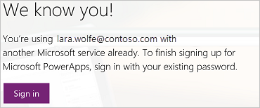

# Sign up for a free license to try PowerApps
To create an app in PowerApps, you need one of several types of licenses that offer different levels of functionality. You already have a license for PowerApps if your organization has purchased any of several versions of Office 365 or Dynamics 365 for you, or your organization purchased PowerApps Plan 1 or Plan 2 licenses for you.

> [!NOTE]
> If you're an administrator, see [Purchase PowerApps for your organization](../administrator/signup-for-powerapps-admin.md) or [PowerApps in your organization Q&A](../administrator/signup-question-and-answer.md).

You can [learn more](https://powerapps.microsoft.com/pricing/) about which licenses include PowerApps and what they offer. You can also determine whether you have a license by selecting **Sign in** on the [PowerApps site](http://powerapps.microsoft.com).

   

If you have no license or you want more functionality than what your current license offers, you can sign up for a free trial of PowerApps Plan 2. This license offers all PowerApps functionality but expires after 30 days.

## Upgrade an existing license 
You can sign up for a free trial by signing into PowerApps with an existing license and then trying any of these features:

* [Create and manage an instance](../administrator/signup-for-powerapps-admin.md) of the Common Data Service.
* [Model your data](./common-data-service/data-platform-intro.md) using the Common Data Service.
* [Create and manage environments](../administrator/environments-administration.md) from the PowerApps admin center.
* [Manage an on-premises data gateway](./canvas-apps/gateway-management.md) in PowerApps.  

If you try any of these features without a Plan 2 license, you'll be prompted to start your free trial. Just select **Start my trial**, and then consent to the terms of use in the dialog box that appears.

## Get a license from scratch
If you have no license for PowerApps, you can sign up for a trial license from the [PowerApps site](http://powerapps.microsoft.com).

* If you're using a browser on a phone, tap the menu icon in the upper-right corner, and then tap **Sign up free**.
* If you're using a browser on another type of device, select **Sign up free** in the upper-right corner.

    

Near the middle of the screen, select **Pricing**, and then select **Start free trial**.

In the dialog box that appears, type or paste your work or school email address, and then click or tap **Submit**.

> [!IMPORTANT]
> Consumer email services, telecommunication providers, government, and military addresses aren't supported, including:  
> 
> * outlook.com, hotmail.com, gmail.com, and so on  
> * .gov and .mil
>
> If you try to sign up with a personal email address, a message indicates that you must use a work or school email address.

If PowerApps recognizes your organization, you can sign in with your credentials for that organization (and skip the rest of these instructions).

Otherwise, you're prompted to check your email. 

In the email message, select the link to verify your email address, and (if prompted) provide more information.

When this dialog box appears, select **Start**, and then start to use [PowerApps](http://web.powerapps.com)!

> [!NOTE]
> If you need more time to evaluate PowerApps, you can request to extend your trial period.

## More questions?
* Review the [FAQ](trial-plan.md) for the trial license.
* Try the PowerApps [community](https://community.powerapps.com).