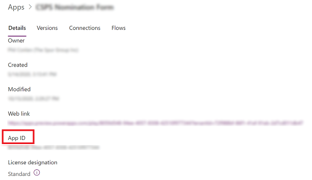
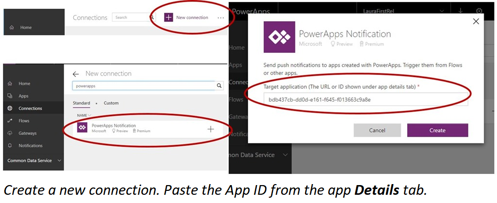
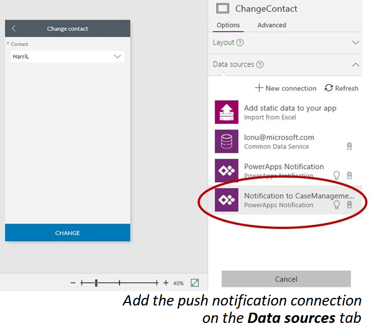
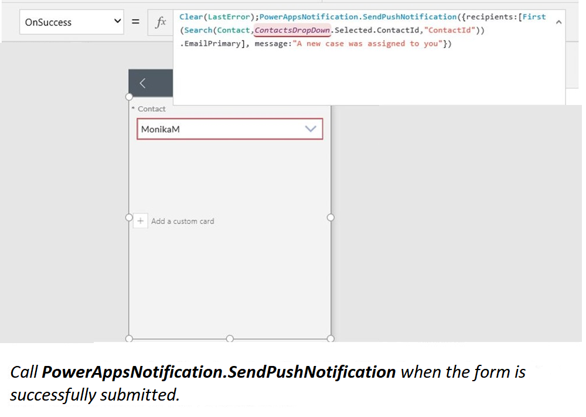

# Send a push notification in Power Apps

Push notifications are used in mobile apps to engage app users and help them prioritize key tasks. In Power Apps, you can send notifications by using the Power Apps Notification connector. You can send native push notifications to any app that you create in Power Apps. 


Add a push notification to your app if:

* Your users need to know information immediately.
* Your users must complete important tasks by using your app, in a preloaded context.
* You want to engage your users on a specific interval, or you need users to enter the app in a specific context.

> [!NOTE]
> To receive push notifications, each user must have opened the app in Power Apps Mobile once or gotten the app from the [Microsoft 365 apps page](https://www.office.com/apps).

## Before you start
In an app for which you have the **Contributor** permission, add a Power Apps Notification connection. If you don't already have an app, you can quickly [create a model-drive app](https://docs.microsoft.com/powerapps/maker/model-driven-apps/build-first-model-driven-app#create-your-model-driven-app), or [create a canvas app](https://docs.microsoft.com/powerapps/maker/canvas-apps/get-started-test-drive), and you'll have the required permission by default. That tutorial and this one use an app based on the Case Management template.

## Step 1: Set up the notification from a flow

If you trigger a push notification from a flow, you can send the notification to only one user or security group at a time.

1. Go to [Power Automate](https://flow.microsoft.com) and select **Create**.

   > [!div class="mx-imgBorder"] 
   > 

2. Select **Instant flow**.

   > [!div class="mx-imgBorder"] 
   > 

3. On the **Build an instant flow** dialog box, enter a name for the flow and then select **Manually trigger a flow**. When you're done, select **Create**.

   > [!div class="mx-imgBorder"] 
   > 
   
   
 4. On the next screen, select **+ New step**.   
 
    > [!div class="mx-imgBorder"] 
    > 
    
 5. In the search box, enter **send a push notification** and then select the **Power Apps Notification** connector. In the resluts, select the **Send push notification V2** action.
 
    > [!div class="mx-imgBorder"] 
    > 
 
 6. on the next screen, enter the information below and then select **Save**.
 
 	- **Mobile app**: Select **Power Apps**.
	- **Your app**: Select the app that you want to set up the notification for.
	- **Recipient Items-1**: Select how the flow is triggered.
	- **Message**: Enter the notification message..
	- **Open app**: Select whether to open the app or not when the user selects the notification.
	- **Entity**: Select which entity the notification is for.
	- **Form or view**: Select if the notification is for a form or view.
	- **Record ID**: If the notification is for a form then select the record ID.


## Send a notification from an app
You can send a push notification from one app to another or to the same app.

1. Go to [Power Apps](https://make.powerapps.com?utm_source=padocs&utm_medium=linkinadoc&utm_campaign=referralsfromdoc), and then selct **Apps**.

    > [!div class="mx-imgBorder"] 
    >     

2. Select an app and then go to **More Commands** > **Details**.

    > [!div class="mx-imgBorder"] 
    >     
    
 3. Copy the **App ID** of the app.
    
    > [!div class="mx-imgBorder"] 
    >     
    
3. On the **Connections** tab, create a connection to the Power Apps Notification connector, and paste in the app ID from the previous step.

    
4. Add the connection to the trigger app.

    In our example, we use the same app as the trigger app. The user who reassigns the case also triggers a push notification to the new case owner.

    
    
5. From the push notification connection, call the **SendPushNotification** method.

    In our example, we trigger this notification by using the **OnSuccess** property in a form.

    

## Load a specific page and context when a user taps the notification
### Pass parameters
Your push notification can pass specific parameters to the app. For example, to read the **CaseID** value, use *Param("CaseID")*. To quickly identify this parameter, add a **Label** control to your app. Set the **Text** property of that control to **Param("CaseID")**. If the user opens the app from the **All apps** list, the value is empty. If the user opens the app from another location on the device, the value is populated with the **CaseID** value.

### Set the start page
You can set your app to open, for example, the **Case details** page as soon as the app opens:

1. Add a **Timer** control, and set its **OnTimerEnd** property to this formula:
   <br>**Navigate(EditCase, ScreenTransition.None)**
2. (optional) Hide the **Timer** control by setting its **Visible** property to **false**.
3. Set the **OnVisible** property of the screen to **Timer.Start()**.

> [!TIP]
> It's a good idea to create a unique first page in the app for the notification:
> 
> 1. Create an empty page that your app doesn't already open, add a **Text Input** control, and set its **timer.Duration** value.
> 2. When you create the app, set the timer to a non-zero value. When you're ready to publish the app, set the value to **0** to immediately trigger the timer.

## Syntax

| Name | Description |
| --- | --- |
| SendPushNotification |Sends a push notification to the app that's specified in the connection settings for the notification. |

### Parameters

| Name | Type | Description |
| --- | --- | --- |
| recipients |String array, required |A list of: <ul> <li>Email addresses for users or security groups</li> <li>Object IDs for users or security groups in Azure Active Directory</li></ul> |
| message |String, required |The message body of the push notification. |
| openApp |Boolean, optional |Whether to open the app when the user taps the push notification. |
| params |Parameters, optional |Key-value parameters to pass with the notification. These can be further processed in the app to open a specific page and load a specific state. |

### Sample formulas
Send a basic notification.

```powerapps-dot
PowerAppsNotification.SendPushNotification(
	{
		recipients: ["f60ccf6f-7579-4f92-967c-2920473c966b", "72f988bf-86f1-41af-91ab-2d7cd011db47"],
		message: "A new case was assigned to you."
	}
)
```

Send a notification that opens an app and passes along specific parameters.

```powerapps-dot
PowerAppsNotification.SendPushNotification(
	{
		recipients: ["email1@contoso.com", "email2@contoso.com"],
		message: "message in the notif toast",
		params: Table({key:"notificationKey", value:"The value for notificationKey"}),
		openApp: true
 	}
)
```

## Known limitations
* Currently, notifications aren't displayed on Power Apps Mobile for Windows Phone.
* Currently, we don't provide push notifications for users who run apps only in a web browser.
* Notifications show the generic Power Apps icon instead of a specific app icon.
* Push notifications aren't currently supported for Model Driven apps. 

For reference information, see [Power Apps Notification reference](https://docs.microsoft.com/connectors/powerappsnotification/).
