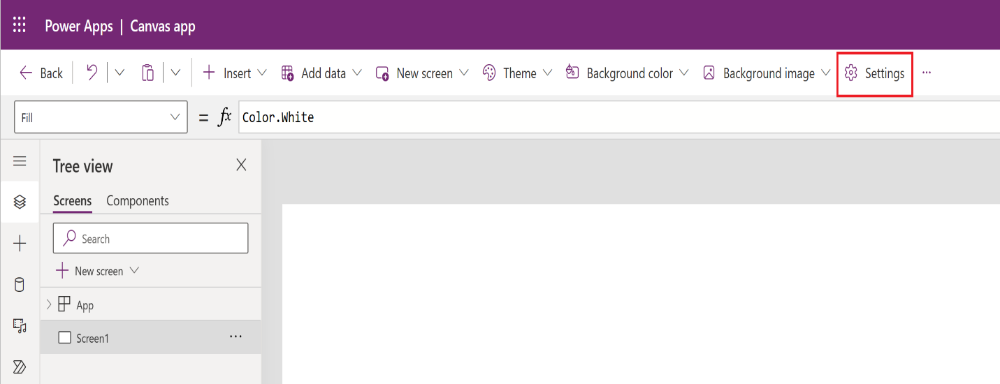

# Set up mobile offline for canvas apps (preview)

[This topic is pre-release documentation and is subject to change.]

When offline mode is enabled, users can interact with their data without internet connectivity on the [<u>Power Apps mobile app</u>](https://powerapps.microsoft.com/downloads/).

## Prerequisites

Verify the following prerequisites before you enable mobile offline:

-   Environment maker, system administrator, or system customizer role is needed to configure offline mode for model-driven apps. These roles have Create, Read, Write, Delete and Share privileges on the **mobile offline profile** table. More information: [<u>About predefined security roles</u>](https://learn.microsoft.com/en-us/power-apps/maker/model-driven-apps/share-model-driven-app#about-predefined-security-roles)

-   Users with the **basic user** role can open and use an offline application. This role has the Read privilege for the **mobile offline profile** table.

    If you have a custom security role, make sure you have the Read privilege for **Mobile Offline profile**. For more information, go to [<u>Miscellaneous privileges - Core Records tab</u>](https://learn.microsoft.com/en-us/power-platform/admin/miscellaneous-privileges).

## Optimize your app for mobile offline

Mobile apps run on small screens with limited connectivity. Before you enable offline mode, make sure your canvas app is optimized for offline and mobile use. Consider the number of user scenarios that you want to cover and the amount of data the app will use. Create an app that's simple and lightweight.

Follow these best practices when building an app for mobile offline use:

-   Identify the on-the-go scenarios that are functionally related, such as tasks that are performed by users who work in the field.

-   Reduce the complexity of your app by limiting the amount of tables that needs to be downloaded on a user's device. Sometimes it is better to have two apps instead of one.

-   Use views that are optimized for the experience rather than displaying a large set of data. For example, it is preferable to rather use the **My active accounts** view than the **All accounts** view.

## Enable tables for offline

Tables in your offline first app must be enabled for offline. Note that some built-in tables are enabled for offline by default. And, if you are using a table provided by a different solution, the solution author may not want the table to be enabled for offline. So, it may not be possible to enable some tables for offline. However, you can enable any new custom table for offline.

Follow these steps to verify whether a table is enabled for offline.

1.  Sign in to <u>Power Apps</u>

2.  On the left pane, **select** **Tables**. This will show the list of tables.

3. **Select the table**. This will open the Tables screen.

4.  In the 'Table Properties' card, **select the properties gear**. This will open the Edit Table properties pane.

5.  In the **Edit table** settings, select **Advanced options**, and in the **Rows in this table** section, select **Can be taken offline**.

    

**Enable your app for offline use (preview)**

Set up the new mobile offline experience in the [canvas app studio](https://learn.microsoft.com/en-us/power-apps/maker/canvas-apps/power-apps-studio).

1.  Sign in to <u>Power Apps</u>

2.  On the left pane, select **Apps**, and then select the canvas app that you want to enable for offline.

3.  Select **More (...)** &gt; **Edit** to open the modern app designer.

4.  On the command bar, select **Settings**.

    

5.  On the **Upcoming** **Features**  tab, select the **Experimental** sub tab. Set the **Dataverse Offline** toggle to **On**.

    

6.  On the **General** tab, set the **Can be used offline** toggle to **On**.

    

    > [!Note]
    > - We recommend to use an **auto-generated profile**. When auto-generated, the app downloads on the device the tables that are used in your app.
    > - A page using the **Offline** template is automatically inserted. The page contains an icon hooked up with the [Connection](https://learn.microsoft.com/en-us/power-platform/power-fx/reference/signals#connection) Power Fx function. The icon has multiple variant that reflect the offline sync status. You can decide to use it or not, and you can also customize it as appropriate.

7.  Close the **Settings** dialog, and then save and publish your app. When you're done, the app will be set up for offline use.

## Set up a mobile offline profile (optional)

The mobile offline profile is auto-generated under the cover by default. However it is also possible to create and assign an offline profile to a canvas app.

To create a profile, follow the steps below:

1.  Go to Power Platform Admin center, [<u>https://admin.powerplatform.microsoft.com</u>](https://admin.powerplatform.microsoft.com/) and sign-in as an admin.

2.  In the navigation pane, select **Environments**.

3.  Choose an environment and then select **Settings**.

4.  Expand **Users + permissions**, and then select **Mobile configuration**.

5.  Select **New Profile** to create a new profile for mobile offline. If you already have a profile that you want to edit, select it from the list.

6.  Enter a name and description for your mobile offline profile. Select **Create** to create the mobile offline profile.

7.  After the profile is created, select it to open the profile so you can continue editing it.

8.  In the **Data available offline** area, select **Add table** to add a table to the profile.

    

9.  Select a table from the list of tables shown. Only tables that can be enabled for mobile offline appear in the list. Select **Next**.

    

10. Select a filter based on the ownership type for the table. Table ownership is decided when you create a table. For more information, see [<u>Types of tables</u>](https://learn.microsoft.com/en-us/powerapps/maker/common-data-service/types-of-entities).

    | **Table ownership type** | **Available Data Download Filter options** |
    |-------------------------|-------------------------|
    | **User or Team** | <ul> <li><blockquote> **Download Related rows only** - Make related data for this table available offline. If you don't set any relationships, no rows for this table will be available. </blockquote></li> <li><blockquote> **All rows** - Make all rows for this table available offline. </blockquote></li> <li><blockquote> **Other data filter** - Make only the specified rows for this table available offline and then choose from the following: </blockquote> <ul> <li><blockquote> **Download user rows** - Make only your rows available offline. </blockquote></li> <li><blockquote> **Download team rows** - Make your team's rows available offline. </blockquote></li> <li><blockquote> **Download my business unit's rows** - Make your business unit's rows available offline. </blockquote></li> </ul></li> </ul> |
    | **Organization** | <ul> <li><blockquote> **Download related rows only** - Make related data for this table available offline. If you don't set any relationships, no rows for this table will be available. </blockquote></li> <li><blockquote> **All rows** - Make all rows for this table available offline. </blockquote></li> </ul> |
    | **Business** | <ul> <li><blockquote> **Download related data only** - Make related data for this table available offline. If you don't set any relationships, no rows for this table will be available. </blockquote></li> <li><blockquote> **All rows** - Make all rows for this table available offline. </blockquote></li> <li><blockquote> **Other rows** - Make only the specified rows for this table available offline and choose from the following: </blockquote> <ul> <li><blockquote> **Download my business unit's rows** - Make your business unit's rows available offline. </blockquote></li> </ul></li> </ul> |
    | **None** | <ul> <li><blockquote> **Download related rows only**. Make related data for this table available offline. If you don't set any relationships, no rows for this table will be available. </blockquote></li> </ul> |

    If **Custom** is selected, admins can define a custom filter based on the following rules. Admins can create filters up to three levels.

    | ** **                         | ** **                      | ** **                          |
    |-------------------------------|----------------------------|--------------------------------|
    | equal                         | not equal                  | gt – greater than              |
    | ge – greater than or equal to | le – less than or equal to | lt – less than                 |
    | like                          | not-like                   | in                             |
    | not-in                        | null                       | not-null                       |
    | eq-userid                     | ne-userid                  | eq-userteams                   |
    | eq-useroruserteams            | eq-useroruserhierarchy     | eq-useroruserhierarchyandteams |
    | eq-businessid                 | ne-businessid              | eq-userlanguage                |
    | begins-with                   | not-begin-with             | ends-with                      |
    | not-end-with                  |                            |                                |

11. In the **Include \[table name\] rows related to these tables** area, select the related table relationships. You need to have added the table you want to create the relationship with. For example, if you want to add a relationship between the Account and Contact tables, then you need to add both tables to the mobile offline profile.

    For example, if you select **Contact \| Field name: Primary contact** this means for every contact, the system will also download the account related to it.

    

12. Select **Save** to add the table to your profile so you can continue editing it.

## Limitations and know issues

The following is not supported

-   A canvas app doesn't work in offline on a web browser.

-   The Auto generated offline profile is not optimized yet for the app. For each table used in the app, it downloads the rows that the user has permissions on.

-   Non Dataverse connectors like Sharepoint are not supported in offline. If you use a non-Dataverse connector, the app can only access the data when the device is connected to the network

-   Dataverse Files and Images are not supported in an offline-enabled canvas app, neither when the device is connected to the network, nor when it is not connected. This is because the app operate in offline-first
