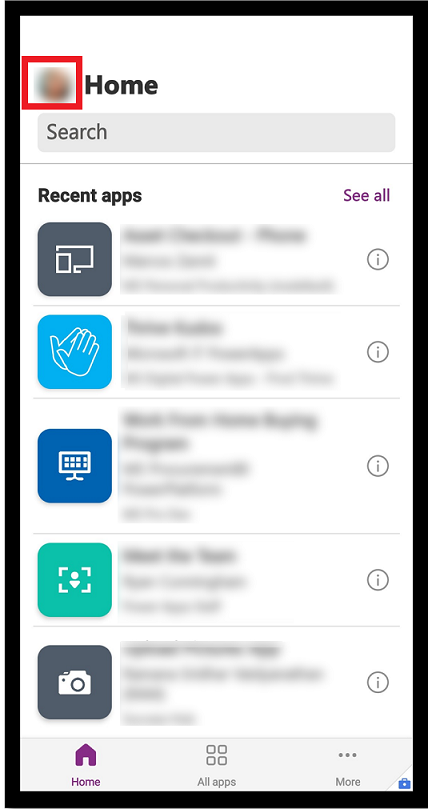
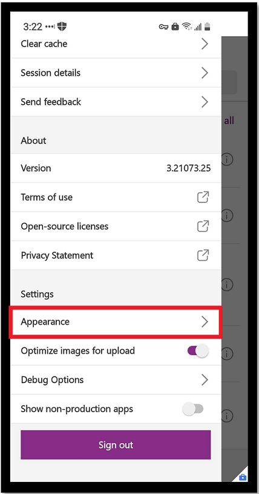
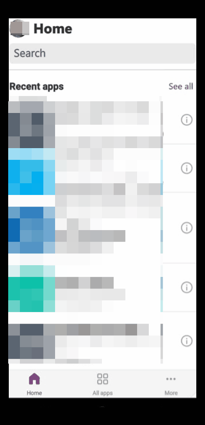

# Set the appearance of your app to dark or light mode

Easily change the display of your app to dark mode, light mode, or set it to the system default on iOS and Android devices. When you choose the **System default**, the display setting will match the default display setting of your mobile device.

The default display mode for Poweer Apps mobile is set to **Light**.

1. To change the display, open Power App mobile and sign in.
2. From the **Home** screen, select your profile picture.

   > [!div class="mx-imgBorder"]
   >  

3. Under **Settings**, select **Appearance**.

   > [!div class="mx-imgBorder"]
   >  
   
4. Select your display setting: **Light**, **Dark**, or **System default**.
  
  > [!div class="mx-imgBorder"]
  >  

5. When you're done, select the **X** to close the window. 

   > [!div class="mx-imgBorder"]
   >  
