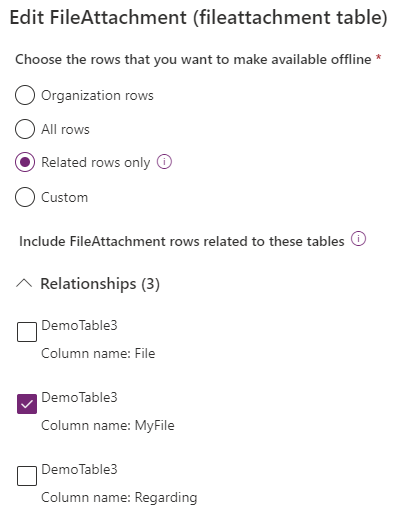

---

title: Work with files and images in offline canvas apps
description: Learn how to work with files and images in offline canvas apps.
author: trdehove
ms.component: pa-user
ms.topic: article
ms.date: 12/01/2023
ms.subservice: mobile
ms.author: trdehove
ms.custom: ""
ms.reviewer: sericks
ms.assetid: 
search.audienceType: 
  - enduser
searchScope:
  - "Power Apps"
---

# Set up files and images to work offline for canvas apps
In an offline enabled canvas app, you can either enable the files and images to be downloaded "on view" (default) or "on sync". We recommend to download files and images on sync only if you don't except to download too many files and images.

## Download files and images on View 
When files and images are configured to be downloaded "on view", the content is downloaded on the device only when the user explicitely opens the files or when the image are presented to the user. The files and images are downloaded when the device is connected to the network and can be used afterward without connectivity.

This mode is enabled by default without any extra configuration. 

## Download files and images on sync
When files and images are configured to be downloaded "on sync", the files and images are downloaded during the offline sync when the device is connected. The user can access the content without connectivity and is notified in the application when the download is completed. 

### Add image columns to mobile offline 

It is required to add both the **Image Descriptor** and **FileAttachment** tables to your mobile offline profile to make images available in offline mode.

1. Go to Power Platform Admin center, [https://admin.powerplatform.microsoft.com](https://admin.powerplatform.microsoft.com) and sign-in as an admin.

2. On the right, select **Environments**.
 
3. Choose an environment and then select **Settings**.
 
4. Expand **Users + permissions**, and then select **Mobile configuration**.

5. Select a mobile offline profile to edit it.

6. In **Data available offline** select **Add table**.

7. Select **Image Descriptor** and then select **Next**.

   > [!div class="mx-imgBorder"]
    >

8. Under **Choose the records that you want to make available offline**, select **Related records only**.
9. Expand **Relationships** and select **Column name:** for each applicable column where **Data type** is set to **Image** (that is, as shown in the screenshot below for the **DemoTable1** and **DemoTable3** tables).

   > [!div class="mx-imgBorder"]
    >
  
10. Select **Save**.
11. In **Data available offline** select **Add table** > **FileAttachment** > **Next**. 
12. Expand **Relationships** and select **Image Descriptor, Column name: FileId**. Don't select **Image Descriptor, Column name: Regarding**.

    > [!div class="mx-imgBorder"]
    > 

13. Select **Save**.

### Add file columns to mobile offline 

It is required to add the **FileAttachment** tables to your mobile offline profile to make files available in offline mode.

1. Go to Power Platform Admin center, [https://admin.powerplatform.microsoft.com](https://admin.powerplatform.microsoft.com) and sign-in as an admin.

2. On the right, select **Environments**.
 
3. Choose an environment and then select **Settings**.
 
4. Expand **Users + permissions**,  and then select **Mobile configuration**.

5. Select a mobile offline profile to edit it.

6. In the **Data available offline** select **Add table**.

7. Select **FileAttachment**  and then select **Next**.

   > [!div class="mx-imgBorder"]
    >

8. Under **Choose the records that you want to make available offline**, select **Related records only**.
9. Expand **Relationships** and select **Column name: Display name** for each applicable column where **Data type** is set to **File** (that is, as shown in the screenshot below for the **DemoTable3** table).

   > ![Note] Don't select **Column name: Regarding.**.

    > [!div class="mx-imgBorder"]
    >
   

 11. Select **Save**. 
   
