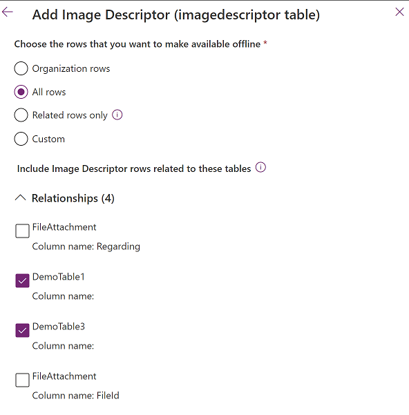

---

title: Configure files and images in offline canvas apps (preview)
description: Learn how to configure files and images in offline canvas apps.
author: trdehove
ms.component: pa-user
ms.topic: article
ms.date: 2/6/2024
ms.subservice: mobile
ms.author: trdehove
ms.custom: ""
ms.reviewer: sericks
ms.assetid: 
search.audienceType: 
  - enduser
searchScope:
  - "Power Apps"
---

# Configure files and images in offline canvas apps (preview)

[This article is prerelease documentation and is subject to change.]

This article explains how to configure files and images in a Power Apps table for offline canvas apps.

> [!Important]
>
> - This is a preview feature.
> - Preview features aren't meant for production use and may have restricted functionality. These features are available before an official release so that customers can get early access and provide feedback.

## Prerequisites

- Have an existing canvas Power App. To create one, see [Build an app](/maker/canvas-apps/getting-started#build-an-app).
- Have an exsiting table in your app or create one.

### View column properties for a file or image

1. Sign in to [Power Apps](https://make.powerapps.com).

1. In the navigation menu, select **Tables**.

1. Select the **Display name** of a column where **Data type** is set to **File** or **Image**.

   For example, when you create a new table, you see options to set the **Display name** and **Data type**.

   :::image type="content" source="media/files-images-offline-canvas-apps/new-table.png" alt-text="Screenshot that shows how you can choose the Display name and Data type when creating a new table.":::

   In an existing table the **Name** and **Type** columns represent the **Display name** and **Data type**, respectively.

   :::image type="content" source="media/files-images-offline-canvas-apps/existing-table.png" alt-text="Screenshot that shows the Name and Type column in an existing table.":::

1. Once you select a table from the **Table** column, you see the properties card of that table.

   :::image type="content" source="media/files-images-offline-canvas-apps/table-properties.png" alt-text="Screenshot that shows the Properties card of a selected table.":::

1. You can select **Properties** from the **Table properties** card to edit the table if needed.

   :::image type="content" source="media/files-images-offline-canvas-apps/edit-properties.png" alt-text="Screenshot that shows the pane that appears when you select Properties on the Table properties card.":::

## Turn on support for file and image columns in Dataverse offline feature

1. In [Power Apps studio](../maker/canvas-apps/power-apps-studio.md), select **Apps** from the navigation menu.

1. Select your canvas app to go into **Editing** mode.

1. Select **Settings** from the navigation menu.

1. Select **Upcoming features**, and then select the **Preview** tab.

1. Turn on the **Enable support for file/image column in Dataverse offline** option.

   :::image type="content" source="media/files-images-offline-canvas-apps/enable-dataverse-support.png" alt-text="Screenshot that shows how to enable Dataverse support from Settings." lightbox="media/files-images-offline-canvas-apps/enable-dataverse-support.png":::

In an offline-enabled canvas app, you can either allow the files and images to be downloaded **on view**, which is the default option or **on sync**. We recommend that you download files and images on sync if you don't expect to download a large number of files or images.

## Download files and images on view

When files and images are configured to download **on view**, the content is downloaded on the device when the user opens a file or when an image is presented to the user. Files and images are downloaded when the device is connected to the network and can be used afterward without connectivity.

This mode is enabled by default without any specific configuration.

## Download files and images on sync

When files and images are configured to download **on sync**, files and images are downloaded during the offline sync when the device is connected. The user can access the content without connectivity and is notified in the application when the download of the files and images is completed.

To configure automatic download of files and images on sync, create a mobile offline profile in the Power Platform admin center and edit it to include files and images. To learn how to create a new mobile offline profile and select it from your app, see [Create a mobile offline profile](canvas-mobile-offline-setup.md#create-a-mobile-offline-profile).

### Add image columns to mobile offline

Adding both the **Image Descriptor** and **FileAttachment** tables to your mobile offline profile enables offline access to images.

1. Go to [Power Platform admin center](https://admin.powerplatform.microsoft.com) and sign-in as an admin.

1. In the left side panel, select **Environments**.

1. Choose an environment and then select **Settings**.

1. Expand **Users + permissions** and then select **Mobile configuration**.

1. Select a mobile offline profile to edit it.

1. In the **Data available offline** section, select **Add table**.

1. Select **Image Descriptor** and then select **Next**.

1. Under **Choose the rows that you want to make available offline**, select **Related rows only**.

1. Expand **Relationships** and select **Column name:** for each applicable column where **Data type** is set to **Image** (that is, as shown in the following screenshot for the **DemoTable1** and **DemoTable3** tables).

    > [!div class="mx-imgBorder"]
    > 
  
1. Select **Save**.

1. In the **Data available offline** section, select **Add table**.

1. Select **FileAttachment** and then select **Next**.

1. Expand **Relationships** and select **Image Descriptor, Column name: FileId**. Don't select **Image Descriptor, Column name: Regarding**.

    > [!div class="mx-imgBorder"]
    > 

1. Select **Save**.

### Add file columns to mobile offline

Adding the **FileAttachment** tables in your mobile offline profile enables offline access to files.

1. Go to [Power Platform admin center](https://admin.powerplatform.microsoft.com) and sign-in as an admin.

1. In the left side panel, select **Environments**.

1. Choose an environment and then select **Settings**.

1. Expand **Users + permissions**  and then select **Mobile configuration**.

1. Select a mobile offline profile to edit it.

1. In the **Data available offline** section, select **Add table**.

1. Select **FileAttachment** and then select **Next**.

   > [!div class="mx-imgBorder"]
    >

1. Under **Choose the rows that you want to make available offline**, select **Related rows only**.

1. Expand **Relationships** and select **Column name: Display name** for each applicable column where **Data type** is set to **File** (that is, as shown in the following screenshot for the **DemoTable3** table).

      Don't select **Column name: Regarding.**.

    > [!div class="mx-imgBorder"]
    >

1. Select **Save**.
