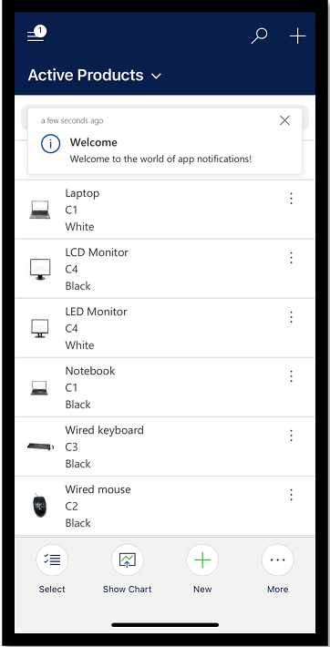
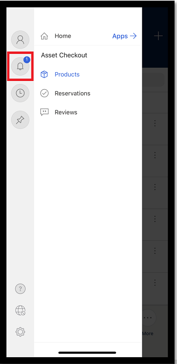
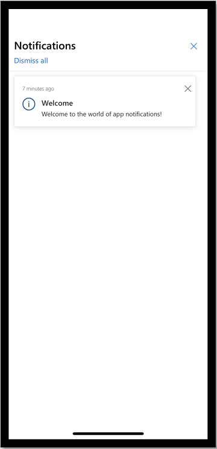
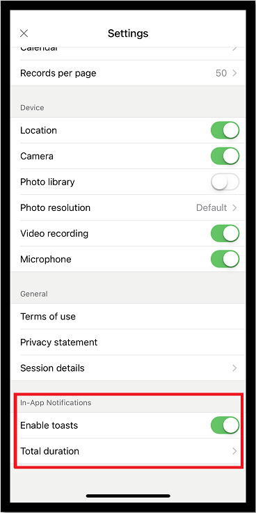

# In-app notifications in Power Apps mobile (preview)

[!INCLUDE [cc-beta-prerelease-disclaimer](../includes/cc-beta-prerelease-disclaimer.md)]

In-app notifications allow users to receive notifications in the notification center and as a notification toast. For more information, see [In-app notifications in model-driven apps](../user/notifications.md). In Power Apps mobile, toast notifications appear one at a time.

> [!div class="mx-imgBorder"] 
>   

> [!IMPORTANT]
> - This is a preview feature, and isn't available in all regions. Your administrator needs to enable [early access](/power-platform/admin/opt-in-early-access-updates) to use the new app notifications feature.
> - [!INCLUDE[cc_preview_features_definition](../includes/cc-preview-features-definition.md)]

## Access notifications

1. To access notifications in Power Apps mobile, go to site map and then select the bell icon.

   > [!div class="mx-imgBorder"] 
   >   

2. The notification center opens which displays all your notifications.
 
   > [!div class="mx-imgBorder"] 
   >   
   
3. To dismiss and delete a notification, select the close **X** button on a notification. Or, select **Dismiss all** to dismiss and delete all notifications.

## Turn toast notifications on or off

1. To turn toast notifications on or off, from the site map, go to **Settings**
2. Under **In-App Notifications**, go to the **Enable toasts** and move the toggle to on or off.
3. If you've enabled toast notifications, then select **Total duration** and enter how long you want the toast to appear.

   > [!div class="mx-imgBorder"] 
   >   

