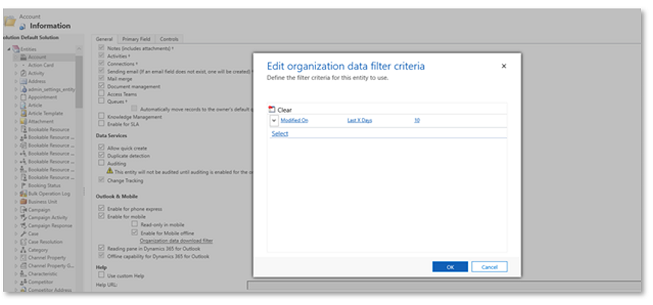

# Mobile offline capabilities and limitations

Before you set up the mobile app in offline mode, be sure to read through the following capabilities, tips,  and limitations. We recommend that you also review the [Offline profile guidelines](mobile-offline-guidelines.md).

These tables and corresponding commands are available in offline mode.
  > [!NOTE]
  > All unsupported commands are hidden in offline.

|Table |Commands|  
|-------------|---------|  
|Account|	Create, Read, Update, Delete|
|Activity Pointer|Read, Delete|
|Appointment|	Create, Read, Update, Delete, Convert Activity Case|
|Attachment	|Read only|
|Case|Create, Read, Update, Delete|
|Competitor|Create, Read, Update, Delete	|
|Competitor Address |Create, Read, Update, Delete	|
|Connection|Read only|
|Connection Role|Read only|
|Contact|Create, Read, Update, Delete	|
|Custom table|Create, Read, Update, Delete	|
|Email|Read only	|
|Lead|Create, Read, Update, Delete, Qualify/Disqualify	|
|Opportunity|Create, Read, Update, Delete|
|Opportunity Product|Create, Read, Update, Delete	|
|Phone Call|Create, Read, Update, Delete	|
|Position|Create, Read, Update, Delete	|
|Product|Read|
|Task |Create, Read, Update, Delete|
|Team |Read only	|
|User |Read only	|

## Supported  capabilities 

- **Business rules** - Business rules are supported in mobile offline. For more information, see [Create business rules and recommendations to apply logic in a model-driven app form](/powerapps/maker/model-driven-apps/create-business-rules-recommendations-apply-logic-form).

- **Business Process Flows** - You can use business process flows in offline mode if the following conditions are met:

    - The business process flow is used in an app that you can run on Power Apps mobile.
    - The Power Apps mobile app is enabled for offline use.
    - The business process flow has a single table.
    - The business process flow table is added in the [offline profile](setup-mobile-offline-classic.md#step-1-enable-tables-for-mobile-offline-synchronization).
      > [!NOTE]
      > If a table is associated with multiple business process flows, in order for any of the business process flows to work in offline, all the business process flows must be added to the offline profile.
    
    There are three commands that are available for a business process flows, when you run an app in offline mode on the Power Apps mobile app.
    
    - Next stage
    - Previous stage
    - Set Active stage

For more information, see [Run business process flows offline](/power-automate/business-process-flows-overview#run-business-process-flows-offline).

- **Lookup support** - Lookups are supported for the tables that are mobile offline-enabled. All the tables participating in the lookup should also be offline-enabled.

- **Supported view** - Only System views and Quick view are supported in mobile offline. Personal views aren't supported.

- **Offline search** - Available only for offline tables. User can only search one table at a time. Global search defaults to categorized search in offline mode, even if Dataverse search is enabled, as Dataverse search isn't supported in offline mode. On grid pages, view-based search (filter by keyword) isn't supported in offline mode and grid search switches to a quick, find-based search.

- **Notes on the Timeline control** - Notes on the Timeline control are available in offline mode. You can take pictures, read notes, and add/remove attachments in offline mode.
  > [!NOTE]
  > The **Date** field isn't available for mobile offline search.
  
- **Custom tables** - These commands are available on edit the form, **Mark Complete**, **Refresh**, **Convert To- Opportunity**, and **Delete**.

## Limitations 

- **Qualify a lead** - When a lead created in mobile offline is qualified and when the user goes online, the business process stage shows the  qualify stage. The user has to manually select **Next stage** to move to the next stage.

- **Grids** - Column filtering is disabled when an offline profile is set up even when there's network connectivity. The grid works with the local database and doesn't support custom filters.

- **Views** aren't supported for the following tables in offline mode: 

     - Email

     - Task

     - Fax

     - Letter

     - Serviceappointment

     - Campaignresponse

     - Campaignactivity

     - Recurringappointmentmaster

     - Socialactivity

    Any views that have linked tables (related table) that aren't available offline are also not supported.

- **Advanced lookups** - The [Advanced lookup](../user/lookup-field.md#advanced-lookup) functionality isn't supported in offline scenarios. When you're offline, the **Advanced lookup** button is replaced by a **Change view** dropdown list.

- **Add Existing on subgrids** - The **Add Existing** functionality isn't supported for mobile offline for certain types of relationships. When you're offline, certain relationships such as relationships that are N:N are read only, and the **Add Existing** command is hidden on subgrids for those relationships. Even if the button is unhidden via customization, the command doesn't work in offline.

- **Web resources** - Web resources are partially supported in offline mode. Refer to the following table for more information.

    |Web resource configuration |Offline support on Android and Windows|Offline support on iOS|  
    |-------------|---------|--------|  
    |Web resource used on form handlers, form scripts and ribbon commands|Supported (File names should be in lower case)|Supported (file names need should be in lower case)|
    |JavaScript files referenced within an HTML web resource| Supported| Not supported. Web resources may be available offline in some circumstances if they're retrieved while online and cached by the browser. |
    |HTML, JS, CSS, XML web resources embedded on a model-driven app form| Supported| Not supported. Web resources may be available offline in some circumstances if they're retrieved while online and cached by the browser.|
    |Other web resources embedded on a model-driven app form (like images, resx, etc.)   **Note**: The [Dataverse file](/power-apps/developer/data-platform/file-attributes) and [image](/power-apps/developer/data-platform/image-attributes) attributes aren't webresources but regular Dataverse data. To enable them offline, see  [Configure mobile offline profiles for images and files](/power-apps/mobile/offline-file-images). |Not supported**|Not supported**|
    |Webpage (HTML web resource) via a model-driven app’s sitemap|Not supported|Not supported|
    |Custom JS files that create a fetchXML dynamically |Not supported|Not supported|

    ** Accessing RESX web resources as a dependency through Client API from within a JS file is supported.

- **Calculated and rollup fields** - Calculated and rollup fields that are part of rows synced to the client aren't reevaluated by the client. The reevaluation happens on the server when the updated row is synced.

- **Mapped fields** - When you run an app in offline mode, mapped fields aren’t prepopulated when you create a new record from a table that has fields mapped to another table.

- **Filter operations** - Not all filter operations are supported in offline mode. For a full list of supported operators, see [Supported Filter Operations Per Attribute Type in Mobile Offline using FetchXML](/power-apps/developer/model-driven-apps/clientapi/reference/xrm-webapi/retrievemultiplerecords#supported-filter-operations-per-attribute-type-in-mobile-offline-using-fetchxml).

- **Appointments** - Appointments can be created or updated in Dataverse, but they're not sent to recipients with server-side synchronization. For more information, see [Appointment table/entity reference](../developer/data-platform/reference/entities/appointment.md) and [Server-side synchronization tables](../developer/data-platform/server-side-synchronization-entities.md).

## Tips

### Mobile offline synchronization
  
- Mobile offline synchronization with mobile devices occurs periodically. A synchronization cycle could last for several minutes, depending on Azure network latency, the volume of data that’s set for synchronization, and mobile network speed. Users can still use the mobile apps during synchronization.  
  
- The time for initial metadata download is determined by the number of total tables in offline-enabled app modules. Make sure to enable only those tables and app modules for offline that are necessary to optimize the experience for end users. 
  
- Ensure that any view that you want to work in offline doesn’t reference the tables that aren't offline enabled. For example, assuming Account is in the offline profile, then an Account view that references the primary contact when Contact isn't in the profile isn't available.

- Changes to a user’s security privileges are updated during the next synchronization cycle. Until that time, users can continue to access data according to their previous security privileges, but any changes they make are validated during the synchronization to the server. If they no longer have privileges to make changes for a row, they receive an error and the row won’t be created, updated, or deleted.

- Any changes to a user’s privilege to view a row won’t take effect on the mobile device until the next synchronization cycle.

- Mobile offline honors the mobile apps security model. It also supports the hierarchical security model. Field level security and attribute sharing aren't supported for offline mode.
  

### Organization data filter 

> [!IMPORTANT]
> Organization data filters are no longer used. Changes to filters should be edited within the mobile profile itself.

It is recommended that you have at least one rule defined for all mobile offline-enabled data filters, if you're using tables across profiles. By default, this value is set to last 10 days for most of the offline-enabled tables.

 > [!div class="mx-imgBorder"]
 >

### Profile filters 

**Profile limitations**

|Profile details |Limitation|  
|-------------|---------|  
|Relationship defined for each table|Maximum of 15 relationships. And maximum of one many to many (M:M) or one to many (1:M) relationships within those 15 relationships. If any custom tables demand this scenario, then revisit the data model. No circular references or self-references are supported.|
|Images and files|Images and files are subject to the same limitations as any other table. Because of implicitly defined relationships, an offline profile can only contain up to 14 image columns, across all entities.|

### Profile filter rules recommendation 

Ensure that you have configured at least one of the Profile rules for each table to download its data. 
  
|Customization |Recommendation|  
|-------------|---------|  
|All Records|	If you're selecting this filter, you cannot define any other filter rule.|
|Download Related Data only|If you're selecting this filter, you cannot define any other filter rule. Ensure that the table has been defined as a Profile Item Association table also.|
|Other Data Filter - if selected, then select at least one of these options: **Download my Records**, **Download my team records**, or **Download my business unit**  |	If you want to define this filter, then you have to pick at least one of the given options. It is highly recommended to not have Business Unit level filter for a table unless there is a strong justification. It is recommended for a master data scenario with a small data set like Country codes. |
|Custom Data Filter |<=3 filters can be defined in the custom data filter. |

[!INCLUDE[footer-include](../includes/footer-banner.md)]
