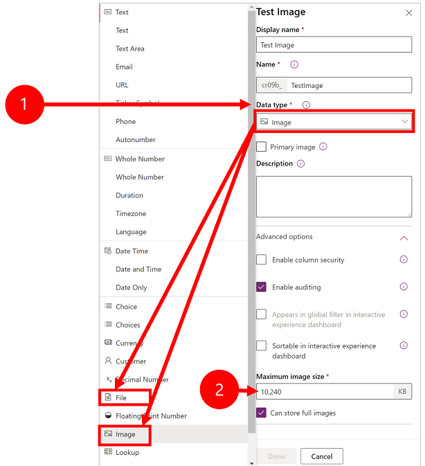
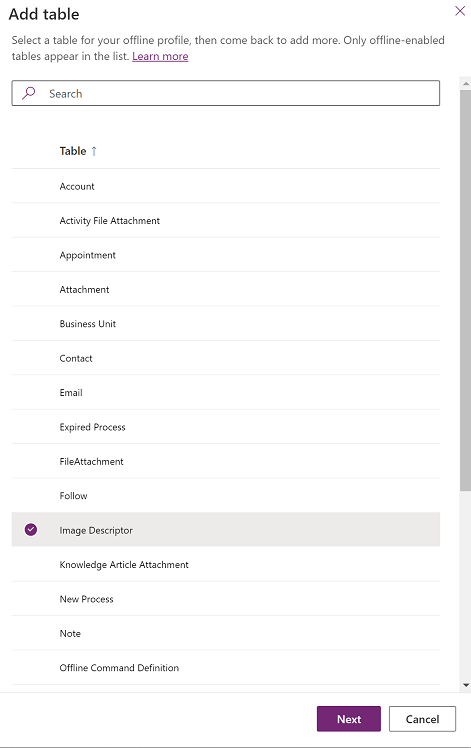
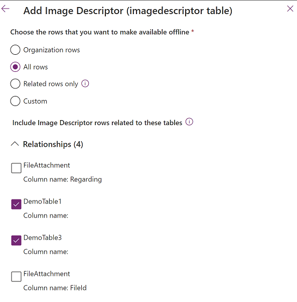
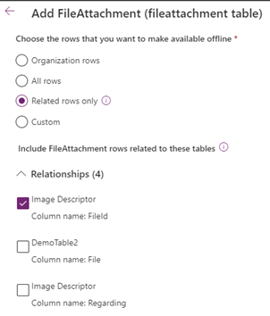
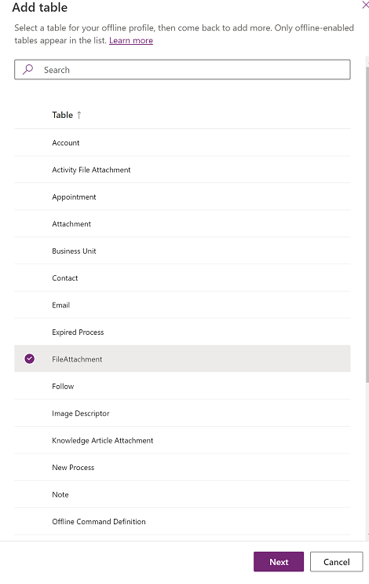
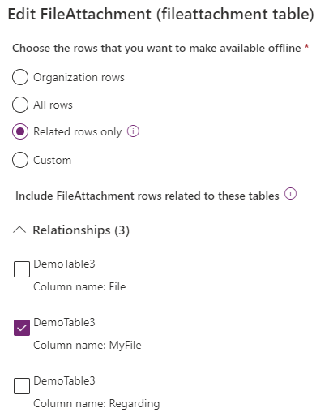
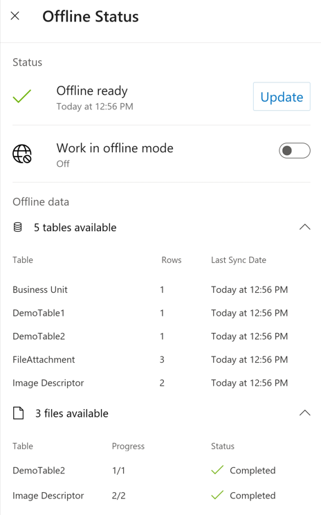

# Configure mobile offline profiles for images and files 

To work with file and image columns in offline mode, you need to add additional tables and relationships.

Follow the steps in this topic, for a mobile offline profile that has a table with a column where **Data type** is set to **File** or **Image**.

## View column properties for a file or image 

1. Sign in to [Power Apps](https://make.powerapps.com).

2. In the left navigation, select **Tables**. [!include [left nav](../includes/left-navigation-pane.md)] 
  
3. Select the **Display name** of a column where **Data type** is set to **File** or **Image**.

4. The column properties show the **Data type**. Expand **Advanced options** to view the maximum size for a file or image.

   > [!div class="mx-imgBorder"]
   >

## Add image columns to mobile offline 

It is required to add both the **Image Descriptor** and **FileAttachment** tables to your mobile offline profile to make images available in offline mode.

1. Go to Power Platform Admin center, [https://admin.powerplatform.microsoft.com](https://admin.powerplatform.microsoft.com) and sign-in as an admin.

2. On the right, select **Environments**.
 
3. Choose an environment and then select **Settings**.
 
4. Expand **Users + permissions**, and then select **Mobile configuration**.

5. Select a mobile offline profile to edit it.

6. In **Data available offline** select **Add table**.

7. Select **Image Descriptor** and then select **Next**.

   > [!div class="mx-imgBorder"]
    >

8. Under **Choose the records that you want to make available offline**, select **Related records only**.
9. Expand **Relationships** and select **Column name:** for each applicable column where **Data type** is set to **Image** (that is, as shown in the screenshot below for the **DemoTable1** and **DemoTable3** tables).

   > [!div class="mx-imgBorder"]
    >
  
10. Select **Save**.
11. In **Data available offline** select **Add table** > **FileAttachment** > **Next**. 
12. Expand **Relationships** and select **Image Descriptor, Column name: FileId**. Don't select **Image Descriptor, Column name: Regarding**.

    > [!div class="mx-imgBorder"]
    > 

13. Select **Save**.

## Add file columns to mobile offline 

It is required to add the **FileAttachment** tables to your mobile offline profile to make files available in offline mode.

1. Go to Power Platform Admin center, [https://admin.powerplatform.microsoft.com](https://admin.powerplatform.microsoft.com) and sign-in as an admin.

2. On the right, select **Environments**.
 
3. Choose an environment and then select **Settings**.
 
4. Expand **Users + permissions**,  and then select **Mobile configuration**.

5. Select a mobile offline profile to edit it.

6. In the **Data available offline** select **Add table**.

7. Select **FileAttachment**  and then select **Next**.

   > [!div class="mx-imgBorder"]
    >

8. Under **Choose the records that you want to make available offline**, select **Related records only**.
9. Expand **Relationships** and select **Column name: Display name** for each applicable column where **Data type** is set to **File** (that is, as shown in the screenshot below for the **DemoTable3** table).

   > ![Note] Don't select **Column name: Regarding.**.

    > [!div class="mx-imgBorder"]
    >
   

 11. Select **Save**. 
   
  
## Offline status of files and images

You can use the **Offline Status** page to see the number of files and images to be downloaded and the current progress.

- The number of images is listed for the **Image Descriptor** table.
- The number of files are listed for each table with file attachments (that is, as shown in the screenshot below for the **DemoTable2** table).

  > [!div class="mx-imgBorder"]
  >
