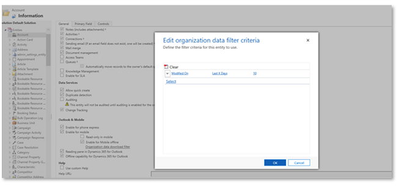

# Mobile offline limitations for model-driven apps

Before you set up the mobile app in offline mode, be sure to read through the following limitations. We recommend that you also review the [Offline best practices](best-practices-offline.md) and the [Offline profile guidelines](mobile-offline-guidelines.md).

These tables and corresponding permissions are available in offline mode.

> [!NOTE]
> Custom permissions and default permissions without the **Mscrm.IsEntityAvailableForUserInMocaOffline** rule won't be displayed in offline-first apps. Learn more in [A button on the command bar is hidden when it should be visible in Power Apps](/troubleshoot/power-platform/power-apps/create-and-use-apps/ribbon-issues-button-hidden?tabs=delete).

|Table |Permissions|  
|-------------|---------|  
|Account|	Create, Read, Update, Delete|
|Activity Pointer|Read, Delete|
|Appointment|	Create, Read, Update, Delete, Convert Activity Case|
|Attachment	|Read only|
|Case|Create, Read, Update, Delete|
|Competitor|Create, Read, Update, Delete	|
|Competitor Address |Create, Read, Update, Delete	|
|Connection|Read only|
|Connection Role|Read only|
|Contact|Create, Read, Update, Delete	|
|Custom table|Create, Read, Update, Delete	|
|Email|Read only	|
|Lead|Create, Read, Update, Delete, Qualify/Disqualify	|
|Opportunity|Create, Read, Update, Delete|
|Opportunity Product|Create, Read, Update, Delete	|
|Phone Call|Create, Read, Update, Delete	|
|Position|Create, Read, Update, Delete	|
|Product|Read|
|Task |Create, Read, Update, Delete|
|Team |Read only	|
|User |Read only	|
|Bookable Resource Booking |Create, Read, Update	|
|Work Order  |Create, Read, Update	|
|Work Order Product |Create, Read, Update	|
|Work Order Service |Create, Read, Update	|
|Work Order Service Task |Create, Read, Update	|

## Feature limitations 
- **Number of records synced**: The total number of records synced is limited to 3,000,000. Attempts to sync a larger number of records fail. This number also includes hidden tables used for offline capabilities.

- **Security model**: [Field level security and field sharing](/power-platform/admin/field-level-security) aren't supported in Mobile offline mode.

- **Qualify a lead**: When a lead created in mobile offline is qualified and when the user goes online, the business process stage shows the qualified stage. The user has to manually select **Next stage** to move to the next stage.

- **Grids**:
    - Column filtering is disabled when an offline profile is set up even when there's network connectivity. The grid works with the local database and doesn't support custom filters.
    - Primary image thumbnails aren't available for offline unless they were previously displayed online.
    - Custom icons alongside values in grids aren't available for offline. For more information about this capability, go to [How to display custom icons](../maker/data-platform/display-custom-icons-instead.md).

- **Supported type of views**: Only system views and quick views are supported in mobile offline. Personal views aren't supported.
   
- **Views** aren't supported for the following tables in offline mode: 

     - Email

     - Task

     - Fax

     - Letter

     - Serviceappointment

     - Campaignresponse

     - Campaignactivity

     - Recurringappointmentmaster

     - Socialactivity

    Any views that have linked tables (related table) that aren't available offline are also not supported.

- **Advanced lookups**: The [Advanced lookup](../user/lookup-field.md#advanced-lookup) functionality isn't supported in offline scenarios. When you're offline, the **Advanced lookup** button is replaced by a **Change view** dropdown list.

- **Add Existing on subgrids**: The **Add Existing** functionality isn't supported for mobile offline for certain types of relationships. When you're offline, certain relationships such as relationships that are N:N are read only, and the **Add Existing** command is hidden on subgrids for those relationships. Even if the button is unhidden via customization, the command doesn't work in offline.

- **Web resources**: Web resources are partially supported in offline mode. For more information, see the following table.

    |Web resource configuration |Offline support on Android and Windows|Offline support on iOS|  
    |-------------|---------|--------|  
    |Web resource used on form handlers, form scripts, and ribbon commands|Supported (File names should be in lower case.)|Supported (File names should be in lower case.)|
    |JavaScript files referenced within an HTML web resource| Supported| Not supported. Web resources may be available offline in some circumstances if they're retrieved while online and cached by the browser. |
    |HTML, JS, CSS, XML web resources embedded on a model-driven app form| Supported| Not supported. Web resources may be available offline in some circumstances if they're retrieved while online and cached by the browser.|
    |Other web resources embedded on a model-driven app form (like images, RESX, and so on)   **Note**: The [Dataverse file](/power-apps/developer/data-platform/file-attributes) and [image](/power-apps/developer/data-platform/image-attributes) attributes aren't web resources but regular Dataverse data. To enable them offline, see  [Configure files and images in offline model-driven apps](/power-apps/mobile/offline-file-images). |Not supported**|Not supported**|
    |Webpage (HTML web resource) via a model-driven app’s sitemap|Not supported|Not supported|
    |Custom JS files that create a fetchXML dynamically |Not supported|Not supported|

    ** Accessing RESX web resources as a dependency through Client API from within a JS file is supported.

    > [!NOTE]
    > For the best compatibility across platforms, use one of the following recommendations instead of HTML web resources:
    > - If the web resource is a user experience component, use a [PCF control](../developer/component-framework/overview.md).
    > - If the web resource doesn't present in the user interface, use [form handler events](../maker/model-driven-apps/configure-event-handlers-legacy.md) which are available offline on all platforms.

- **Calculated and rollup fields**: Calculated and rollup fields that are part of rows synced to the client aren't reevaluated by the client. The reevaluation happens on the server when the updated row is synced.

- **Mapped fields**: When you run an app in offline mode, mapped fields aren’t prepopulated when you create a new record from a table that has fields mapped to another table.

- **Lookup fields**: The value of a lookup field may not be updated in a form or grid when the display name of the lookup item is updated.

- **Filter operations**: Not all filter operations are supported in offline mode. For a full list of supported operators, see [Supported Filter Operations Per Attribute Type in Mobile Offline using FetchXML](/power-apps/developer/model-driven-apps/clientapi/reference/xrm-webapi/retrievemultiplerecords#supported-filter-operations-per-attribute-type-in-mobile-offline-using-fetchxml).

- **Appointments**: Appointments can be created or updated in Dataverse, but they're not sent to recipients with server-side synchronization. For more information, see [Appointment table/entity reference](../developer/data-platform/reference/entities/appointment.md) and [Server-side synchronization tables](../developer/data-platform/server-side-synchronization-entities.md).

- **Work order service tasks**: Work order service tasks created through *custom* code require msdyn_lineorder to be set to -1. An actual value will be automatically set after the next synchronization cycle.

- **Quick find search**: When you search offline, the results might be different from online searches. Characters in your search terms must match exactly when searching offline, while online equivalent results might be found.
  
- **Offline search**: Offline search is available only for offline tables. Users can only search one table at a time. Global search defaults to a categorized search in offline mode, even if Dataverse search is turned on and there is network connectivity, as Dataverse search isn't supported in offline mode. On grid pages, view-based search (filter by keyword) isn't supported in offline mode and grid search switches to a quick, find-based search.

- **Duplicate records**: The [experience of detecting duplicates and merging them](/power-platform/admin/detect-duplicate-records) isn't supported in offline mode. 

### Profile filters limitations

|Profile details |Limitation|  
|-------------|---------|  
|Relationship defined for each table|A maximum of 15 relationships is allowed. There's also a maximum of one many to many (M:M) or one to many (1:M) relationships within those 15 relationships. If any custom tables demand this scenario, then revisit the data model. No circular references or self-references are supported.|
|Images and files|Images and files are subject to the same limitations as any other table. Because of implicitly defined relationships, an offline profile can only contain up to 14 image columns, across all entities.|

### Organization data filter 

> [!IMPORTANT]
> Organization data filters are no longer used. Changes to filters should be edited within the mobile profile itself.

It's recommended that you have at least one rule defined for all mobile offline-enabled data filters if you're using tables across profiles. By default, this value is set to last 10 days for most of the offline-enabled tables.

 > [!div class="mx-imgBorder"]
 > 

### Related information
[Troubleshoot offline sync errors in the Power Apps mobile app](/troubleshoot/power-platform/power-apps/mobile-apps/mobile-offline-troubleshooting)

[!INCLUDE[footer-include](../includes/footer-banner.md)]
