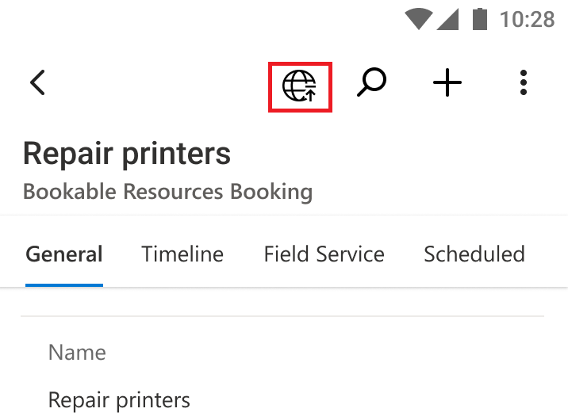

# View offline sync status

[This article is pre-release documentation and is subject to change.]

The offline sync icon is now always visible in the mobile navigation bar. The icon provides contextual information such as if the app is connected, if data is currently refreshing, whether there are pending user updates that have not synchronized yet, and whether the sync has an error or warning.

The offline sync icon is now visible in the main navigation on iOS and Android devices.

> [!div class="mx-imgBorder"]
> 

> [!IMPORTANT]
> - This is a preview feature.
> - [!INCLUDE[cc_preview_features_definition](../includes/cc-preview-features-definition.md)]

## Offline sync icon changes based on sync status
The offline sync icon changes based on sync status.  The following table provides more detail.

| Icon | Description|
|------|--------------|
| | App is connected to the internet.|
|  |App is not connected to the internet.|
|  |App is syncing data.|
|  |App has pending changes to upload.|
|  |There is an error in the synchronization process.|
|  |There is a warning in the sychronization process.|

## Offline Status page
When you select the offline sync icon, the **Offline Status** page is displayed. The **Offline Status** page provides detailed information about the sync status, such as what data was downloaded and if there is data yet to upload to the app, as shown in the following image.

:::image type="content" source="media/OfflineStatusPage-NotConnected.png" alt-text="When you select the offline sync icon, the **Offline Status** page is displayed.":::

## Notifications
On iOS and Android devices, notifications about the offline sync have been redesigned to be consistent across the different sync steps.    

## Known issues

- During the first sync, the offline sync icon continues to spin until the user navigates and switches from online mode to offline mode. 
- The the app has pending changes to upload, the number is the sum of updated rows, added and removed files, and images.   
