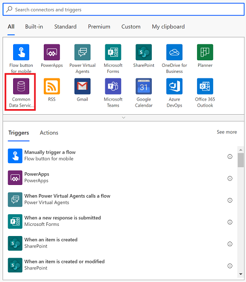

title: Set up push notification for the Power Apps mobile app| Microsoft Docs
description: Learn how to send push notifications for Power Apps mobile.
author: mduelae
ms.service: powerapps
ms.component: pa-user
ms.topic: quickstart
ms.date: 10/15/2020
ms.author: mkaur
ms.custom: ""
ms.reviewer: ""
ms.assetid: 
search.audienceType: 
  - enduser
search.app: 
  - PowerApps
---
---
# Set up push notification for the Power Apps mobile app

Push notifications are used in mobile apps to engage app users and help them prioritize key tasks. In Power Apps, you can send notifications by using the Power Apps Notification connector. You can send native push notifications to any app that you create in Power Apps. 

Add a push notification to your app if:

* Your users need to know information immediately.
* Your users must complete important tasks by using your app, in a preloaded context.
* You want to engage your users on a specific interval, or you need users to enter the app in a specific context.

> [!NOTE]
> To receive push notifications, each user must have opened the app in Power Apps Mobile once or gotten the app from the [Microsoft 365 apps page](https://www.office.com/apps).

## Before you start
In an app for which you have the **Contributor** permission, add a Power Apps Notification connection. If you don't already have an app, you can quickly [create a model-drive app](https://docs.microsoft.com/powerapps/maker/model-driven-apps/build-first-model-driven-app#create-your-model-driven-app), or [create a canvas app](https://docs.microsoft.com/powerapps/maker/canvas-apps/get-started-test-drive), and you'll have the required permission by default. That tutorial and this one use an app based on the Case Management template.

## Step 1: Set up the notification from a flow

If you trigger a push notification from a flow, you can send the notification to only one user or security group at a time.

1. Go to [Power Automate](https://flow.microsoft.com) and select **Create**.

   > [!div class="mx-imgBorder"] 
   > 

2. Select **Instant flow**.

   > [!div class="mx-imgBorder"] 
   > 

3. On the **Build an instant flow** dialog box, enter a name for the flow and then select **Manually trigger a flow**. When you're done, select **Create**.

   > [!div class="mx-imgBorder"] 
   > 
   
   
 4. On the next screen, select **+ New step**.   
 
    > [!div class="mx-imgBorder"] 
    > 
    
 5. In the search box, enter **send a push notification** and then select the **Power Apps Notification** connector. In the resluts, select the **Send push notification V2** action.
 
    > [!div class="mx-imgBorder"] 
    > 
 
 6. on the next screen, enter the information below and then select **Save**.
 
 	- **Mobile app**: Select **Power Apps**.
	- **Your app**: Select the app that you want to set up the notification for.
	- **Recipient Items-1**: Select how the flow is triggered.
	- **Message**: Enter the notification message..
	- **Open app**: Select whether to open the app or not when the user selects the notification.
	- **Entity**: Select which entity the notification is for.
	- **Form or view**: Select if the notification is for a form or view.
	- **Record ID**: If the notification is for a form then select the record ID.
