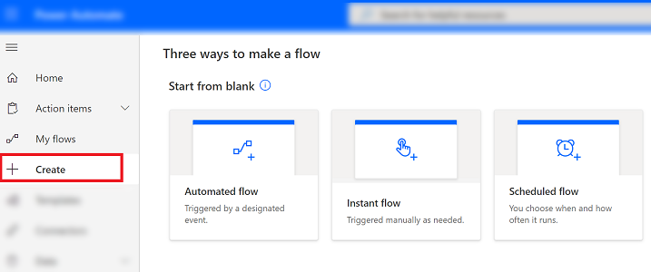
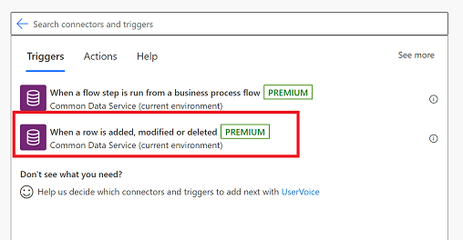
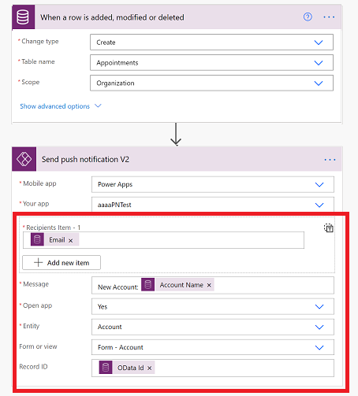

# Create push notifications for the Power Apps mobile app

Push notifications are used in Power Apps mobile to engage app users and help them prioritize key tasks. In Power Apps, you can create notifications for Power Apps mobile by using the Power Apps Notification connector. You can send notifications to any app that you create in Power Apps. 
 

Add a push notification to your app if:

* Your users need to know information immediately.
* Your users must complete important tasks by using your app, in a preloaded context.
* You want to engage your users on a specific interval, or you need users to enter the app in a specific context.

> [!NOTE]
> To receive push notification, each user must have opened the app in Power Apps Mobile once or gotten the app from the [Microsoft 365 apps page](https://www.office.com/apps).

Before you can create push notification  you need have access to an app and have the record ID if you're creating a notificatin for a form.

## Step 1: Create an app

You need have **Contributor** permission for a model-driven app or canvas app. If you don't have an app, you can create one. For information, see:

- [Create a model-drive app](https://docs.microsoft.com/powerapps/maker/model-driven-apps/build-first-model-driven-app#create-your-model-driven-app)
- [Create a canvas app](https://docs.microsoft.com/powerapps/maker/canvas-apps/get-started-test-drive)
     

## Step 2: Create a notification from a flow

When you trigger a push notification from a flow, you can send the notification to only one user or security group at a time.

1. Go to [Power Automate](https://flow.microsoft.com) and select **Create**.

   > [!div class="mx-imgBorder"] 
   > 

2. Select **Automated flow**.

   > [!div class="mx-imgBorder"] 
   > 

3. On the **Build an instant flow** screen, choose one of the flow trigger or select **Skip** and manually create one.

   > [!div class="mx-imgBorder"] 
   > 
   
   
 4. On the next screen, select **+ New step**.   
 
    > [!div class="mx-imgBorder"] 
    > 
    
 5. In the search box, enter **send a push notification** and then select the **Power Apps Notification** connector. In the results, select the **Send push notification V2** action.
 
    > [!div class="mx-imgBorder"] 
    > 
 
 6. On the **Send push notification** screen, enter the following information:
 
 	- **Mobile app**: Select **Power Apps**.
	- **Your app**: Select the app that you want to set up the notification for. Model-driven apps and canvas apps have different parameters. The next step will depend on the type of app you select here.
	
 7. Do one of the following:
 
 - For a model-driven app, enter the following informaiton:
 
      - **Recipient Items-1**: Select how the flow is triggered.
      - **Message**: Enter the notification message.
      - **Open app**: Select whether to open the app or not when the user selects the notification.
      - **Entity**: Select which entity the notification is for.
      - **Form or view**: Select if the notification is for a form or view.
      - **Record ID**: If the notification is for a form then enter the record ID.

      

- For a canvas app, enter the following information: 
    
     - **Recipient Items-1**: Select how the flow is triggered.
     - **Message**: Enter the notification message.
     - **Open app**: Select whether to open the app or not when the user selects the notification.
     - **Parameters**: Key-value parameters to pass with the notification. Your push notification can pass specific parameters to the app These can be further processed in the app to open a specific page and load a specific state. For more information, see [Load a specific page and context when a user taps the notification](https://docs.microsoft.com/powerapps/maker/canvas-apps/add-notifications#load-a-specific-page-and-context-when-a-user-taps-the-notification).
	 
     
	
8. When you're done, select **Save**. 
9. Select **Flow checker** to check for error or warnings.
10. Test the flow by selecting **Test** and follow the prompts. 

## Known limitations

* Currently, notifications aren't displayed on Power Apps Mobile for Windows Phone.
* Currently, we don't provide push notifications for users who run apps only in a web browser.
* Notifications show the generic Power Apps icon instead of a specific app icon.

For reference information, see [Power Apps Notification reference](https://docs.microsoft.com/connectors/powerappsnotification/).

