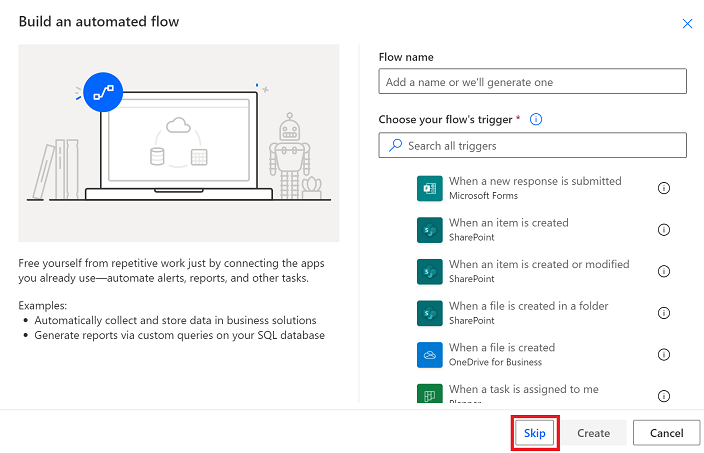
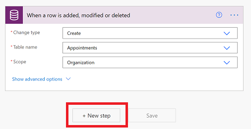
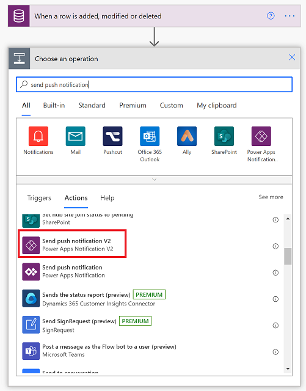

# Create push notifications for Power Apps mobile

Push notifications are used in Power Apps mobile to engage app users and help them prioritize key tasks. In Power Apps, you can create notifications for Power Apps mobile by using the Power Apps Notification connector. You can send notifications to any app that you create in Power Apps. 
 

Add a push notification to your app if:

* Your users need to know information immediately.
* Your users must complete important tasks by using your app, in a preloaded context.
* You want to engage your users on a specific interval, or you need users to enter the app in a specific context.

> [!NOTE]
> To receive push notification, each user must have opened the app in Power Apps Mobile once or gotten the app from the [Microsoft 365 apps page](https://www.office.com/apps).

Before you can create push notification you need to have access to an app and have the row ID if you're creating a notification for a form.

Create an app

You need to have **Contributor** permission for a model-driven app or canvas app. If you don't have an app, you can create one. For information, see:

- [Create a model-drive app](../maker/model-driven-apps/build-first-model-driven-app.md#create-your-model-driven-app)
- [Create a canvas app](../maker/canvas-apps/get-started-test-drive.md)
     
## Create a notification from a flow

When you trigger a push notification from a flow, you can send the notification to only one user or security group at a time.

1. Go to [Power Automate](https://flow.microsoft.com) and select **Create**.

   > [!div class="mx-imgBorder"] 
   > 

2. Select **Automated flow**.

   > [!div class="mx-imgBorder"] 
   > 

3. On the **Build an automated flow** screen, choose one of the flow trigger or select **Skip** and manually create one.

   > [!div class="mx-imgBorder"] 
   > 
   
   
 4. From the list of connectors and triggers select **Microsoft Dataverse (current environment)**.  
 
    > [!div class="mx-imgBorder"] 
    > 
    
 5. Select the action that will trigger the notification. 
 
    > [!div class="mx-imgBorder"] 
    > 
    
    
 6. Enter the trigger condition information and then select **New step**.  
 
    | Name | Description |
    | --- | --- |
    | Trigger condition |Select the condition for the notification. |
    | The table name |Select which table the notification is for. |
    | Scope |Select the scope. |
 
    > [!div class="mx-imgBorder"] 
    > 
 
7. In the **Choose an action** search box, enter **send push notification**. In the list of **Actions** choose **Send push notification V2**.
 
    > [!div class="mx-imgBorder"] 
    > 
 
 
 6. On the **Send push notification** screen, enter the following information:
 
 	- **Mobile app**: Select **Power Apps**.
	- **Your app**: Select the app that you want to set up the notification for. Model-driven apps and canvas apps have different parameters. The next step will depend on the type of app you select here.
	
 7. Depending on the type of app that you selected in the previous step, do one of the following:
 
 - For a model-driven app, enter this information:
 
      - **Recipient Items-1**: Select how the flow is triggered.
      - **Message**: Enter the notification message.
      - **Open app**: Select whether to open the model-driven app or not when the user selects the notification.
      - **Table**: Select which table the notification is for.
      - **Form or view**: Select if the notification is for a form or view.
      - **Row ID**: If the notification is for a form, then enter the row ID.

      

- For a canvas app, enter this information: 
    
     - **Recipient Items-1**: Select how the flow is triggered.
     - **Message**: Enter the notification message.
     - **Open app**: Select whether to open the canvas app or not when the user selects the notification.
     - **Parameters**: Key-value parameters to pass with the notification. Your push notification can pass specific parameters to the app. These can be further processed in the app to open a specific page and load a specific state. For more information, see [Perform an action when a user taps the notification](power-apps-mobile-notification.md#perform-an-action-when-a-user-taps-the-notification).
	 
     
	
8. When you're done, select **Save**. 
9. Select **Flow checker** to check for error or warnings.
10. Test the flow by selecting **Test** and follow the prompts. 

## Perform an action when a user taps the notification

### Pass parameters

For canvas apps, you can pass key-value pairs using the **Parameters** field as JSON. For example, if you wanted to pass the CaseID, you would put the following as **Parameters**:
` { "CaseID": 42 }`. You can also use dynamic values from earlier steps as shown below.

### Read parameters

To read the passed parameters, use Param("ParameterName"). For example, to read the **CaseID** value, use *Param("CaseID")*. To quickly identify this parameter, add a **Label** control to your app. Set the **Text** property of that control to **Param("CaseID")**. If the user opens the app from the **All apps** list, the value is empty. If the user opens the app from another location on the device, the value is populated with the **CaseID** value.

### Set the start page

You can set your app to open, for example, the **Case details** page as soon as the app opens:

1. Add a **Timer** control, and set its **OnTimerEnd** property to this formula:

    `Navigate(EditCase, ScreenTransition.None)`

1. (optional) Hide the **Timer** control by setting its **Visible** property to **false**.

1. Set the **OnVisible** property of the screen to **Timer.Start()**.

> [!TIP]
> It's a good idea to create a unique first page in the app for the notification:
> 
> 1. Create an empty page that your app doesn't already open, add a **Text Input** control, and set its **timer.Duration** value.
> 2. When you create the app, set the timer to a non-zero value. When you're ready to publish the app, set the value to **0** to immediately trigger the timer.

## Known limitations

* Currently, notifications aren't displayed on Power Apps Mobile for Windows Phone.
* Currently, we don't provide push notifications for users who run apps only in a web browser.
* Notifications show the generic Power Apps icon instead of a specific app icon.
* Notifications are not supported in China.

For reference information, see [Power Apps Notification reference](/connectors/powerappsnotification/).

[!INCLUDE[footer-include](../includes/footer-banner.md)]
