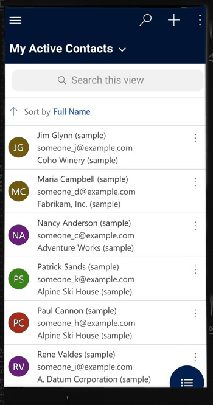
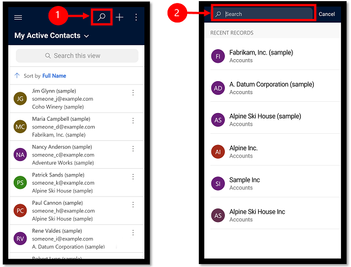
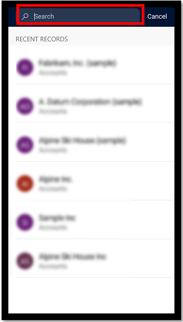
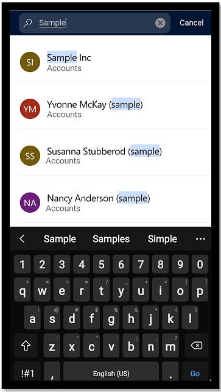
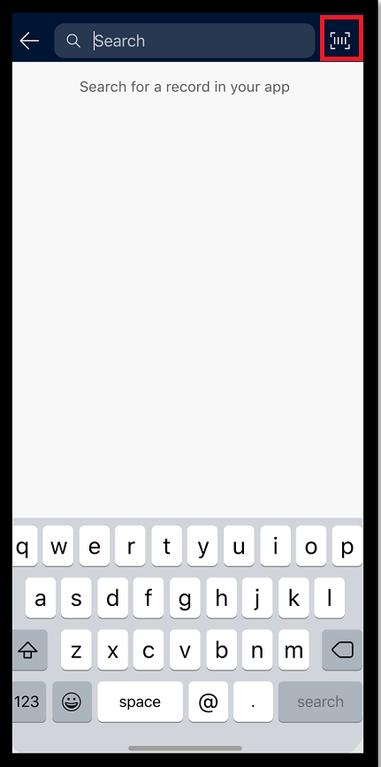
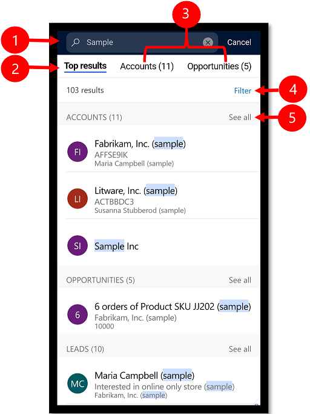

# Use relevance search for model-driven apps using Power Apps Mobile 

You can quickly find the information that you're looking for by using relevance search. The relevance search experience delivers fast and comprehensive results across multiple tables, in a single list, sorted by relevance.

Relevance search is already available when you're using a model-driven app in a web browser. The functionality is the same in Power Apps Mobile, but it works a little differently. More information: [Search for tables and rows by using relevance search](../user/relevance-search.md)

Before you begin using relevance search, the new experience needs to be enabled by the administrator for your organization. More information: [Enable the new relevance search experience](/power-platform/admin/configure-relevance-search-organization#enable-the-new-relevance-search-experience)<!--note from editor: Edit to alt text suggested. This isn't really a "diagram," which is a line drawing such as a conceptual illustration.-->

  > [!div class="mx-imgBorder"]
  > 

 

## Run a search

View suggested search results inline as you type, minimizing keystrokes and simplifying page navigation.

1. Select the search button. 

   > [!div class="mx-imgBorder"]
   >  
  
2. Enter the words you want to search for in the search box.  

   > [!div class="mx-imgBorder"]
   >  
  
3. As you enter search text, rows that match your text begin to appear.

   > [!div class="mx-imgBorder"]
   > 

## Early access: Use the barcode scanner

 [!INCLUDE [cc-beta-prerelease-disclaimer](../includes/cc-beta-prerelease-disclaimer.md)]
 
 If you're on [early access](/power-platform/admin/opt-in-early-access-updates), you can use the barcode scanner to look up rows. The scanner automatically detects a barcode, a QR code, or a data-matrix code.
 
 1. To use the barcode scanner, select the search button.
 2. Select the barcode scanner button and then scan your item.

   > [!div class="mx-imgBorder"]
   > 
 

## View search results

Search results are ranked and grouped by table.

 
  
  Legend
  
  1. **Search box**: Enter the words you want to search for.
  2. **Top results**: This tab shows the rows that best match the search query. 
  3. **Table-specific tab**: To narrow your search results to a specific table, select the table tab.
  4. **Filter**: Refine the search results by using filters. When you select filters, the number of tables that have been filtered on appears next to the filter option.
  5. **See all**: Up to three rows will appear; if there are more, select **See all**.
  
## Filter search results
  
Use filters to drill into and explore the results of your current search without having to repeatedly refine your search terms. Immediately after you perform a search, you can filter by **Owner**, **Created On**, or **Modified On**.

 
  
  Legend
  
  1. **Back**: Go back to the search results screen.
  2. **Filter**: Select a filter type to filter the search results.
  3. **Clear all**: Clear all filters and return to the search results screen.

[!INCLUDE[footer-include](../includes/footer-banner.md)]
