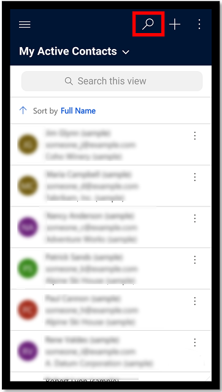
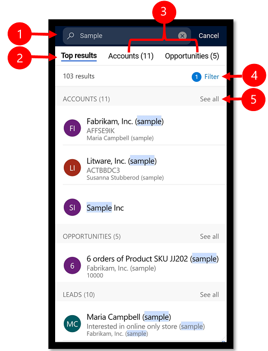
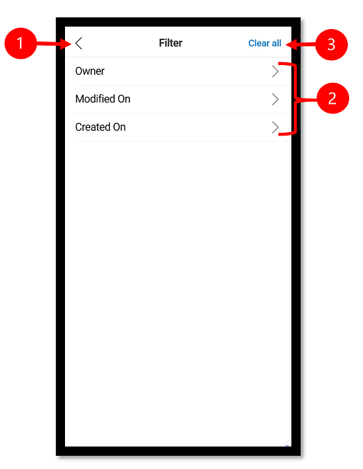

# Use relevance search for model-driven apps using the Power Apps mobile app (preview)

[!INCLUDE [cc-beta-prerelease-disclaimer](../includes/cc-beta-prerelease-disclaimer.md)]

Quickly find the information that you are looking for using Relevance search. The Relevance search experience delivers fast and comprehensive results across multiple tables, in a single list, sorted by relevance.

Relevance Search is already available when you're using a model-driven app in a web browser. The functionality is the same but it works a little differently when you're using it with the mobile app. For more information, see [Using relevance search to search for rows](https://docs.microsoft.com/powerapps/user/relevance-search).

Before you begin using Relevance Search, the new experience needs to be enabled by the administrator for your organization. For more information, see [Enable the new Relevance Search experience](https://docs.microsoft.com/power-platform/admin/configure-relevance-search-organization#enable-the-new-relevance-search-experience).

  > [!div class="mx-imgBorder"]
  > 

## Run a search 

View suggested search results inline as you type, minimizing keystrokes and simplifying page navigation. 

1. To run a search, select the search button. 

   > [!div class="mx-imgBorder"]
   >  
  
2. Enter your search words in the search box.  

   > [!div class="mx-imgBorder"]
   >  
  
3. As you enter search text, rows that match start showing.

   > [!div class="mx-imgBorder"]
   >  
     
## View search results

Search results are ranked and grouped by table. 

 
  
  
  Legend
  
  1. **Search box**: This is where you enter the search text.
  2. **Top results**: Show rows that best match the search query. 
  3. **Row type**: To narrow your search results to a specific table, select the table tab.
  4. **Filter**: Refine the search results by using filters. When you select filters, the number of tables that have been filtered on show up next to the filter option.
  5. **See all**: Up to three rows will show, if there is more than select **See all** to view the rest.
  
## Filter search results
  
Filters let you drill into and explore the results of your current search without having to repeatedly refine your search terms. Immediately after you perform a search you can filter by  owner, created on, and modified on.

 
  
  
  Legend
  
  1. **Back**: Go back to the search results screen.
  2. **Filter**: Select a filter type to filter the search results.
  3. **Clear all**: Clears all filter and takes you back to the search results screen.

[!INCLUDE[footer-include](../includes/footer-banner.md)]