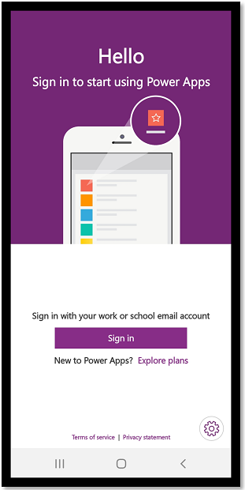

# Use relevance search for model-driven apps using the Power Apps mobile app

Quickly find the information that you are looking for using Relevance search. The Relevance search delivers fast and comprehensive results across multiple tables, in a single list, sorted by relevance.

> - Customer engagement apps (such as Dynamics 365 Sales and Dynamics 365 Customer Service) don't run in the Power Apps mobile app. Instead, you use the Dynamics 365 for phones and tablets apps. More information: [User Guide for Dynamics 365 for phones and tablets](https://docs.microsoft.com/dynamics365/mobile-app/dynamics-365-phones-tablets-users-guide).
> - Power Apps for Windows isn't supported if you have the [Power Apps per app plan](/power-platform/admin/about-powerapps-perapp).

Legend:

1. **Model-driven apps**
2. **Canvas apps**

## Required privileges

For privileges required to run model-driven apps on Power Apps Mobile app, see [Required privileges](/dynamics365/mobile-app/set-up-dynamics-365-for-phones-and-dynamics-365-for-tablets#required-privileges).

## Supported devices 

These are the supported devices for running model-driven apps and canvas apps on the Power Apps mobile app.

| **Minimum required** | **Recommended** |
| --- | --- |
| iOS 12 or later |iOS 12 or later|
| Android 7 or later |Android 7 or later |
| Windows 8.1 or later (PC only) |Windows 10 Fall Creators Update with at least 8 GB of RAM)|

> [!NOTE]
> - On October 16, 2020 we will no longer support iOS 12. After October 16, 2020 iOS 13 or later will be supported. 
> - We currently don't support new features on Windows platform for [Power Apps mobile app](/powerapps/user/run-app-client). Features such as the Improved Microsoft Dataverse option and guest access are not available on this platform. We recommend using a web player on Windows to leverage the full set of capabilities. Updates to the Power Apps mobile app for Windows platform will be announced in future.

## Install Power Apps mobile app

To follow this procedure, if you're not signed up for Power Apps, [sign up for free](https://make.powerapps.com/signup?redirect=marketing&email=).  Also, make sure you have access to a model-driven app or canvas app that you created or that someone else created and shared with you. 

Choose the download link for your device:

- For iOS (iPad or iPhone), go to the [App Store](https://itunes.apple.com/app/powerapps/id1047318566?mt=8).

- For Android, go to [Google Play](https://play.google.com/store/apps/details?id=com.microsoft.msapps). 

## Open Power Apps, and sign in

Open Power Apps on your mobile device, and sign in by using your Azure Active Directory credentials.

If you have the Microsoft Authenticator app installed on your mobile device, enter your username when prompted, and then approve the notification sent to your device.

## Find the app

When you sign in to the app, the **My apps** filter is set by default. If you don't find the app you're looking for, you can open the **Power Apps** menu, and then select a different filter. 

