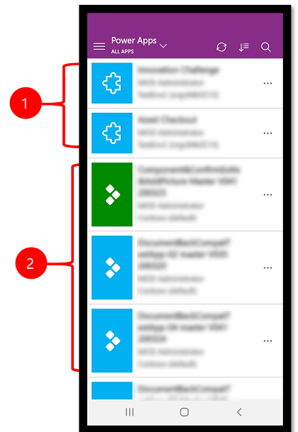
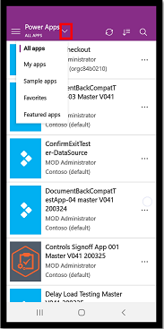
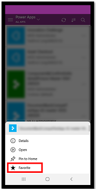
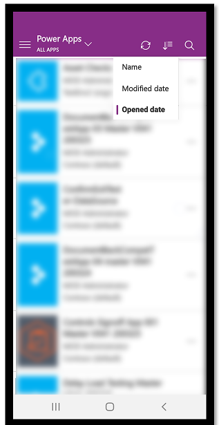
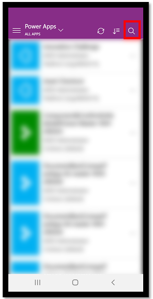
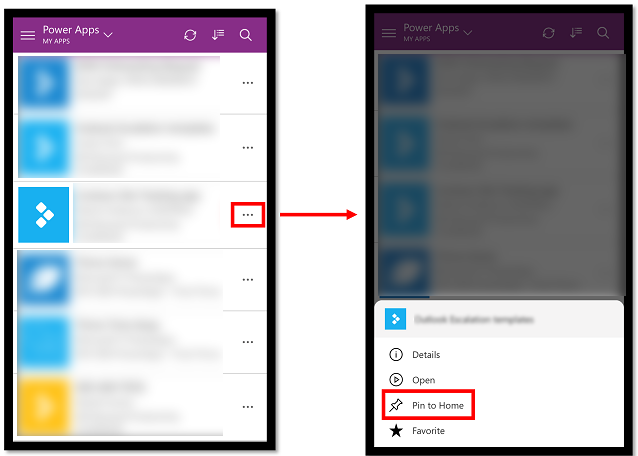
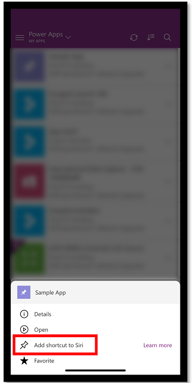
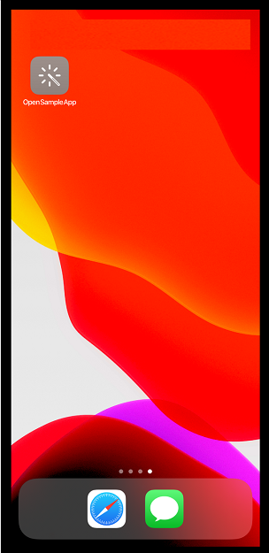

# Run model-driven apps and canvas apps on Power Apps mobile

When you create an app, or someone shares an app with you&mdash;either a [canvas app](https://docs.microsoft.com/powerapps/maker/#canvas-apps) or [model-driven](https://docs.microsoft.com/powerapps/maker/#model-driven-apps) app&mdash;you can run that app on iOS and Android devices by using the Power Apps mobile app. 

If you're on a Windows device, you can only run canvas apps; model-driven apps aren't supported on [Power Apps for Windows](https://www.microsoft.com/p/power-apps/9nblggh5z8f3?activetab=pivot:overviewtab). Also, Power Apps for Windows isn't supported if you have the [Power Apps per app plan](/power-platform/admin/about-powerapps-perapp).

| **App type**  | **iOS** |**Android** |**Windows** |
| --- | --- |--- |--- |
| **[Model-driven](https://docs.microsoft.com/powerapps/maker/#model-driven-apps)** |X |X| |
| **[Canvas](https://docs.microsoft.com/powerapps/maker/#canvas-apps)** |X |X|X|

> [!NOTE]
> Customer engagement apps (such as Dynamics 365 Sales and Dynamics 365 Customer Service) don't run in the Power Apps mobile app. Instead, you use the Dynamics 365 for phones and tablets apps. More information: [User Guide for Dynamics 365 for phones and tablets](https://docs.microsoft.com/dynamics365/mobile-app/user-guide-mobile-app).

In this topic, you'll learn how to get started and run a canvas app and a model-driven app on your mobile device 

Legend:

1. **Model-driven apps**
2. **Canvas apps**

## Required privileges

For privileges required to run model-driven apps on Power Apps Mobile app, see [Required privileges](/dynamics365/mobile-app/set-up-dynamics-365-for-phones-and-dynamics-365-for-tablets#required-privileges).

## Supported devices 

These are the supported devices for running model-driven apps and canvas apps on the Power Apps mobile app.

| **Minimum required** | **Recommended** |
| --- | --- |
| iOS 12 or later |iOS 12 or later|
| Android 7 or later |Android 7 or later |
| Windows 8.1 or later (PC only) |Windows 10 Fall Creators Update with at least 8 GB of RAM)|

> [!NOTE]
> - On October 16, 2020 we will no longer support iOS 12. After October 16, 2020 iOS 13 or later will be supported. 
> - We currently don't support new features on Windows platform for [Power Apps mobile app](/powerapps/user/run-app-client). Features such as the Improved Microsoft Dataverse option and guest access are not available on this platform. We recommend using a web player on Windows to leverage the full set of capabilities. Updates to the Power Apps mobile app for Windows platform will be announced in future.

## Install Power Apps mobile app

To follow this procedure, if you're not signed up for Power Apps, [sign up for free](https://make.powerapps.com/signup?redirect=marketing&email=).  Also, make sure you have access to a model-driven app or canvas app that you created or that someone else created and shared with you. 

Choose the download link for your device:

- For iOS (iPad or iPhone), go to the [App Store](https://itunes.apple.com/app/powerapps/id1047318566?mt=8).

- For Android, go to [Google Play](https://play.google.com/store/apps/details?id=com.microsoft.msapps). 

## Sign in

Open Power Apps on your mobile device, and sign in by using your Azure Active Directory credentials.

If you have the Microsoft Authenticator app installed on your mobile device, enter your username when prompted, and then approve the notification sent to your device. If you run into issues signing in, see [Troubleshoot sign in issues](https://docs.microsoft.com/en-us/powerapps/user/powerapps_mobile_troubleshoot#sign-in-issues).

## Find the app

When you sign in to the app, the **My apps** filter is set by default. If you don't find the app you're looking for, you can open the **Power Apps** menu, and then select a different filter. 

The following filters are available:

- **All apps**: Displays all canvas apps and model-driven apps to which you have access, including apps you created and apps that others shared with you.

- **My apps**: For canvas apps, this displays canvas apps that you've opened, apps that you're the owner of, and apps that you can edit. For model-driven apps, this displays all model-driven apps that you have access to. 

- **Sample apps** (canvas apps only): Displays sample canvas apps from Microsoft that showcase real application scenarios with fictitious data to help you explore design possibilities.

- **Favorites** (canvas apps only): Displays canvas apps that you've marked by selecting the ellipsis (...) on the app tile, and then selecting **Favorite**. To remove an app from this list, select the ellipsis (...) on the app tile, and then select **Unfavorite**.

    

- **Featured apps** (canvas apps only): Displays canvas apps that your admin has marked as featured apps.

### Sort apps

After you filter your apps, you can sort the filtered list by the date the apps were most recently opened or modified, or alphabetically by name. These preferences are retained when you close and reopen apps. You can sort both canvas apps and model-driven apps.

### Search apps

If you know the name of the app you want to run, you can select the search icon at the top, and then type part of its name in the search box. You can search for both canvas apps and model-driven apps.

If you filtered your apps, the filtered list will be searched.

### Refresh the list of apps

Select the refresh icon  to refresh the list of apps. This will refresh the lists of both the canvas apps and model-driven apps. 

## Pin to home

You can pin both canvas apps and model-driven apps to the home screen of your device for quick access.

### Use Safari to pin to home (iOS 13 or earlier)

1. Select the ellipsis (...) on the app tile, select **Pin to Home**;

   > [!div class="mx-imgBorder"]
   >  

2. Select .
 
   > [!div class="mx-imgBorder"]
   >  
   
3. Scroll down and select **Add to Home Screen**   

   > [!div class="mx-imgBorder"]
   >  
   
4. Select **Add**.   

   > [!div class="mx-imgBorder"]
   >  
   
> [!NOTE]
> For iOS devices that have multiple browsers installed, use Safari when pinning an app to home. 

### Use Siri shortcuts to pin to home (iOS 14 or later) 

The Power Apps mobile app is now integrated with Siri shortcuts, which gives you the ability to pin to home, launch apps with Siri, and create new workflows. For more information on how shortcuts work on iOS, see [Shortcuts User Guide](https://support.apple.com/guide/shortcuts/welcome/ios). This feature requires Power Apps mobile version 3.20092.x or later.

Users on iOS 14 or later can use Siri Shortcuts to pin an app to the home screen. The new experience works for both model-driven and canvas apps. When you add a Siri shortcut, the app is added to the iOS **Shortcuts** app and from there you can add the app to your home screen.

1. To pin an app to the home screen, select the ellipsis (...) on the app tile.
2. Select **Add shortcut to Siri**.

   > [!div class="mx-imgBorder"]
   > 
   
3. Add a custom phrase to open the app using voice commands and then select **Add to Siri**.

   > [!div class="mx-imgBorder"]
   >

   
4. The app is added to the **Shortcuts** app on your mobile device. Open the **Shortcuts** app and select the ellipsis (...) above the app name.

   > [!div class="mx-imgBorder"]
   > 

5. Select **Add to Home Screen**.

   > [!div class="mx-imgBorder"]
   > 
   
6. On the upper right corner, select **Add** and then select **Done**. 

   > [!div class="mx-imgBorder"]
   >
   

7. Go to your home screen to find the pinned app.   
  
   > [!div class="mx-imgBorder"]
   > 

You can customize the shortcut icon but it is limited to the customization options in iOS. For more information, go to [Modify shortcut icons](https://support.apple.com/guide/shortcuts/modify-shortcut-icons-apd5ad5a2128/ios).

### Pin to home on Android 

Select the ellipsis (...) on the app tile, select **Pin to Home**, and then follow the instructions that appear.

  

## See non-production apps

By default, only production model-driven apps are shown in the list of apps.

To see model-driven apps from non-production environments, select the **Settings** menu , and then turn on **Show non-production apps**. Follow the instructions that appear.

## Run an app

To run an app on a mobile device, select the app tile. If someone else created an app and shared it with you in an email, you can run the app by selecting the link in the email.

### Run a canvas app

If this is the first time you're running a canvas app by using the Power Apps mobile app, a screen shows the swipe gestures.

#### Close a canvas app

Use your finger to swipe from the left edge of the app to the right to close an app. On Android devices, you can also press the Back button and then confirm that you intended to close the app.

#### Pinch and zoom in on a canvas app

#### Give consent to a canvas app

If an app requires a connection to a data source or permission to use the device's capabilities (such as the camera or location services), you must give consent before you can use the app. Typically, you're prompted only the first time you run the app.

### Use a model-driven app 

The following image shows an example of a model-driven app screen after you've signed in. To learn how to use model-driven apps running on the Power Apps mobile app, go to [User Guide for model-driven apps running on the Power Apps mobile app](use-custom-model-driven-app-on-mobile.md). 

#### Give consent to a model-driven app

If an app requires a connection to a data source or permission to use the device's capabilities (such as the camera or location services), you must give consent before you can use the app. Typically, you're prompted only the first time you use the app.

#### Close a model-drive app

Select the site map , and then select **Apps**.

## See also

[User Guide for model-driven apps running on the Power Apps mobile app](use-custom-model-driven-app-on-mobile.md)  
[Troubleshoot issues for the Power Apps mobile app](https://docs.microsoft.com/powerapps/user/powerapps_mobile_troubleshoot)

[!INCLUDE[footer-include](../includes/footer-banner.md)]