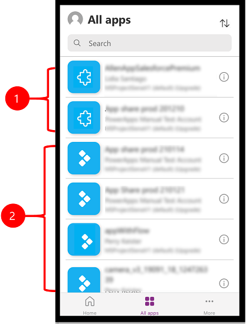
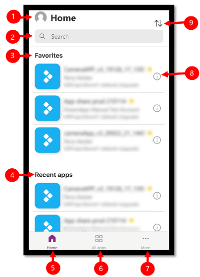
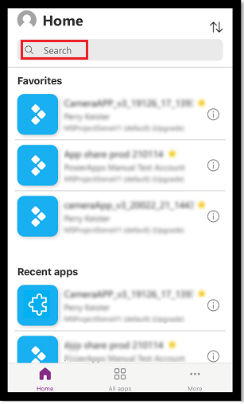
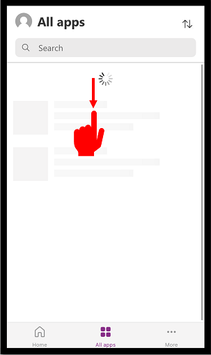
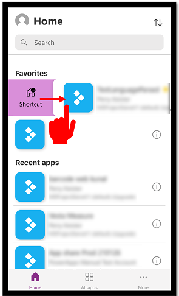

#  Install the Power Apps mobile app

If you're not signed up for Power Apps, [sign up for free](https://make.powerapps.com/signup?redirect=marketing&email=). Then choose the download link or scan a QR code to download Power Apps mobile.

| iOS | Android | Windows |
| :---:         |     :---:      |          :---: |
|    |      |    |
|     |        |     |

> [!NOTE]
>  For more information on Power Apps for Windows, see [Power Apps for Windows](windows-app-install.md).

## Required privileges and supported devices

Review the following privileges and supported devices to run Power Apps Mobile app:

- [Required privileges](/dynamics365/mobile-app/set-up-dynamics-365-for-phones-and-dynamics-365-for-tablets#required-privileges)
- [Supported platforms for running apps using the Power Apps mobile app](../limits-and-config.md#supported-platforms-for-running-apps-using-the-power-apps-mobile-app)

## Sign in

Open Power Apps on your mobile device, and sign in by using your Azure Active Directory credentials.

If you have the Microsoft Authenticator app installed on your mobile device, enter your username when prompted, and then approve the notification sent to your device. If you run into issues signing in, see [Troubleshoot issues for Power Apps mobile app](powerapps-mobile-troubleshoot.md).

    
## Find the app
  
When you create an app, or someone shares an app with you&mdash;either a [canvas app](../maker/index.md#canvas-apps) or [model-driven](../maker/index.md#model-driven-apps) app&mdash;you can run that app on Power Apps mobile. 
   
> [!NOTE]
> To see a model-driven app in the list of apps on Power Apps mobile, you need to have a [predefined security role](/power-platform/admin/database-security#predefined-security-roles) in the environment that the app is in. If a predefined security role is assigned to a user using a Dataverse team, you need to use an Azure Active Directory (AAD) group team. Users will not see model-driven apps if a predefined security role is assigned using a Dataverse owner team.
  

Legend:

1. **Model-driven apps**
2. **Canvas apps**  

The apps that you used recently will show on the default screen when you sign in to Power Apps mobile.
  
The **Home** is the default screen when you sign in. It shows the apps that you used recently and the apps that have marked as favorites. 

## Filter apps 

If you don't have any apps, then when you sign in, you will land on the **All apps** screen. The list of apps is organized in alphabetical order. Type in an app name in the search bar to find an app.

  

1. **Settings**: Access app settings and sign out.
2. **Search**: Use the search to search for apps. When you run a search, it will only search for apps that are on the screen you're on.
3. **Favorites** (canvas apps only): Displays canvas apps that you have pinned to favorites.
4. **Recent apps**: Displays both model-driven and canvas apps that you have recently used.
5. **Home**: Displays favorite apps and recently accessed apps sorted by open date.
6. **All apps**: Displays all canvas apps and model-driven apps to which you have access, including apps you created and apps that others shared with you.
7. **More** (canvas apps only): Displays featured and sample apps.
8. **Details**: View information about the app including run the app, add a shortcut for the app, and add the app to favorites.
9. **Sort apps**: You can short by the app name or modified date. </li> 
  
## Add to favorites

You can only add canvas apps to your list of favorite apps.

- Swipe left and then select **Favorite**. A yellow star will appear next to app name when it's added to favorites. You can also select **Details**  and then add the app to favorites.

   > [!div class="mx-imgBorder"]
   >      

- To remove the app from the list, swipe left again and then select **Unfavorite**.

   > [!div class="mx-imgBorder"]
   >      

## Sort apps

You can sort both canvas apps and model-driven apps. 
You can sort apps alphabetically by name or by modified date. The sort option is available on **Home**, **All apps**, **Featured apps**, and **Sample apps** screen.

## Search apps

If you know the name of the app that you want to run, then use search to quickly find the app. You can search for both canvas apps and model-driven apps.

To find an app, enter the app name in the search field. The app will only search for apps that are on the screen you're on.

## Refresh the list of apps

On the **Home**, **All apps** or any other screen with a list of apps, swipe down to refresh the app list.

   > [!div class="mx-imgBorder"]
   >

## Add shortcuts

You can add a shortcut for both canvas apps and model-driven apps to the home screen of your device for quick access.

### Use Safari to add a shortcut (iOS 13 or earlier)

1. On the app that you want to create a shortcut for, swipe to the right and select **Shortcut**.

     > [!div class="mx-imgBorder"]
     >  

2. Select .
 
   > [!div class="mx-imgBorder"]
   >  
   
3. Scroll down and select **Add to Home Screen**   

   > [!div class="mx-imgBorder"]
   >  
   
4. Select **Add**.   

   > [!div class="mx-imgBorder"]
   >  
   
> [!NOTE]
> For iOS devices that have multiple browsers installed, use Safari when pinning an app to home. 

### Use Siri shortcuts to add a shortcut to the Home screen (iOS 14 or later) 

The Power Apps mobile app is now integrated with Siri shortcuts, which gives you the ability to add a shortcut to the Home screen, launch apps with Siri, and create new workflows. For more information on how shortcuts work on iOS, see [Shortcuts User Guide](https://support.apple.com/guide/shortcuts/welcome/ios). This feature requires Power Apps mobile version 3.20092.x or later.

Users on iOS 14 or later can use Siri Shortcuts to pin an app to the home screen. The new experience works for both model-driven and canvas apps. When you add a Siri shortcut, the app is added to the iOS **Shortcuts** app and from there you can add the app to your home screen.

1. On the app that you want add a shortcut for, swipe to the right and select **Shortcut**.

    > [!div class="mx-imgBorder"]
    >  
   
3. Add a custom phrase to open the app using voice commands and then select **Add to Siri**.

   > [!div class="mx-imgBorder"]
   >
   
4. The app is added to the **Shortcuts** app on your mobile device. Open the **Shortcuts** app and select the ellipsis (...) above the app name.

   > [!div class="mx-imgBorder"]
   > 

5. Select **Add to Home Screen**.

   > [!div class="mx-imgBorder"]
   > 
   
6. On the upper right corner, select **Add** and then select **Done**. 

   > [!div class="mx-imgBorder"]
   >
   
7. Go to your home screen to find the pinned app.   
  
   > [!div class="mx-imgBorder"]
   > 

You can customize the shortcut icon but it is limited to the customization options in iOS. For more information, go to [Modify shortcut icons](https://support.apple.com/guide/shortcuts/modify-shortcut-icons-apd5ad5a2128/ios).

### Pin to home on Android 

Select the ellipsis (...) on the app tile, select **Pin to Home**, and then follow the instructions that appear.

  

## See non-production apps

By default, only production model-driven apps are shown in the list of apps.

To see model-driven apps from non-production environments, select the **Settings** menu , and then turn on **Show non-production apps**. Follow the instructions that appear.

## Run an app

To run an app on a mobile device, select the app tile. If someone else created an app and shared it with you in an email, you can run the app by selecting the link in the email.

### Run a canvas app

If this is the first time you're running a canvas app by using Power Apps mobile, a screen shows the swipe gestures.

#### Close a canvas app

Use your finger to swipe from the left edge of the app to the right to close an app. On Android devices, you can also press the Back button and then confirm that you intended to close the app.

#### Pinch and zoom in on a canvas app

#### Give consent to a canvas app

If an app requires a connection to a data source or permission to use the device's capabilities (such as the camera or location services), you must give consent before you can use the app. Typically, you're prompted only the first time you run the app.

### Use a model-driven app 

The following image shows an example of a model-driven app screen after you've signed in. To learn how to use model-driven apps running on Power Apps mobile, go to [Use model-driven apps on Power Apps mobile](use-custom-model-driven-app-on-mobile.md). 

#### Give consent to a model-driven app

If an app requires a connection to a data source or permission to use the device's capabilities (such as the camera or location services), you must give consent before you can use the app. Typically, you're prompted only the first time you use the app.

#### Close a model-drive app

Select the site map , and then select **Apps**.

>[!Note]
> An app maker can customize the navigation bar and show or hide the **Home**, **Recent**, **Pinned** buttons in the site map. An app maker can also make groups collapsible. For more information, see [Hide or show the Home, Pinned, Recent, and collapsible groups](../user/navigation.md#hide-or-show-the-home-pinned-recent-and-collapsible-groups).

## Other mobile apps

The table below outlines which other mobile apps you can use to run your app.

| **Mobile App** | **Apps you can run** |
|-------------------------|-------------------------|
| [Power Apps mobile](run-powerapps-on-mobile.md) (covered in this topic) | <ul><li>[Model-driven apps](../maker/index.md#model-driven-apps)</li><li>[Canvas apps](../maker/index.md#canvas-apps)</li><li>[Dynamics 365 Marketing](/dynamics365/marketing/help-hub)</li><li>[Dynamics 365 Customer Service](/dynamics365/customer-service/help-hub)</li></ul> |
| [Power Apps for Windows](windows-app-install.md) | <ul><li>[Model-driven apps](../maker/index.md#model-driven-apps)</li><li>[Canvas apps](../maker/index.md#canvas-apps)</li></ul> |
| [Dynamics 365 for phone and tablets](/dynamics365/mobile-app/overview) | <ul><li>[Microsoft Dynamics 365 Customer Engagement (on-premises)](/dynamics365/customerengagement/on-premises/overview)</li> <b>Note</b>: Dynamics 365 for Tablets is deprecated, and won't be supported in 2023. |
| [Dynamics 365 Sales Mobile](/dynamics365/sales/sales-mobile/dynamics-365-sales-mobile-app) | <ul><li>[Dynamics 365 Sales](/dynamics365/sales/help-hub)</li></ul> |
| [Field Service Mobile](/dynamics365/field-service/mobile-power-app-overview) | <ul><li>[Field Service (Dynamics 365) ](/dynamics365/field-service/overview)</li></ul> |
  
## Regional availability of Power Apps mobile app
 
Power Apps mobile app is available to users in Azure global cloud and also in the following regions:
- [US Department of Defense (US DoD)](/azure/azure-government/documentation-government-overview-dod)
- [US Government Community Cloud (GCC) High](/power-platform/admin/microsoft-dynamics-365-government#about-dynamics-365-us-government-environments-and-products)
- [US Government Community Cloud (GCC)](/power-platform/admin/microsoft-dynamics-365-government#about-dynamics-365-us-government-environments-and-products)
- [China Sovereign Cloud](/power-platform/admin/about-microsoft-cloud-china)
  
Mobile users have an option to select their region on Power Apps mobile app sign in screen.

:::image type="content" source="media/Select_user_region_mobile_app.jpg" alt-text="Choose a region when signing in to Power Apps mobile app":::
 
 More information:
 - [Azure Government documentation](/azure/azure-government/)
 - [Dynamics 365 US Government](/power-platform/admin/microsoft-dynamics-365-government#about-dynamics-365-us-government-environments-and-products)
 - [Power Platform and Dynamics 365 apps in China](/power-platform/admin/about-microsoft-cloud-china)
  
## Privacy notice
Power Apps mobile app for Android registers for a system event that is broadcasted when the device is finished booting. Power Apps mobile app for Android registers for this event to support push notifications sent to the app. 
  
Power Apps mobile app and [wrapped native mobile apps](../maker/common/wrap/overview.md) may use device sensors, such as the device accelerometer, to respond to user actions. For example, [wrapped native mobile apps](../maker/common/wrap/overview.md) would automatically show the app menu when the user shakes the device. 
    
## See also

[Use model-driven apps on Power Apps mobile](use-custom-model-driven-app-on-mobile.md)  
[Troubleshoot issues for Power Apps mobile](/powerapps/user/powerapps_mobile_troubleshoot)

[!INCLUDE[footer-include](../includes/footer-banner.md)]
