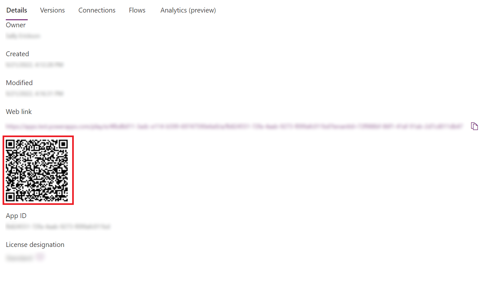

# Open an app in Power Apps mobile by scanning a QR code

Users can easily open a Power Apps canvas app on their mobile device by scanning a QR code, shown in [Power Apps](https://make.powerapps.com), from their desktop computer.  To do this, complete the following steps on your desktop computer.

1. Sign in to [Power Apps](https://make.powerapps.com).
2. In the left pane, select **Apps**.
3. Select the check mark icon next to the canvas app that you want to open on your mobile device.
4. Select the **More Commands** (**...**) icon, and then select **Details**.
5. A page showing the details of your canvas app is shown. With your mobile device, scan the QR code.

   
   
6. The canvas app will open on your mobile device.

