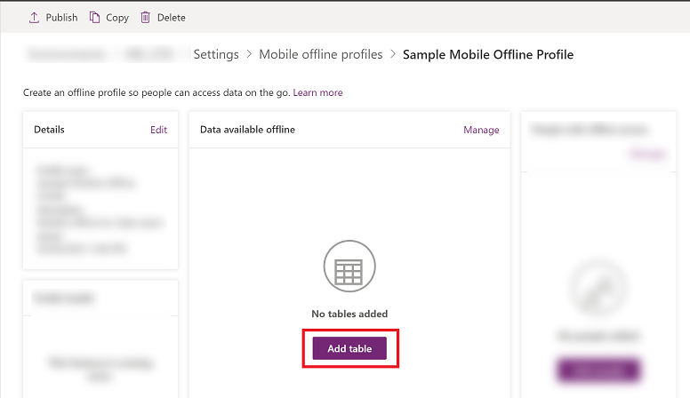
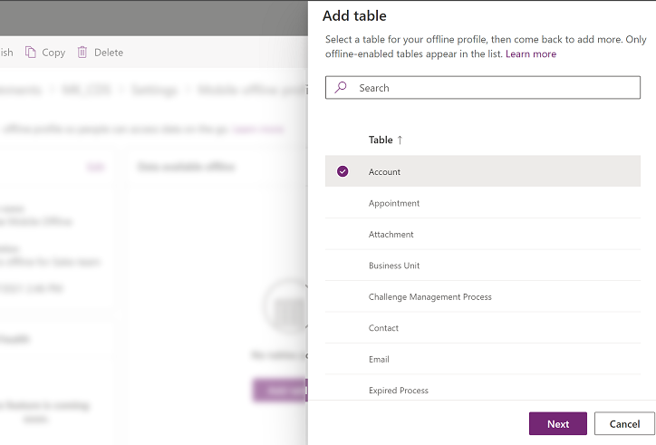
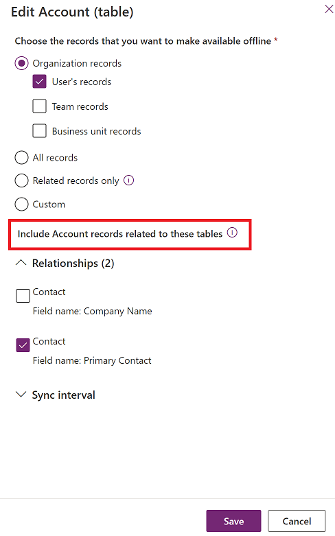
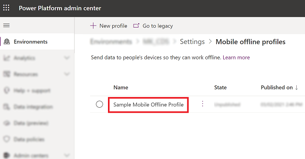
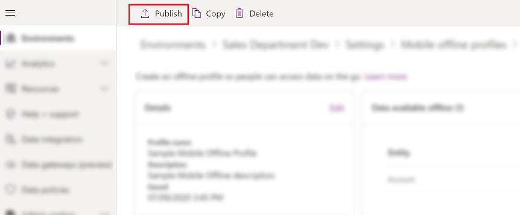
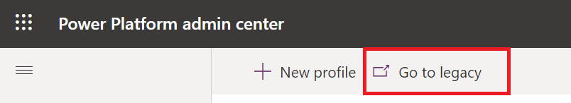
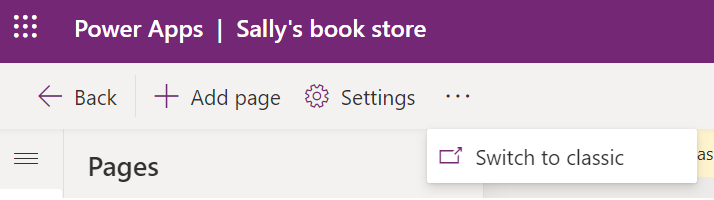
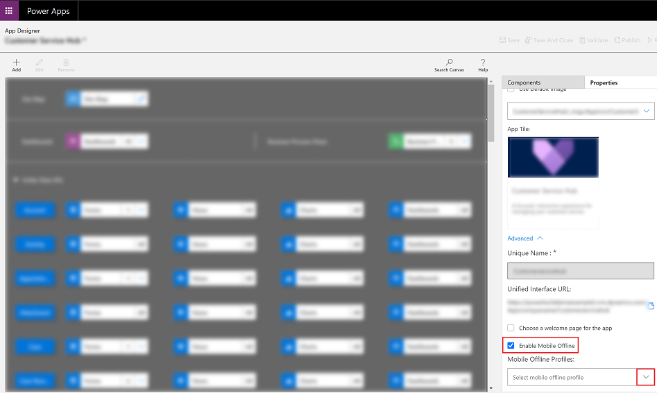
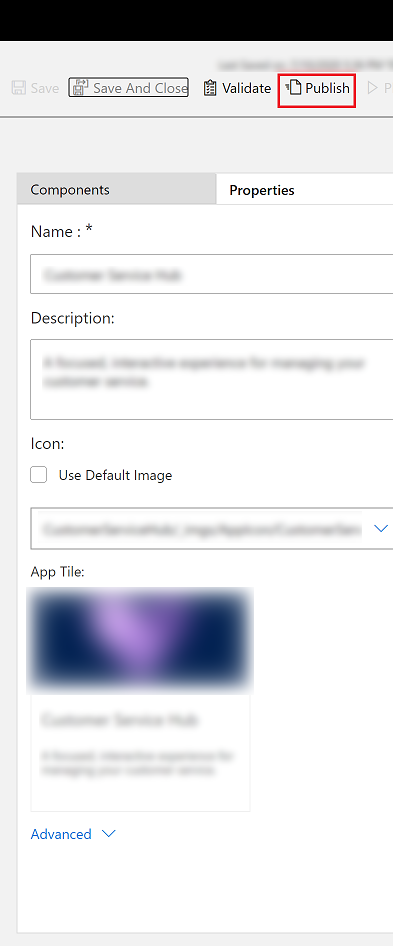

# Set up mobile offline (classic)

Set up mobile offline synchronization to allow users to work in offline mode on their mobile device. Mobile offline allows users to use Power Apps in offline mode and interact with their data without an internet connection.

The mobile app provides a rich offline experience that helps users stay productive. You can use basic commands such as create, read, update, and delete when you're offline. Once you're back online, the changes that you made on the mobile app are automatically synchronized with Microsoft Dataverse.

## Step 1: Enable tables for mobile offline synchronization 
 
One of the first things you need to do is enable tables that will be available to mobile users when they're using the mobile app in offline mode. You can disable or enable any of the supported tables for offline mode.

To enable a table for mobile offline synchronization, follow the steps below.

1. Sign in to [Power Apps](https://make.powerapps.com).
 
2. In the navigation pane, select **Tables**. [!include [left nav](../includes/left-navigation-pane.md)] 
  
3. Select the row for the table that you want to enable for mobile offline, such as **Account**.  

4. On the command bar, select **Properties**. 

5. On the **Edit table** pane, expand **Advanced options**. 

6. Under **Rows in this table**, make sure the **Can be taken offline** check box is selected, and then select **Save**.

   > [!NOTE]
   > Keep in mind that the amount of data you make available to users while they’re offline can affect data sync times, device performance, and can affect the data usage rates for devices on a cellular network. The amount of data that gets downloaded to the device depends on: 
   > -   The number of tables that you enable for mobile offline.  
   > -   The filters you set while creating mobile offline profiles.  
 
## Step 2: Create a mobile offline profile to determine what data will be available while offline
 
Create a mobile offline profile to enable users for offline and configure filters that will determine how much data will be available to the user when they're working in offline mode. 

To create a profile, follow the steps below.
  
1. Go to Power Platform Admin center, [https://admin.powerplatform.microsoft.com](https://admin.powerplatform.microsoft.com) and sign-in as an admin.

2. In the navigation pane, select **Environments**.
 
3. Choose an environment and then select **Settings**.
 
4. Expand **Users + permissions**,  and then select **Mobile configuration**.
  
5. Select **New Profile** to create a new profile for mobile offline. If you already have a profile that you want to edit, select it from the list.

6. Enter a name and description for your mobile offline profile. Select **Create** to create the mobile offline profile.
  
7. After the profile is created, select it to open the profile so you can continue editing it.  

8. In the **Data available offline** area, select **Add table** to add a table to the profile. 

   > [!div class="mx-imgBorder"]
   >
   
  
9. Select a table from the list of tables shown. Only tables that can be enabled for mobile offline appear in the list. Select **Next**.

   > [!div class="mx-imgBorder"]
   >
 

10. Select a filter based on the ownership type for the table. Table ownership is decided when you create a table. For more information, see [Types of tables](/powerapps/maker/common-data-service/types-of-entities).

    |Table ownership type|Available Data Download Filter options |  
    |---------------|-----------------|  
    |**User or Team**| <ul><li>**Download Related rows only** - Make related data for this table available offline. If you don’t set any relationships, no rows for this table will be available.</li> <li>**All rows** - Make all rows for this table available offline.</li> <li>**Other data filter** - Make only the specified rows for this table available offline and then choose from the following: </li> <ul><li> **Download user rows** - Make only your rows available offline.</li>  <li> **Download team rows** - Make your team’s rows available offline.</li> <li>**Download my business unit’s rows** - Make your business unit’s rows available offline.</lu>|  
    |**Organization**|<ul><li>**Download related rows only** - Make related data for this table available offline. If you don’t set any relationships, no rows for this table will be available.</li> <li>**All rows** - Make all rows for this table available offline. </li>|  
    |**Business**|<ul><li>**Download related data only** -  Make related data for this table available offline. If you don’t set any relationships, no rows for this table will be available. </li> <li>**All rows** - Make all rows for this table available offline.</li> <li>**Other rows** - Make only the specified rows for this table available offline and choose from the following:</li> <ul><li> **Download my business unit’s rows** - Make your business unit’s rows available offline.</li>   |  
    |**None**|  <ul><li>**Download related rows only**. Make related data for this table available offline. If you don’t set any relationships, no rows for this table will be available.</li> |        
 
    
    If **Custom** is selected, admins can define a custom filter based on the following rules. Admins can create filters up to three levels.  

    |&nbsp; |&nbsp; |&nbsp; |
    |---------|---------|---------|
    |equal     |     not equal     |   gt – greater than      |
    |ge – greater than or equal to     |   le – less than or equal to      |   lt – less than      |
    |like     |   not-like      |     in   |
    |not-in     |    null     |    not-null     |
    |eq-userid     |   ne-userid      |    eq-userteams     |
    |eq-useroruserteams     |    eq-useroruserhierarchy     |    eq-useroruserhierarchyandteams     |
    |eq-businessid     |    ne-businessid     |   eq-userlanguage      |
    |begins-with     |     not-begin-with    |    ends-with     |
    |not-end-with    |       |         |

 
11. In the **Include [table name] rows related to these tables** area, select the related table relationships. You need to have added the table you want to create the relationship with. For example, if you want to add a relationship between the Account and Contact tables, then you need to add both tables to the mobile offline profile. 

    For example, if you select **Contact | Field name: Primary contact** this means for every contact, the system will also download the account related to it. 
     
    > [!div class="mx-imgBorder"]
    >
  
12. (**Optional**) Select **Sync interval** and choose how often you want the table's data to automatically sync to users's devices. You can select a short interval such as **Every 5 minutes** or choose a less frequent interval to optimize the sync performance and user experience. Make the selection based on your business requirements and how often users make updates to the table. Typically, the more static the data is, the less need for a frequent sync interval. 

    > [!NOTE]
    > Even if the value for **Sync interval** is set to be less frequent than, **Every 1 hour**, data will currently still be synched every hour. 
    >
    > A sync is only initiated when there is connectivity and when the app is actively running on the user’s mobile device. For Android devices, once the sync is initiated it can be completed even in background. 
    >
    > Dependencies, based on selected relationships and custom filters that includes related tables are analyzed at each sync request. This might result in a sync being triggered also for related tables.
  
13. Select **Save** to add the table to your profile so you can continue editing it.

### Step 2.1: Add users or team to a mobile offline profile 

After you've created a mobile offline profile, you can start adding users to the profile. This will make the profile available to the users so that they can get the mobile offline experience that you've set up. 

A user can only be added to one offline profile at a time. If a user is added to another offline profile, then you will get a warning stating that the user is already added to another offline profile. If you continue with the change, the user will be moved to the new profile. This may disrupt users, so it's recommended that you notify them when you move them to a different profile. 

> [!NOTE]
> To use a mobile device in offline mode, a user must have a security role that has read permissions to the table that was added to the mobile offline profile.  

1.  If it’s not already open, select the profile name to open the mobile offline profile you want to add users to.

    > [!div class="mx-imgBorder"]
    >
 
2.  In the **Users with offline access** area, select **Add users**.  
  
3.  Choose the users that you want to add to the mobile offline profile. The actual users added based on teams are displayed under each team. User's that are added individually are displayed under individual users. 
  
4.  When you’re done adding people, select **Save**.
  
    > [!NOTE]
    > If you made any changes to an Azure Active Directory (Azure AD) group team, you must remove and add the team back to the mobile offline profile for the changes to take effect.
 
### Step 2.2: Publish a mobile offline profile

The profile that was set up in the previous step is still in draft mode, until you publish it. In order to deploy your changes to a user's device, the draft profile needs to be published.

When you publish the profile, it will be available to your users and they will get the mobile offline experience that you have defined in the profile.

Following these steps to publish the profile:
  
1. If it’s not already open, open the mobile offline profile that you want to publish.  
  
2. When you’re done adding people and making any other changes to the mobile offline profile, select **Publish** so the data you specified can start syncing with your users’ mobile devices.  

   It's not required to republish a mobile profile after users or team have been added.

   > [!div class="mx-imgBorder"]
   >
  
   > [!TIP]
   > **Solution export and import**  
   >   
   >  When exporting a solution that includes a mobile offline profile, always select the **Include table metadata** check box for each table you export.  
   >   
   >  After importing the solution into the target organization, publish all mobile offline profiles.  

### Step 2.3: Set conflict detection for mobile offline  

1. Go to Power Platform Admin center, [https://admin.powerplatform.microsoft.com](https://admin.powerplatform.microsoft.com) and sign-in as an admin.

2. In the navigation pane, select **Environments**.
 
3. Select an environment and then select **Settings**.
 
4. Expand **Users + permissions**,  and then select **Mobile configuration**.
  
5. Select **Go to legacy** on the command bar.

   > [!div class="mx-imgBorder"]
   >
  
6. Select **Mobile Offline Settings**.
   
7. When there is a mismatch of data between client and server, conflict errors occur. To resolve the issue, choose one of the following settings:

    - Select **No** - Conflict detection for mobile offline is turned off, so whatever changes are made by a user in offline mode are automatically synced to the server when the user is back online, and client wins over server.

    - Select **Yes** - Server wins over client.

## Step 3: Enable the app module for offline

Enable mobile offline for a specific app.

1. Sign in to [Power Apps](https://make.powerapps.com).

2. In the left navigation pane, select **Apps** and then select the app that you want open. 
  
3. On the command bar, select **Edit**. This will open the app in the **App Designer**.
  
4. In the command bar, select the elipses (...) icon, and then select **Switch to classic**.
  
   > [!div class="mx-imgBorder"]
   >
  
5. Select the **Properties** tab and scroll down to select the **Enable Mobile Offline** check box. Then select the drop-down menu and choose a mobile offline profile.

   > [!div class="mx-imgBorder"]
   >
   
   > [!NOTE] 
   > You can add more than one profile for an app module.

6. When you're done, at the top choose **Save** and then **Publish**.

   > [!div class="mx-imgBorder"]
   > 

## Configure mobile offline profiles for images and files

For information on how to work with file and image columns in offline modeo , see [Configure mobile offline profiles for images and files](/powerapps/mobile/offline-file-images).
  
## Mobile offline capabilities and limitations

For information on capabilities and limitations of mobile offline, see [Mobile offline capabilities and limitations](offline-capabilities.md).
