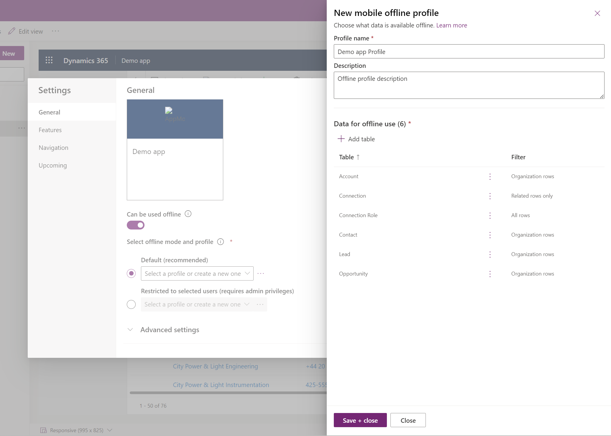

# Set up mobile offline (preview)

[This topic is pre-release documentation and is subject to change.]

Use the [modern app designer](../maker/model-driven-apps/app-designer-overview) to enable your model-driven apps for offline use on a mobile device. When offline mode is enabled, users can interact with their data without internet connection on [Power Apps mobile](https://powerapps.microsoft.com/downloads/).

## Prerequisites 

Verify the following prerequisites before you enable mobile offline: 

- Environment maker, system administrator, or system customizer role is needed to configure offline mode for model driven apps. These roles have create/read/write/delete and share privilege on the **mobile offline profile** table. More information: [About predefined security roles](share-model-driven-app.md#about-predefined-security-roles)

- Users with the **basic user** role can open and use an offline application. This role has the read privilege to the **mobile offline profile** table.

   If you have a custom security role, make sure you ave **Read** privilege for **Mobile Offline profile**. For more information, see [Miscellaneous privileges - Core Records tab](/power-platform/admin/miscellaneous-privileges).

  > [!div class="mx-imgBorder"] 
  > 

##  Optimize your app for mobile offline 

Before you enable offline mode, make sure your model-driven app is optimized for offline and mobile use. Mobile apps run on smaller screens with limited connectivity so it's important that the app is always aviliable. Create an app that is simple and lightweight. Also, consider the number of user scenarios that you want to cover and the amount of data the app will use.

If you have desktop and remote mobile users then create two seperate apps. Optimize the user experience and create an online app for your office users and another app for your mobile users who may have limited connectivity. 

Follow these best practices when building an app for mobile offline use:

- Identify the on-the-go scenarios that are functionally related, such as which tasks are performed by users in the field on any given day.
- Reduce the complexity of your app and limit the amount of app metadata that needs to be downloadeded on a user's device. Only add the tables and views that are needed in a mobile scenario. For more information, see [Add pages to your app](../maker/model-driven-apps/create-a-model-driven-app#add-pages-to-your-app).
- Keep view that are absolutely necessary and remove any view that aren't needed on a day-to-day basis. For example, avoid adding the **All accounts** view and keep views such as  **My active accounts**. Keep your forms lightweight for a smooth and intuitive experience on small screen devices. The following are options for mobile-optimized forms:

   - Build dedicated forms for mobile use.

   - Share forms across mobile and desktop experience but disable some fields on mobile.

    
      > [!div class="mx-imgBorder"]
      > 

## Enable your app for offline use (preview)

Set up the new mobile offline experience in the [modern app designer (preview)](../maker/model-driven-apps/app-designer-overview).

1. Sign in to [Power Apps (preview)](https://make.powerapps.com/?utm_source=padocs&utm_medium=linkinadoc&utm_campaign=referralsfromdoc) 

2. On the left nav, select **Apps** and then select the model-driven app that you want enable for offline.

3. Select ... > **Edit** > **Edit in preview** to open the modern app designer.

    > [!div class="mx-imgBorder"]
    > 
 
4. On the command bar, select **Settings**.

    > [!div class="mx-imgBorder"]
    > 

5. On the **Upcoming** tab, set the **Offline setup from the modern app designer** toggle to **On**.

    > [!div class="mx-imgBorder"]
    > 

6.  On the **General** tab, set the **Can be used offline** toggle to **On**.

    > [!div class="mx-imgBorder"]
    > 

7.  Select an existing offline profile or select **New profile with current app data**. To set up a offline profile, go to the [Set up a mobile offline profile](setup-mobile-offline.md#mobile-offline-profiles) section.

    > [!div class="mx-imgBorder"]
    > 

8.  Close the **Settings** dialog and then save and publish your app. When you're done, the app will be set up for offline use.

## Set up a mobile offline profile

The mobile offline profile represents the data set in the app that is synced locally on a user's device. It consists of the list of tables with related filters that are applied when data is synced to a user's device.

### Prerequisite: Enable a table for offline

A table needs to be enabled for offline in order to add it to a offline profile. Follow these steps to verify a table is enabled for offline.

1. Sign in to [Power Apps (preview)](https://make.powerapps.com/?utm_source=padocs&utm_medium=linkinadoc&utm_campaign=referralsfromdoc) 

2. On the left nav, select **Dataverse** > **Tables**. 
3. Select the table that you want to add to a offline profile and then on the command bar, select **Settings**

    > [!div class="mx-imgBorder"]
    > 
    
4. In the **Edit table** settings, select **Advanced options**, and in the **Rows in this table** section select **Can be take offline**.

   > [!NOTE]
   > App can only be linked to one profile but a profile can be shared between multiple apps. This can be useful when different apps share the same data set to only download it once on the device and locally  between the apps.

    > [!div class="mx-imgBorder"]
    > 

### Default profile

The modern app designer comes with the capability to generate a default offline profile based how your app is configured.

The default offline profile is a starting point to help you quickly build an offline profile. The default profile probably won't compute the most optimal filters for each table. If you have a complex app, the auto generation profile might be partially successful as only part of the app might be set up correctly for offline use. With this in mind, it's important that you review and adjust the proposed filters based on your organization needs.

1. To generate a default profile for your app, select **New profile with current app data**. 

    > [!div class="mx-imgBorder"]
    > 

2. Review the proposed filters for each table. Make sure the data that is downloaded on users' devices is limited to what is absolutely necessary. Focus on the most used tables in your app, which in most cases have the **Organization rows** filter set.

    > [!div class="mx-imgBorder"]
    > 

  The tables that are added to the profile, also have the **Related rows only** filter. These are tables that are used in some views and need to have related information available so you may not need to modify these based on your organization needs.

### Add a table to an offline profile and apply filters

Applying an appropriate filter for each of the tables configured in the offline profile is critical to limit the amount of data downloaded on users' devices.

1. To add a table to a profile, select **Add table**.

    > [!div class="mx-imgBorder"]
    > 

2. Choose a table and then define the filters. 
 
    > [!div class="mx-imgBorder"]
    > 

3. Set the following filters:

   1. Choose the row that you want to make avaliable offline. For the **Custom** option, use the [expression builder](../maker/model-driven-apps/create-edit-view-filters) which allows advanced conditions set up.
   2. **Relationships** lists the different relationships available between the current table and other tables added in the offline profile. Selecting a relationship will ensure related rows following that relationship will be downloaded and made available offline.
   3. **Files** and **Images** lets you to define what table columns for a file or image need to be downloaded offline. For images, each column can be selected granularly but not for files it's all or nothing.
   4. **Sync interval** defines the sync frequency to be applied on the device to sync the data with the server. If your table data doesn't change frequently like a catalog or product table, you may want to refresh it only once a day and focus on only syncing data when necessary.
      
      > [!div class="mx-imgBorder"]
      >

4. Select **Add** to add your table and filters to the profile.

5. When all tables are properly configured for the profile, select **Done** > **publish your application**.

When the app is published, the app will be enabled for offline use. All your users who have access to the app can also use it in offline mode.

[!INCLUDE[footer-include](../includes/footer-banner.md)]
