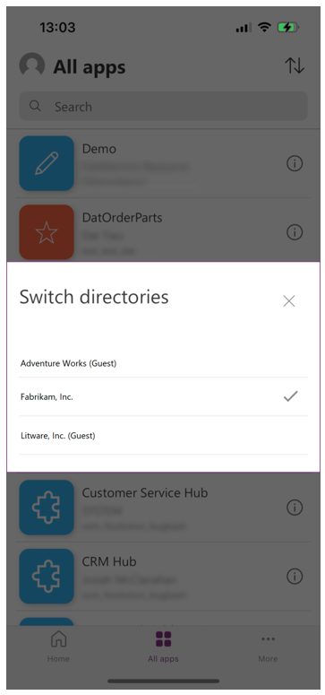

# Switch to a different directory in the Power Apps mobile app

When a user signs into the Power Apps mobile app, they sign into their *home tenant*, which is the Azure Active Directory (Azure AD) tenant where their credentials are provisioned. After signing in, a user can easily change the tenant or *directory* with which they intend to use the Power Apps mobile app. This enables users to easily access the Power Apps that have been shared with them in different directories.

This means that:

- Users no longer need to log out of the Power Apps mobile app to switch directories.
- Users can specify the directory they want to work in from a list of directories on the user profile page.
- Users, including guest users, can access apps shared with them in different directories.

To switch to a different directory in the Power Apps mobile app:

1. Open the Power Apps mobile app.
2. From the **Home**, **All apps**, or **More** page, select your profile image. Your user profile page appears.

    > [!Note]
    > Users signing into the Power Apps mobile app with a Microsoft account cannot switch directories from their user profile page. They must use a [deeplink](mobile-deep-links.md), instead.
    > 
    > For more information about how to share canvas apps with guest users, see [Share a canvas app with guest users](../maker/canvas-apps/share-app-guests.md#in-power-apps-mobile-how-does-a-guest-see-apps-in-the-guest-tenant).

3. Select the directory you're signed in to. A list of directories appears.
    
    > [!div class="mx-imgBorder"] 
    > 
   
4. Select the directory you want to switch to.

