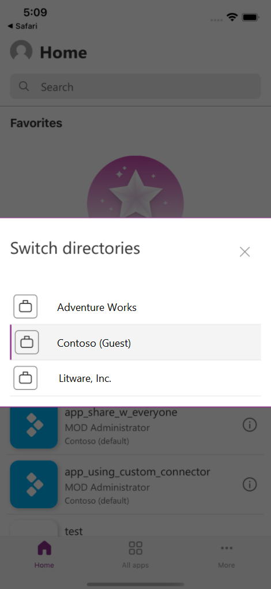

# Switch to a different tenant in Power Apps for Windows

Users can now easily switch to a different tenant, without having to log out of Power Apps, when using Power Apps on mobile devices. Users can specify the tenant they want to work in on the user profile page.  This means that:

- Users no longer need to sign ou of Power Apps to switch tenants.
- Users can now access shared apps from a list on the user profile page.

The following image shows how you can select a different tenant from the list on the user profile page.

