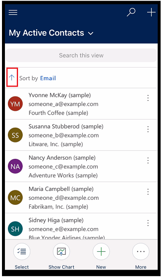

# User guide for model-driven apps running on Power Apps mobile

Use Power Apps mobile to run model-driven apps on your mobile device. For more information about how to install and get started with an app, see [Run model-driven apps and canvas apps on Power Apps mobile](run-powerapps-on-mobile.md).

> [!IMPORTANT]
> Model-driven apps for Dynamics 365 Sales, Dynamics 365 Customer Service, and Dynamics 365 Field Service don't run in Power Apps mobile. Instead, you use the Dynamics 365 for phones and tablets app. For more information, see [User Guide for Dynamics 365 for phones and tablets](/dynamics365/mobile-app/user-guide-mobile-app).

## Home screen 

It's easy to get around in Power Apps mobile. The following illustration shows the primary navigation elements on the Home screen. 

Legend:

1. **Site map**: Open the menu and move between apps, get to your favorite and recently used rows, access settings, and more.
2. **Search**: Search for app rows in Microsoft Dataverse.
3. **New**: Create a new row and quickly enter almost any type of information into the system.
4. **Assistant**: Use the assistant to monitor and track daily actions and communications. It helps you stay on top of your day with insight cards that are displayed prominently throughout the app to provide tailored and actionable insights.

## Site map 

From the Home screen, select the site map  to access tables, favorite or most-used rows, other apps, and settings.

If you're on [early access](/power-platform/admin/opt-in-early-access-updates) your site map might look different. With 2021 release wave 2, the app maker can customize the navigation bar and show or hide the **Home**, **Recent**, **Pinned** buttons in the site map. The app maker can also make groups collapsible. For more information, see [Hide or show the Home, Pinned, Recent, and collapsible groups](../user/navigation.md#early-access-hide-or-show-the-home-pinned-recent-and-collapsible-groups).
 
   > [!div class="mx-imgBorder"]
   > 
   

The following illustration shows the primary navigation elements on the site map screen. 

Legend

1. **App selector**: Open this menu to close your app and switch to another app.
2. **Home screen**: Select this to go back to the Home screen.
3. **Profile**: Go to the Profile screen to sign out or reconfigure the app. 
4. **Recent rows**: View a list of rows you were recently using. 
5. **Pinned rows**: View and open your favorite (pinned) rows. 
6. **Table navigator**: This area lists the table available in the app.
7. **Help**: Access help content for more information about how to use Power Apps mobile.
8. **Offline status**: Work with your data in offline mode, even when you don't have internet access. More information: [Work offline on your mobile device](/dynamics365/mobile-app/work-in-offline-mode)
9. **Settings**: Access settings.

## Pin favorite rows

The **Pinned** and **Recent** lists provide quick access to rows that you've recently used or pinned to favorites. Use the **Recent** list to pin favorite rows.  

1. From the site map , select **Recent** .

2. On the **Recent** rows screen, select the push-pin icon next to a row to add it to your favorites (pinned rows).

3. To view the newly pinned rows, select **X**, and then select **Pinned** .

   
   > [!div class="mx-imgBorder"]
   > 
   

### Unpin a row

1. From the site map , select **Pinned** .

2. Select the remove-pin icon  next to a row to remove it from favorites (pinned rows).

   > [!div class="mx-imgBorder"]
   > 
   

## Change views

- From the Home screen, select the down arrow  next to the current view, and then select a new view.

   > [!div class="mx-imgBorder"]
   > 

## Add a row quickly

1. From the Home screen, select **New** .
2. Fill in the columns, and then select **Save**.
3. After the row is created, you can view the new row. 

   > [!div class="mx-imgBorder"]
   > 

-  To save and open the row that you created, select **More** , and then select **Save and Open**.

- To save and create another row, select **More** , and then select **Save and Create new**.

   > [!div class="mx-imgBorder"]
   > 

## Sort rows

**Sort in ascending or descending order**: From a list view, select the arrow to sort the list in ascending or descending order.
 
   > [!div class="mx-imgBorder"]
   > 

**Sort by field**: Select the current **Sort by** field and then select another field to sort by.

   > [!div class="mx-imgBorder"]
   > 
 
## Access the actions menu

From a list view, swipe left to access the actions menu for a row.

   > [!div class="mx-imgBorder"]
   > 

>[!NOTE]
> The Flow actions menu in Power Apps mobile doesn't support flows created in a solution.
 
## Access more commands (Android)

1. From the Home screen, open a row.
2. On the open row, select **More**  to access more commands.

   > [!div class="mx-imgBorder"]
   > 

## Edit a row

1. From the Home screen, open a row that you want to edit. 
2. When you're done editing the row, select **Save**. To cancel your changes, select **Discard**.

   > [!div class="mx-imgBorder"]
   > 

## Go back to the Home screen

- To get back to the Home screen when you're in a row, select **Back** .
- At any point, press and hold **Back**  to go back to the Home screen. 

   > [!div class="mx-imgBorder"]
   > 

## Sign out

From the site map , select the profile icon , and then select **Sign out**.

[!INCLUDE[footer-include](../includes/footer-banner.md)]
