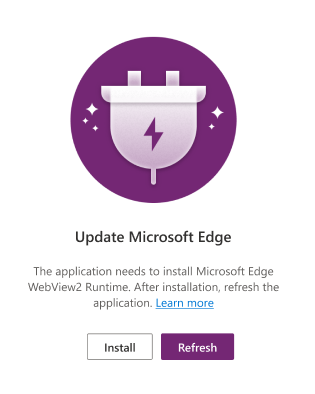
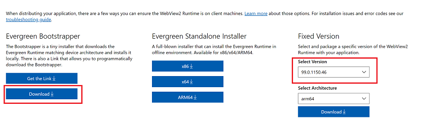

# Install Power Apps for Windows

Install Power Apps for Windows to run model-driven app or canvas app on your Windows device. For more information on Power Apps, see [What is Power Apps](/powerapps/powerapps-overview).

> [!IMPORTANT]
> - Power Apps for Windows 8 will be deprecated and replaced with the Windows app covered in this topic. For more information, see [Power Apps for Windows will be deprecated and replaced with a new app](/power-platform/important-changes-coming#power-apps-for-windows-will-be-deprecated-and-replaced-with-a-new-app).
> - The [Microsoft Dynamics 365 (Preview)](https://apps.microsoft.com/store/detail/microsoft-dynamics-365-preview/9N0RWZ9KZZT8?hl=en-us&gl=US) app for Windows was deprecated on June 20, 2022. The app is no longer supported. Now you can run your Dynamics 365 apps on Powers Apps for Windows with the same set of features and capabilities. 

## Install the app

1. Go to the Microsoft Store and install [Power Apps](https://www.microsoft.com/store/apps/9MVC8P1Q3B29) for Windows.  
2. When the app is installed, open it and [sign in](windows-app-use.md). 
> [!IMPORTANT]
> If you run into issues during the installation or the app closes without warning, follow the steps in the next section to install the latest version of WebView2 Runtime, and retry installing Power Apps for Windows.

## Webview2 Runtime

If you get an **Update Microsoft Edge** error message when you're installing Power Apps for Windows, this means you don't have WebView2 Runtime on your device.

> [!div class="mx-imgBorder"]
> 

Power Apps for Windows also won't run correctly if you have an older version of WebView2. Follow these steps to see which version you have installed:

1. On your device, go to **Settings** > **Apps** > **Apps & features**.
2. Search for **WebView**. You need version **99.0 or later** installed to run Power Apps for Windows.

In both cases, whether you get an error message or have an older version installed, you need to install WebView2 Runtime.

You need administrator rights on your device to install WebView2. If you don't have admin rights, ask your administrator to install it for you. 
 
1. [Download the WebView2 Runtime](https://developer.microsoft.com/microsoft-edge/webview2/#download-section).
2. Select version **99.0 or later**. Installing an earlier version may cause Power Apps to crash. Under **Evergreen Bootstrapper**, select **Download**.
   > [!div class="mx-imgBorder"]
   > 
3. Go over the license terms and privacy statement and then select **Accept and Download**.
4. Run **MicroEdgeWebview2Setup.exe**.

## Install from app center

If you don't have access to install Power Apps for Windows from the Microsoft Store then you can install it from the [app center](https://install.appcenter.ms/orgs/dynamics365-mobile/apps/power-apps-windows-store-signed-builds/distribution_groups/windows%20store-signed%20build%20external%20partners).

An administrator can also download the package from the [app center](https://install.appcenter.ms/orgs/dynamics365-mobile/apps/power-apps-windows-store-signed-builds/distribution_groups/windows%20store-signed%20build%20external%20partners) and distribute it to users with Intune.

