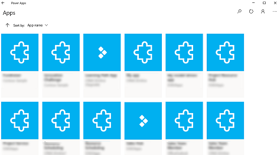
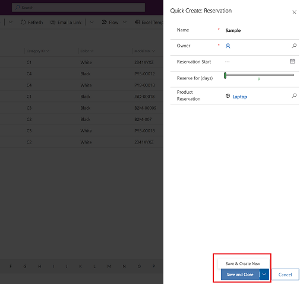

# Use Power Apps for Windows (preview) 

[!INCLUDE [cc-beta-prerelease-disclaimer](../includes/cc-beta-prerelease-disclaimer.md)]

This topic covers how to sign in and run your apps on Power Apps for Windows.

## Sign in 

Sign into Power Apps for Windows quickly using your work email address. If you need help with your sign-in information, contact your Power Apps administrator.

1.  On the Welcome screen, select **Sign in**.

    > [!div class="mx-imgBorder"] 
    > 

2.  Enter your email address, and then select **Next**. Then enter your password and then select **Sign in**.

    > [!div class="mx-imgBorder"] 
    > 

3.  From the list of apps that you have access to, select the app that you want to use.

    > [!div class="mx-imgBorder"] 
    > 

## Move between apps

When you're using an app, you can select the back button to go back to the **Apps** screen. From the **Apps** screen, you can then select another app to use.

For model-driven apps, you can also select the name of the current app that you're using to go back to the **Apps** screen.

## Switch to another canvas app

1.  Select the back button.

    > [!div class="mx-imgBorder"] 
    > 

2.  On the **Apps** screen select an app. You'll only see apps for your organization.

    > [!div class="mx-imgBorder"] 
    > 

## Switch to another model-driven app

1.  Select the back button or select the current app name.

    > [!div class="mx-imgBorder"] 
    >

2.  On the **Apps** screen select an app. You'll only see apps for your organization.

    > [!div class="mx-imgBorder"] 
    > 

## Run an app

Because [canvas apps](../maker/canvas-apps/getting-started.md) can essentially be anything, there isn't much help documentation on how to use an app once it's created. If you need help using a canvas app, contact your app maker or Power Apps admin.

You'll find below the documentation on how to run [model-driven apps](../user/use-model-driven-apps.md) on Power Apps for Windows.

## Navigation in model-driven apps

It's easy to get around and get back to your favorite or most-used rows. The following illustration shows the primary navigation elements for a model-driven app.

> [!div class="mx-imgBorder"] 
>

Legend:

1. **Click to change app**: Select the current app name to change to a different app.

2. **Collapse/expand site map**: Select this to collapse the navigator to allow more room for the main part of the page. If the navigator is already collapsed, select this button to expand it again.

3. **Recent**: Expand this entry to view a list of rows you were recently using. Select a row here to open it. Select the push-pin icon next to a row listed here to add it to your pinned rows.

4. **Pinned**: Expand this entry to view and open your favorite pinned rows. Use the **Recent** list to add rows here. Select the remove-pin icon next to a row listed here to remove it from this list.

5. **Page navigation**: This area lists each table and dashboard page available for the current work area. Select any entry here to open the named dashboard or list view for that table.

6. **Create new row**: Select **New** to create a new row.

7. **Setting**: Access your setting such as personalization setting and information about the app.

8. **User Information**: See the current user that's signed in, sign out of the app, or reconfigure the app**.**

### Go back, row set navigation, open a new window

Use the buttons on the command bar to navigation forms, views, and dashboard pages.

> [!div class="mx-imgBorder"] 
>

Legend

1. **Go back**: Use the back button for form, view, and dashboard pages on the command bar to go back to the previous page.

2. **Open Record Set**: Navigate through multiple rows by using preset views and queries. The row-focused navigation improves productivity by allowing users to jump from row to row in the list and easily navigate back without losing their working list. The number of rows that you see in the row set navigation pane is based on the number of rows that your system administrator has defined for the table.

### Create and edit rows

The **New** button or **Quick create** makes it fast and easy to enter almost any type of information into the system. The command is on the navigation bar, so it's available whenever you need to enter new information into the system. You can also save a row and create a new one directly from the **Quick create** form.

Note, the Quick create option is only available for rows that are enabled by your admin.

1.  On the navigation bar, select the **plus sign** , and then select the item you want.

    > [!div class="mx-imgBorder"] 
    > 

2.  Fill in the columns, and then select **Save and Close**. Or, to save and create another row, select the down arrow and then select **Save & Create New**

    > [!div class="mx-imgBorder"] 
    > 

### Create a new row using the New button

1.  From the left navigation pane, select a table such as **Products** and then select **New**.

    > [!div class="mx-imgBorder"] 
    > 

2.  Fill in the columns and then on the command bar, select **Save** or **Save & Close**.

### Edit a row

1.  From the left navigation pane, select a table such as **Products**.

2.  Select a row to open it.

    > [!div class="mx-imgBorder"] 
    > 

3.  Make your edits and when you're done editing, select **Save** or **Save & Close**.

## Use search

With Dataverse search, the search box is always available at the top of every page in your app. You can start a new search and quickly find the information that you're looking for. For more information, see [Search for tables and rows by using Dataverse search](../user/relevance-search.md).

## Limitations and known issues
- The followiing is not supported:
  - Advanced controls such as [sensors](../maker/canvas-apps/how-to/mobile-sensors.md) and [location](../maker/canvas-apps/functions/signals.md#location).
  - [Push notifications](power-apps-mobile-notification.md)
  - [Guest access](../maker/canvas-apps/share-app-guests.md)
  - Pinning an app on Windows desktop
  - AI Builder’s document processing 
  - [Mixed relity controls](../maker/canvas-apps/mixed-reality-overview.md)
  - [NFC function](../maker/canvas-apps/functions/function-readnfc.md)
- You can't see favorites, recent, featured apps, or the app details.
- User picture isn’t displayed in the app list
- The **Optimize images for Upload** option is not available on Windows.
- The barcode scanner doesn’t suppport **BarcodeType**, **PreferFrontCamera**, and **FlashlightEnabled** properties. For more information, see [Barcode scanner control in Power Apps - Power Apps](../maker/canvas-apps/controls/control-new-barcode-scanner.md). The barcode scanner does support [symbologiess](/windows/uwp/devices-sensors/pos-camerabarcode-symbologies).
- You can only connect to the public cloud. Other datacenter regions such as Government Community Cloud (GCC) is not supported.
