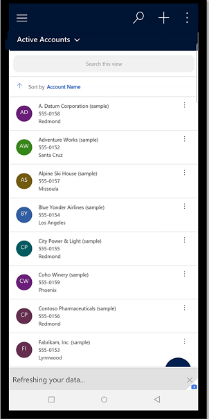

# Enable and use mobile offline-first (preview)

[This topic is pre-release documentation and is subject to change.]

This topic covers the new mobile offline-first setup and user experience. After [offline is enabled](setup-mobile-offline.md) for your model-driven app, you can run it on one of the following mobile apps:

- [Power Apps mobile app](run-powerapps-on-mobile.md)
- [Dynamics 365 for Phones and Tablets](/dynamics365/mobile-app/overview)
- [Field Service (Dynamics 365) mobile app](/dynamics365/field-service/mobile-2020-power-platform)

Depending on the app that you set up and use, your offline experience might be different. 

## Offline-first vs. classic offline

With the new offline-first experience, it's important to understand the key benefits of the new offline-first experience versus the [classic offline experience](/dynamics365/mobile-app/work-in-offline-mode). 

|Offline-first| Classic offline  |
|---------|---------|
| <ul><li>Your data is always the same, regardless of your network connection. </li> 

 

  <li> There's no toggle for users to switch from offline to online mode. A user will never forget to sync their changes back to the server because the app will do it automatically. 

  </li></ul>    |   <ul> <li> Users have the option to skip the initial offline sync and stay online, which means that users in your organization might not have the same experience. 

  </li> <li> Users have to remember to disable the **Work in offline mode** toggle before they can sync changes with the server. 

  </li> 

 </li> <li> To save your changes in offline mode, you need to set the **Work in offline mode** toggle to **On**. Otherwise, when you’re working on a row and suddenly lose internet connection your changes will be lost. </li> <li> The rows you see in offline mode are listed from the local database. Which means, the rows you see in offline mode vs. online can be different.  </li></ul>  |

## Enable mobile offline-first

To use offline-first, you need to enable it for each of your model-driven apps. It's a separate app setting for each app.

1. Sign in to [Power Apps (preview)](https://make.powerapps.com/?utm_source=padocs&utm_medium=linkinadoc&utm_campaign=referralsfromdoc) 

2. On the left pane, select **Apps**, and then select the model-driven app that you want to enable for offline.

3. Select **More (...)** > **Edit** to open the modern app designer.

4. On the command bar, select **Settings**.

    > [!div class="mx-imgBorder"]
    > 

5. On the **Upcoming** tab, set the **Choose the offline mode to apply to your app** toggle to **No** and then select **Save**.

6. Select **Save** and then **Publish** the app.

Some features—such as dashboards, charts, multiple-table business process flows, and server-side sync—are only available when you're online. Be sure to validate your app and verify that it's fully functional before it's deployed. 

## Use mobile offline-first

For the app to be available in offline mode, app and user data must be downloaded on your device. This process is called *initial offline sync*.

The app data includes all the resources needed for the app to run properly. User data includes that is configured for the offline profile and stored in Microsoft Dataverse tables.

With offline-first, during the initial offline sync, you'll get a notification stating that your app is syncing the offline data with the number of rows downloaded and how much disk space is used. This can take a few minutes or longer, depending on what has been configured in the offline profile. If the initial offline sync isn't complete, it will be triggered every time the app is opened. You will also get the same notification when you resume the app after a long period of inactivity.

> [!div class="mx-imgBorder"]
> 

You can also select the **Offline status** button to see more information about sync progress.

> [!div class="mx-imgBorder"]
> 

When the initial sync is complete, you can start using the app in offline mode.

> [!div class="mx-imgBorder"]
> 

When you refresh your data on a grid view, you'll get notification stating, **Refreshing your data**.

> [!div class="mx-imgBorder"]
> 

### See also

[Offline profile guidelines (preview)](mobile-offline-guidelines.md)

[!INCLUDE[footer-include](../includes/footer-banner.md)]
