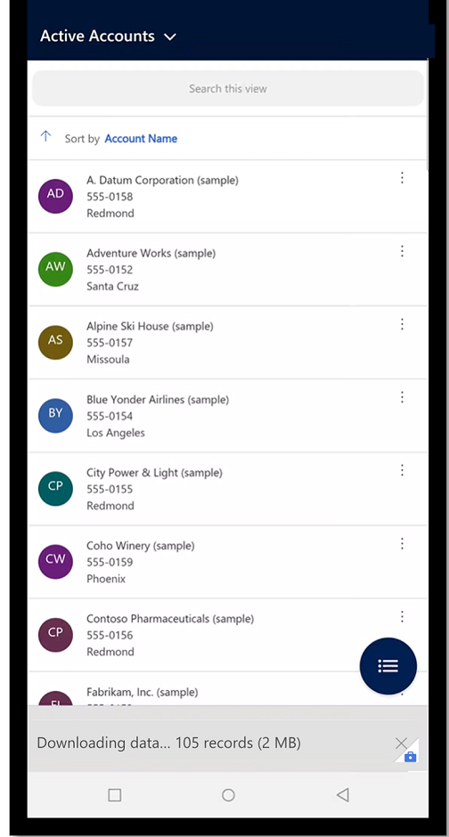

# Offline-first (preview)

This topic covers the new offline-first user experience. Once [offline is enabled](setup-mobile-offline.md) for your model-driven app, you can run it one of the following mobile apps:

- [Power Apps mobile](run-powerapps-on-mobile)
- [Dynamics 365 for Phones and Tablets](/dynamics365/mobile-app/overview)
- [Field Service (Dynamics 365) mobile app](/dynamics365/field-service/mobile-2020-power-platform)

Depending on the app you’re using and your set up, your offline experience may be different. 

## Offline-first vs. classic offline

With the new offline-first experience it's important to understand the key benifits of the new vs. the [classic offline experience](/dynamics365/mobile-app/work-in-offline-mode). 

**Classic offline with internet connection**

Users have the options to skip the initial offline sync and stay online which means user in your organization won't have the same experiences.

|Offline-first| Classic offline  |
|---------|---------|
| <ol><li>Your data is always the same regardless of your network connection </lo> 

 

 !     |   <ol> <li> Users have the options to skip the initial offline sync and stay online which means user in your organization won't have the same experiences. 

  </li> <li> The Work in offline mode toggle is something a user has to remember to disable to sync back all your changes with the server. 

  </li> 

 

     |

ser  listed from the server but if connection is lost while editing an online mode the row and suddenly losing connection. In that case, I may lose all my changes if I try to save them while not having connection

1. **Offline-first**: Your data is always the same regardless of your network connection. Th
 

For your app to be available offline, it needs to download the app and user data on the device first. This process is called initial offline sync.
The app data includes all the resources needed for the app to run properly and the user data configured in the offline profile and stored in Microsoft Dataverse tables.

With offline-first, during the initial offline sync, you'll get a notification stating that your app is syncing the offline data. This can take a few minutes or even more depending on what has been configured in the offline profile. The initial offline sync is triggered everything when the app is launched. Select **See details** to open the offline status page.

> [!div class="mx-imgBorder"]
> 

You can also select the **Offline status** button to see more information about sync progress.

> [!div class="mx-imgBorder"]
> 

When the sync is complete, you can start using your application offline. Depending on the sync intervals set up in the offline profile, all subsequent syncs will happen automatically.

> [!div class="mx-imgBorder"]
> 

 
 
 
 
 
 
 
 
 
 
 
 This is the new preview experience.
2. **Class offline**: This is the [currect released offline experience](/dynamics365/mobile-app/work-in-offline-mode).

                                                                                             |
 User see records listed from the server and may be facing weird situations like editing an online record and suddenly losing connection. In that case, I may lose all my changes if I try to save them while not having connection.
 
 When no network available, the records are listed from the local database and hence wouldn't be the same as when connected to the network. | With Offline-first, my data is always the same regardless of my network connectivity and relies on my offline profile setup. |

One option to avoid the confusing experience described above with classic offline between **with** and **without** network connectivity is to force the app to work offline (e.g.: Only access the local database).

| Classic offline                                                                                                                                                                                 | Offline first                                                                      |
|-------------------------------------------------------------------------------------------------------------------------------------------------------------------------------------------------|------------------------------------------------------------------------------------|
|                                                                                                                         |            |
| Enabling the **Work in offline mode** toggle is an option to have a consistent experience but you have to remember to disable at some point to sync back all your changes since you enabled it. | No toggle to handle anymore, I never forget to sync back my changes to the server. |

**Note:** Some of the experiences (like Dashboards/Charts, multi-table BPFs or server-side plugins) which are only available online may not be available when enabling the offline-first (preview) feature. You need to validate that your app is fully functional before deploying to your end users.

## Enabling offline-first for your application (Preview)

Once you're ready to test offline-first, you can enable offline-first for each of your apps separately as it is an app setting.

1.  Open your application using the **modern app designer**

2.  Select **Settings** &gt; **Upcoming** tab.

3.  Go to the **Upcoming** tab and set the "**Disable classic offline**" toggle to On

4.  

Offline limitations cleanup

[!INCLUDE[footer-include](../includes/footer-banner.md)]
