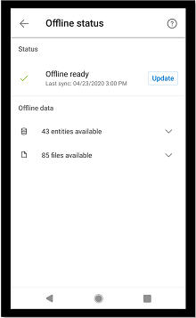
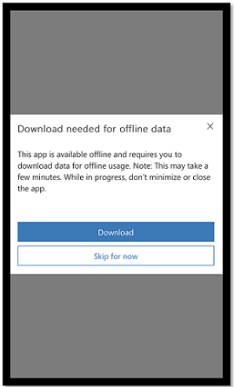
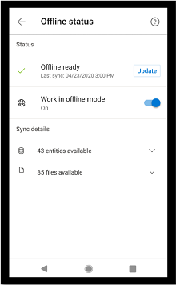
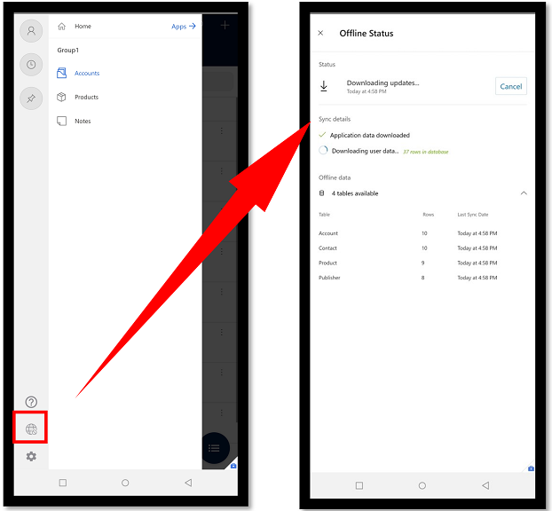
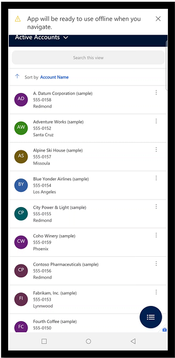

# Set up and use mobile offline-first (preview)

[This topic is pre-release documentation and is subject to change.]

This topic covers the new mobile offline-first set up and user experience. Once [offline is enabled](setup-mobile-offline.md) for your model-driven app, you can run it one of the following mobile apps:

- [Power Apps mobile](run-powerapps-on-mobile.md)
- [Dynamics 365 for Phones and Tablets](/dynamics365/mobile-app/overview)
- [Field Service (Dynamics 365) mobile app](/dynamics365/field-service/mobile-2020-power-platform)

Depending on the app you’re using and the setup, your offline experience may be different. 

## Offline-first vs. classic offline

With the new offline-first experience, it's important to understand the key benefits of the new offline-first experience vs. the [classic offline experience](/dynamics365/mobile-app/work-in-offline-mode). 

|Offline-first| Classic offline  |
|---------|---------|
| <ol><li>Your data is always the same regardless of your network connection. </lo> 

 

  <li> There no toggle for users to switch form offline to online mode. A user will never forget to sync their changes back to the server because the app will do it automatically. 

  </li>     |   <ol> <li> Users have the options to skip the initial offline sync and stay online, which means users in your organization won't have the same experience. 

  </li> <li> The Work in offline mode toggle is something a user has to remember to disable to sync changes with the server. 

  </li> 

 </li> <li> When there's no network, the rows are listed from the local database so they won't be the same when you connect back to the server. If you lose internet connection while editing in online mode, you will lose your changes because you can't save changes in offline mode. </li>  |

## Enable mobile offline-first

To use offline-first, you need to enable it for each of your model-driven. It's separate app setting for each app.

1. Sign in to [Power Apps (preview)](https://make.powerapps.com/?utm_source=padocs&utm_medium=linkinadoc&utm_campaign=referralsfromdoc) 

2. On the left nav, select **Apps** and then select the model-driven app that you want enable for offline.

3. Select ... > **Edit** > **Edit in preview** to open the modern app designer.

    > [!div class="mx-imgBorder"]
    > 
 
4. On the command bar, select **Settings**.

    > [!div class="mx-imgBorder"]
    > 

5. On the **Upcoming** tab, set the **Disable classic offline** toggle to **On**.

6. Close the **Settings** dialog and then save and publish the app.

Some of the features such as dashboards, charts, multi-table business process flows, and server-side sync are only available when you're online. Be sure to validate your app and make sure that it's fully functional be you deploy it. 

## Use mobile offline-first

For your app to be available offline, it needs to download the app and user data on the device first. This process is called initial offline sync.
The app data includes all the resources needed for the app to run properly and the user data configured in the offline profile and stored in Microsoft Dataverse tables.

With offline-first, during the initial offline sync, you'll get a notification stating that your app is syncing the offline data. This can take a few minutes or even more depending on what has been configured in the offline profile. The initial offline sync is triggered every time when the app is launched. Select **See details** to open the offline status page.

:::image type="content" source="media/offline-first-1.png" alt-text="Initail offline sync." lightbox="media/offline-first-1.png":::

You can also select the **Offline status** button to see more information about sync progress.

> [!div class="mx-imgBorder"]
> 

When the sync is complete, you can start using your application offline. Depending on the sync intervals set up in the offline profile, all subsequent syncs will happen automatically.

> [!div class="mx-imgBorder"]
> 

[!INCLUDE[footer-include](../includes/footer-banner.md)]
