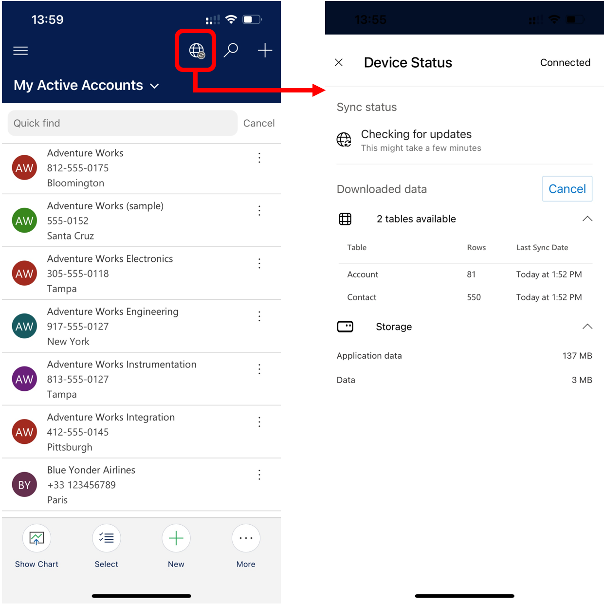

---

title: Work offline on your mobile device (offline-first mode)
description: Work in offline-first mode on your device.
author: trdehove
ms.component: pa-user
ms.topic: quickstart
ms.date: 07/19/2023
ms.subservice: mobile
ms.author: trdehove
ms.custom: ""
ms.reviewer: sericks
ms.assetid: 
search.audienceType: 
  - enduser
---

# Work offline on your mobile device (offline-first mode)

For the app to be available in offline mode, app and user data must be downloaded on your device. This process is called *initial offline sync*.

The app data includes all the resources needed for the app to run properly. User data includes that is configured for the offline profile and stored in Microsoft Dataverse tables.

With offline-first, during the initial offline sync, you'll get a notification stating that your app is syncing the offline data with the number of rows downloaded and how much disk space is used. This can take a few minutes or longer, depending on what has been configured in the offline profile. If the initial offline sync isn't complete, it will be triggered every time the app is opened. You will also get the same notification when you resume the app after a long period of inactivity.

> [!div class="mx-imgBorder"]
> 

You can also select the **Device status** button to see more information about sync progress.

> [!div class="mx-imgBorder"]
> 

When the initial sync is complete, you can start using the app in offline mode.

> [!div class="mx-imgBorder"]
> 

When you refresh your data on a grid view, you'll get notification stating, **Updating data...**.

> [!div class="mx-imgBorder"]
> 

### See also

[Offline profile guidelines (preview)](mobile-offline-guidelines.md)

[!INCLUDE[footer-include](../includes/footer-banner.md)]
