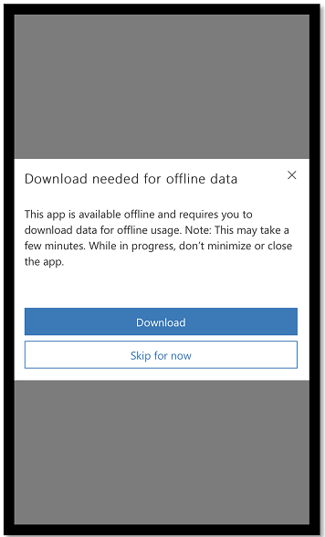
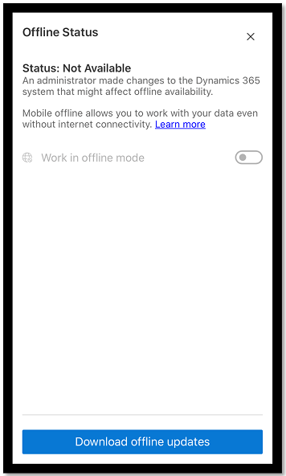
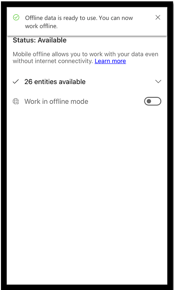
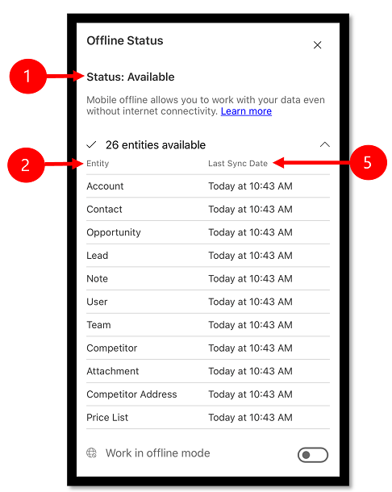
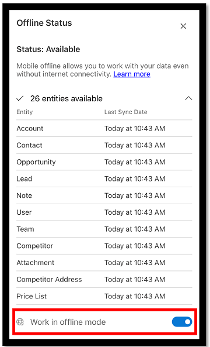

# Work offline on your mobile device (classic)

Work with your data in offline mode even when you don't have internet access. The mobile app provides a rich offline experience that lets you work with commands like create, read, update, and delete—along with some special commands—so you always stay productive. After you're back online, changes you've made are synchronized with your apps in the Microsoft Dataverse environment.

If you're working on a record and lose network connection, any updates made to the record are saved in offline mode and will be synchronized to the app after you're back online. When the record is synchronized with the app, it follows the filter rule for availability in offline mode.

> [!IMPORTANT]
> - There is a new experience to setup and use mobile offline for model-driven apps. For more information:
>   - [Set up mobile offline (preview)](setup-mobile-offline.md)
>   - [Enable and use mobile offline-first (preview)](work-in-offline-mode.md)

## Download updates to work in offline mode

After you've installed the mobile app and your admin has [enabled mobile offline mode](setup-mobile-offline-classic.md), the next time you access the mobile app you'll be prompted to download offline updates. After you download the updates, you can start using the mobile app in offline mode.

- When you see the dialog box that asks you to download updates to work offline, select **Download**. 

   > [!div class="mx-imgBorder"] 
   >   

Offline data starts downloading as you continue to use the app. On iOS, data is only downloaded while the app is active, so keep your phone unlocked with the app visible until the initial download is complete.

## Download offline data later

If you didn't want to download offline data and selected **Skip for now**, you won't be able to use the app in offline mode until you manually download the updates:

1. On the home screen, select the site map , and then select **Offline** .

2. On the **Offline Status** screen, select **Download offline updates**.

   > [!div class="mx-imgBorder"] 
   > 

3. The download will start, and the status will change to **Initializing**.

   > [!div class="mx-imgBorder"] 
   > 

4. When the download of offline data is complete, you'll get a notification that you can start working in offline mode.

   > [!div class="mx-imgBorder"] 
   > 

## See whether offline mode is available

When offline updates are complete, you can check to see whether mobile offline mode is available. 

- On the home screen, select the site map , and then select **Offline** .
  
    > [!div class="mx-imgBorder"] 
    > 

Legend:

1. **Status**: Tracks the offline status of the whole app and also the status of each individual entity. When the status appears as **Available**, offline mode is available and data has been synced successfully.
   > [!NOTE]
   > The status here can be **Not Available** due to an error or if you missed downloading offline updates. If the status is **Not Available** due to missing the latest offline updates, try downloading the updates again.
2. **Entity**: Provides the offline status of each entity individually. For the available entities, you can also track the last time the entity was synced. Data is synced periodically in the background to ensure that you have access to the latest data whenever you go offline.
3. **Last Sync Date**: Indicates the last time your data was synced with the server.

## Work in offline mode

After the offline download is complete, you can use the mobile app in offline mode.

When you have no connectivity, you'll automatically have access to the downloaded data so you can continue working while you're on the go. The data will be automatically synced with the server as soon as connectivity is restored.

When you have intermittent connectivity, we recommend that you switch to offline mode. As long as offline mode is turned on, the updates that you make on your device won't be synced with the server and you can continue to work with the local data on your device. To push the changes you've made to the server and refresh your local data, turn off the **Work in offline mode** toggle.

**To work in offline mode**

1. On the home screen, select the site map , and then select **Offline** .

2. Turn on the **Work in offline mode** toggle.

   > [!div class="mx-imgBorder"] 
   >  

## Sync conflict resolution

Conflict errors can be resolved based on the settings set by your admin:

- If conflict resolution has been set to **No**, the data you upload from your client device "wins" and there will be no sync errors.

- If conflict resolution has been set to **Yes**, the data on the server wins. While syncing changes to the server, you might notice that some errors have been automatically resolved. Client changes are overwritten by server values.

## Mobile offline capabilities and limitations

For information about the capabilities and limitations of mobile offline, go to [Mobile offline capabilities and limitations](offline-capabilities.md).

[!INCLUDE[footer-include](../includes/footer-banner.md)]
